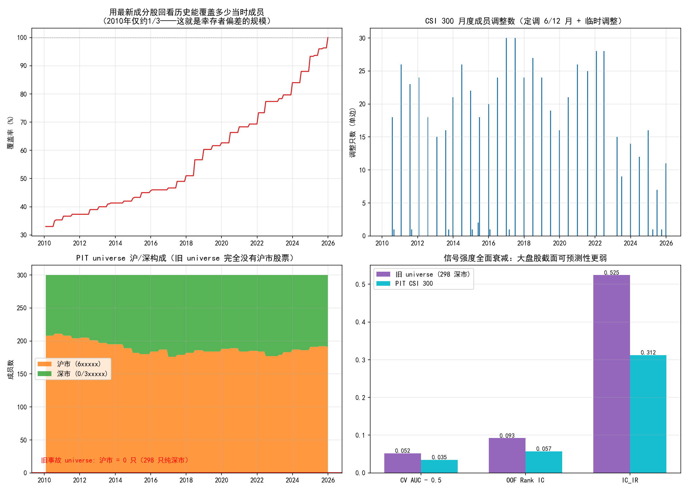
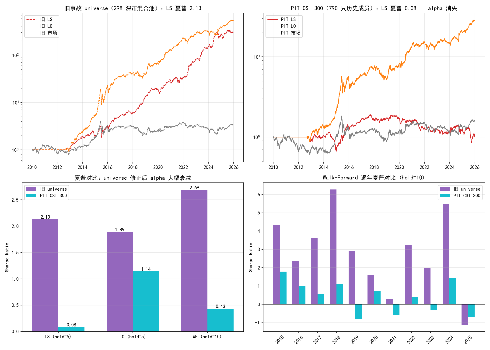

# LightGBM 非线性多因子合成

> **核心结论（2026-07-26 幸存者偏差修正后）**：在**真实 PIT 沪深 300 universe**（790 只历史成员，含退市股，逐日成员掩码）上，模型仍有统计显著的截面预测能力——Purged 5 折 CV AUC **0.535 ± 0.008**，OOF Rank IC = **+0.057**（IC_IR = 0.31, t = 17.8），且持续优于线性基线。**但组合层面策略失效**：hold=5 多空组合扣 0.3% 双边成本后夏普仅 **0.083**（Bootstrap p = 0.37，不显著），Walk-Forward 样本外夏普 **0.434**、年化 +6.0%，与市场等权基准（+5.8%）无异。此前报告的 LS 夏普 2.13 / WF 2.69 是**"事故 universe"（298 只纯深市中小盘混合池）+ 幸存者偏差**共同制造的幻觉，非模型能力。完整定位与重算见「方法论修正 II」。

> ⚠️ **重要更正 I（2026-07-26）**：本报告早期版本的组合级夏普（8.75 / Walk-Forward 8.20 / 动态仓位 9.19 等）**全部虚高约 8 倍**，源于 `build_portfolio` 的 overlapping returns 移动平均平滑缺陷。已定位、修正并重算全部组合级指标，见**「方法论修正 I」**章节。模型级指标（AUC / Rank IC / IC_IR / 特征重要性）不受影响。

> ⚠️ **重要更正 II（2026-07-26）**：修正 I 之后的数字（LS 夏普 2.13、WF 2.69 等）建立在一个**错误的股票池**上——`sorted(cache)[:300]` 切片在缓存扩容后取出了 298 只纯深市股票（CSI300/CSI500/退市股混合），既非沪深 300、也不可复现。切换到真实 PIT 成分股后**组合级 alpha 消失**。全过程见**「方法论修正 II」**章节——两次修正合起来是本报告最有价值的部分：一个夏普 8.75 的"策略"，经过两层方法论纠错后真实值是 0.08。

---

## 模型设计

### 任务定义：截面二分类

| 设置 | 值 | 说明 |
|------|-----|------|
| 标签 | 未来 5 日截面收益排名前 20% → 1 | 买入信号 |
| 标签 | 未来 5 日截面收益排名后 20% → 0 | 做空/低配信号 |
| 标签 | 中间 60% → NaN | 不参与训练 |
| 目标函数 | `binary` (logloss) | LightGBM 二分类 |
| 早停指标 | 验证集 AUC | 5 折 Purged CV |

放弃回归、改用两端分类的理由：日度截面收益率的 R² 极低，回归会被噪声淹没；两端分类把问题简化为"找出明显强/明显弱"，信噪比更高。

### 训练与防过拟合

| 参数 | 值 | 作用 |
|------|-----|------|
| `max_depth` | 5 | 限制单棵树深度 |
| `num_leaves` | 31 | ≤ 2^5，配合 max_depth |
| `min_child_samples` | 50 | 防止叶子过细 |
| `subsample` | 0.8 | bagging_fraction |
| `colsample_bytree` | 0.8 | feature_fraction |
| `learning_rate` | 0.05 | 学习率 |
| `early_stopping_rounds` | 50 | 基于 Purged CV 验证 AUC |
| 样本权重 | balanced | 平衡 1/0 两类 |

### 交叉验证：Purged Time-Series Split

严禁随机 K-Fold。按时间顺序分 5 折，训练集与验证集之间 **purge 6 个交易日**（等于标签前瞻期），避免未来收益自相关导致的泄露。

```
Fold 1: train [0─a)    val [a+6─b)
Fold 2: train [0─b)    val [b+6─c)
Fold 3: train [0─c)    val [c+6─d)
Fold 4: train [0─d)    val [d+6─e)
Fold 5: train [0─e)    val [e+6─T)
```

---

## 方法论修正 I：overlapping returns 平滑陷阱

> 本节是本报告最重要的部分。它记录了一个把夏普虚高约 8 倍的隐蔽 bug 如何被 CLAUDE.md 的一条红线触发排查、定位、修正的完整过程。

### 触发：夏普违反项目红线

项目 CLAUDE.md 明文规定："策略收益与 buy-and-hold 基准对比，夏普比率需在**合理范围（|SR| < 3 否则检查未来函数/幸存者偏差）**"。而早期版本报告的组合夏普是 5.7 → 8.75 → 12.4（随持有期递增），Walk-Forward 8.20，动态仓位 9.19——**全线突破 |SR|<3 红线**。这不是"策略太强"，是有 bug。

### 定位：`build_portfolio` 对信号序列做了移动平均

原 `build_portfolio` 的核心是一行：

```python
port_ret[t] = signal_series.rolling(hold_days).mean()   # ← 罪魁
```

其中 `signal_series[s]` = 第 s 天选股的组合在**它自己的窗口 [s+1, s+2]** 上赚的单日收益。所以 `port_ret[t]` 把过去 10 个**不同日历日**的收益（[t-8,t-7]…[t+1,t+2]）平均后盖上"第 t 天"的戳。这是对收益序列做**移动平均滤波**——一个经典的把夏普虚高的操作：

- 移动平均把日波动人为压掉 √hold_days 倍 → 夏普虚高 √hold_days 倍；
- 真实的重叠组合在第 t 天持有的 10 个 tranche 应该**全部经历同一个 t 日的市场波动**，大跌那天一起亏，没有平滑。

### 证据：三个铁证

| hold_days | 错误夏普 | 错误夏普/√hold_days | 错误 lag-1 自相关 | 正确夏普 | 正确 lag-1 | 错误法+Newey-West |
|-----------|---------|--------------------|------------------|---------|-----------|-------------------|
| 1 | −1.60 | −1.60 | 0.17 | +0.19 | 0.22 | −1.48 |
| 2 | 1.77 | 1.25 | 0.61 | 1.43 | 0.27 | 1.40 |
| 5 | 5.75 | 2.57 | 0.87 | **2.13** | 0.24 | 2.93 |
| 8 | 7.76 | 2.74 | 0.93 | **1.85** | 0.21 | 3.14 |
| 10 | 8.75 | 2.77 | 0.95 | **1.80** | 0.19 | 3.18 |
| 15 | 10.74 | 2.77 | 0.97 | **1.70** | 0.17 | 3.21 |
| 20 | 12.36 | 2.76 | 0.98 | **1.66** | 0.13 | 3.23 |


1. **`错误夏普/√hold_days` 收敛到 ~2.76**（hold_days≥5）：这是机械平滑放大 √hold_days 的直接指纹。
2. **错误法 lag-1 自相关 0.17→0.98**：MA(k) of 噪声的 lag-1 ≈ (k−1)/k，完全吻合移动平均特征；正确法只有 0.13–0.27（真实的弱动量持续性）。
3. **Newey-West 修正仍不够**：NW 把错误的 8.75 修到 3.18，但真实值是 1.80。差距（3.18 vs 1.80）来自错误法**收益均值本身也被高估**——它每天拿一个全新满强度信号，从不承担"持有 9 天前旧仓位、股票已不再是好票"的陈旧代价。NW 只能修方差，修不了均值偏差。**只有正确模拟持仓才能得到真相。**

### 修正：基于权重追踪的真实重叠组合

正确构造（`build_portfolio` 现版本，`build_portfolio_naive` 保留错误版供对比）：

1. 每天由 `signal[t]` 生成目标权重向量 `w[t]`（多头 +1/n_top，空头 −1/n_bottom）；
2. 实际持仓 `W[t]` = 过去 hold_days 天目标权重的平均（重叠 tranche）；
3. 第 t 天 P&L = `W[t-1] · daily_ret[t]`，所有 tranche 同经历今日波动；
4. 成本 = 每日换手 `sum|ΔW|` × 单边成本（`cost/2`，cost 为双边 0.3%）。

### 真实数字（修正 I 重算；注意：仍是事故 universe，后被修正 II 再次推翻）

| 指标 | 原报告（错误法） | 修正 I 后（事故 universe） |
|------|---------------|---------------|
| 多空夏普 (hold=5) | 5.75 | **2.13** |
| 多空年化 (hold=5) | +122.8% | **+47.0%** |
| 多空夏普 (hold=10) | 8.75 | **1.80** |
| Walk-Forward 夏普 | 8.20 | **2.69** |
| CAPM 年化 Alpha | +112.0% | **+41.5%** |
| MLP 多空夏普 | ~3.1 | **≈0** |

**当时的结论是"没有崩塌，只是回到地面"**——多空夏普 2.13、Walk-Forward 2.69，符合 |SR|<3 红线，非线性合成的相对优势看似为真。**但这个结论后来又被推翻了**：这些数字建立在一个错误的股票池上，见「方法论修正 II」。

一个附带发现：修正后**持有期越短夏普越高**（hold=5→2.13 vs hold=20→1.66），与错误版"越长越好"的结论完全相反——原来的"越长越好"纯粹是平滑假象。（注：这个结论在修正 II 后又翻转了回去，见「调仓频率优化」——在真实 universe 的弱信号下，长持有摊薄成本反而占优。同一个实验设计，三个 universe/方法组合给出三个相反结论，这本身就是"回测结论对方法论极度敏感"的最好教材。）

---

## 方法论修正 II：幸存者偏差与"事故 universe"

> 本节记录第二次方法论纠错：为落实 CLAUDE.md 铁律第 2 条（消灭幸存者偏差）而排查股票池时，发现问题比幸存者偏差更严重——**模型从头到尾没有在沪深 300 上训练过**。切换到真实 PIT 成分股后，组合级 alpha 消失。

### 发现：universe 根本不是沪深 300

全 pipeline（`select_features.py` 与 `models/` 全部脚本）用同一句取股票池：

```python
symbols = sorted(cache_summary()["symbol"].tolist())[:300]   # ← 地雷
```

这在缓存只有 300 只 CSI 300 成分股时等于"全缓存"。但缓存后来被 `sync_extended_universe` 扩到 **1068 只**（CSI300 + CSI500 + 退市股），切片悄悄变成了按代码排序的前 300 个——**000001~002673，298 只纯深市股票，0 只沪市股**。核查 `X_matrix.csv` 证实：

| 事实 | 数值 |
|------|------|
| X_matrix 实际股票数 | 298（全深市，混合 CSI300/CSI500/退市股） |
| 其中沪市股票 | **0 只** |
| 与当时沪深 300 深市成分的交集 | 68 / 111 |
| 切片是否随缓存增长漂移 | 是——违反"回测可复现"标准 |

即：修正 I 之后的所有数字（LS 2.13、WF 2.69）刻画的是一个**深市中小盘倾斜混合池**，与"沪深 300 大盘股"无关。

### 修复：baostock 历史成分股 PIT 名单

`bs.query_hs300_stocks(date=...)` 支持按日期查询历史成分股名单（实测含后来退市的武钢股份 600005，且其 2014 年底调出、2015 年 6 月重新纳入的记录与快照一致，updateDate 显示 baostock 底层为月度级更新）。修复步骤：

1. **`data/index_membership.py`（新增）**：逐月查询 2010–2025 共 192 个月末快照，得到 **790 只历史成员**的 date × symbol 成员矩阵，缓存于 `data/cache_meta/hs300_membership.csv`；快照前向填充到日频（保证 PIT，不用未来名单）
2. **补数据**：790 只中 231 只缓存缺失（多为退市/调出股），已全部拉取
3. **`build_pit_matrix.py`（新增）**：在 790 只全量历史上重算**同一组** 16 alpha + 2 市场特征（不重跑因子筛选，隔离 universe 变量），仅保留 (date, symbol) 在当日指数内的样本——过滤后 1,165,707 行，**日均恰好 300 只**
4. **标签修正**：`build_labels` 新增 `universe` 参数，截面分位数只在当日成员内计算；前向收益仍用真实价格（调出指数 ≠ 退市，收益照常实现）
5. **拆雷**：`models/` 全部脚本的 close_matrix 改为直接取 X_matrix 内的股票集合，`sorted(cache)[:300]` 切片废除
6. **顺带清除两处平滑残留**：`portfolio_backtest.py` 与 `walk_forward.py` 的市场等权基准仍在做 `rolling(hold_days).mean()`（修正 I 的漏网之鱼，等权恒定权重根本没有重叠 tranche）——旧市场基准夏普 1.31 实为 **0.249**



左上图量化了幸存者偏差的规模：**用 2025 年末成分股回看 2010 年，只能覆盖当时成员的约 1/3**——三分之二的当时成员后来被调出或退市，旧方法对它们完全失明。

### 结果：模型级信号衰减，组合级 alpha 消失

| 指标 | 事故 universe（298 深市） | PIT CSI 300（790 历史成员） |
|------|--------------------------|------------------------------|
| CV AUC | 0.5520 ± 0.0078 | **0.5347 ± 0.0082** |
| OOF Rank IC | +0.0926 | **+0.0574** |
| IC_IR | 0.5246 | **0.3122** (t = 17.8，仍显著) |
| LS 夏普 (hold=5) | 2.13 (p<0.0001) | **0.083 (p=0.37，不显著)** |
| LS 年化 (hold=5) | +47.0% | **+1.3%** |
| LO 夏普 (hold=5) | 1.89 | **1.14** |
| Walk-Forward 夏普 (hold=10) | 2.69 | **0.434** |
| Walk-Forward 年化 | +46.9% | **+6.0%** |
| 市场等权基准夏普 | 1.31（含平滑残留） | **0.249**（诚实重算） |



### 解读：旧数字从哪来，为什么消失

1. **风格错配是主因**：Alpha 191 类价量因子的截面区分能力集中在中小盘。事故 universe 是深市中小盘倾斜池（大量 CSI500 成分 + 退市股），信号天然强；真实沪深 300 是全市场流动性最好、关注度最高、定价最有效的 300 只大盘股，同一组因子的 IC 从 0.093 掉到 0.057，IC_IR 腰斩。
2. **幸存者偏差叠加**：旧池含 93 只退市股（意外混入），但**成员资格不是 PIT 的**——CSI500 小盘股在它入指数前的年份也在样本里贡献"小盘超额收益"。
3. **成本吞噬弱信号**：IC 0.057 的信号在 0.3% 双边成本 + 日频调仓下毛利≈成本。多头侧仍有增益（LO 1.14 vs 市场 0.249，超额约 21 个百分点年化），**空头侧彻底失效**——大盘股的"坏票"跌得不够多，做空成本收不回来。
4. **模型没有作弊，是数据在作弊**：两次修正中 Purged CV、`.shift(1)`、权重追踪构造全部无恙；错的是喂给模型的股票池。这正是铁律排序的意义：未来函数 → 幸存者偏差 → 平滑陷阱，一条都不能跳过。

### 各章节数字状态

| 章节 | 状态 |
|------|------|
| 训练结果 / 特征重要性 / 线性基线 / 组合回测 / 条件归因 / 调仓频率 / 动态仓位 / Walk-Forward | ✅ 已用 PIT universe 重算（下文数字为新值） |
| CAPM 因子归因 / 最终全量模型 / MLP 对照 | ⚠️ 未重跑，保留旧 universe 数字仅作方法演示（组合级 alpha 已不存在，重跑无研究价值） |

---

## 数据与特征

| 维度 | 值 |
|------|-----|
| 特征来源 | `strategies/feature_selection/X_matrix.csv`（由 `build_pit_matrix.py` 生成） |
| Alpha 因子 | 16 个（见下表） |
| 市场状态特征 | `market_vol_20d`, `market_turnover_20d`（当日指数成员内截面均值） |
| 股票池 | **PIT 沪深 300**：790 只历史成员（含退市股），逐日成员掩码，日均 300 只 |
| 时间范围 | 2010-01-04 ~ 2025-12-23 |
| 训练样本 | 466,892（仅含前/后 20% 标签） |
| 成员名单来源 | baostock `query_hs300_stocks`，192 个月末快照前向填充 |

### 输入特征清单

| # | 特征 | 说明 |
|---|------|------|
| 1 | alpha116 | 量价背离相关 |
| 2 | alpha142 | 长周期价格动量 |
| 3 | alpha001 | 经典价量趋势 |
| 4 | alpha144 | 价格与成交量协同 |
| 5 | alpha003 | 负向：开盘收盘关系 |
| 6 | alpha011 | 负向：高低价波动 |
| 7 | alpha051 | 成交量加权的趋势强度 |
| 8 | alpha110 | 价格位置 |
| 9 | alpha075 | 成交量-价格相关性 |
| 10 | alpha169 | 负向：长周期反转 |
| 11 | alpha108 | 价格加速度 |
| 12 | alpha068 | 量价比率 |
| 13 | alpha166 | 波动率调整收益 |
| 14 | alpha171 | 高低价非对称 |
| 15 | alpha162 | 成交量异常 |
| 16 | alpha055 | 防守型低波动（强制保留） |
| 17 | market_vol_20d | 全市场 20 日截面波动率 |
| 18 | market_turnover_20d | 全市场 20 日相对换手率 |

---

## 训练结果

> 本节数字为 PIT universe 重算值（2026-07-26）。旧 universe 对照见「方法论修正 II」。

### 5 折 CV AUC


| Fold | 训练样本 | 验证样本 | 验证 AUC |
|------|----------|----------|----------|
| 1 | 77,809 | 77,815 | 0.5355 |
| 2 | 155,624 | 77,816 | **0.5461** |
| 3 | 233,440 | 77,815 | 0.5321 |
| 4 | 311,255 | 77,815 | 0.5212 |
| 5 | 389,070 | 77,816 | 0.5385 |
| **mean ± std** | — | — | **0.5347 ± 0.0082** |

CV AUC 从旧 universe 的 0.552 降到 **0.535**，且跨折稳定——大盘股截面的可预测性系统性弱于中小盘，不是单期波动。

### OOF 预测能力

| 指标 | 值 |
|------|-----|
| Rank IC mean | **+0.0574** |
| Rank IC std | 0.1838 |
| IC_IR | **0.3122** |
| IC t | **17.75** (n=3,233 天) |

Rank IC 仍显著为正（t=17.8）——模型在真实沪深 300 上**确实学到了微弱的截面排序信号**，问题不在统计显著性，在下文的经济显著性。

### 日频再平衡组合绩效

评估方式：每天按 OOF 分数排序，top 20% 等权做多、bottom 20% 等权做空，次日调仓，扣双边成本（hold_days=1，无重叠构造，不受平滑问题影响）。

| 指标 | Long-Short (hold=1) |
|------|---------------------|
| 年化收益 | **-20.6%** |
| 夏普 | **-1.04** |
| 最大回撤 | -93.6% |

这是与旧 universe（LS +40.1%/夏普 1.32）反差最大的数字：IC 0.057 的信号毛利撑不起日频全换手的交易成本，**统计显著 ≠ 经济可行**。分组收益细节见上方汇总图。

---

## 特征重要性

按 LightGBM `gain` 排序（PIT universe 重算）：

| 排名 | 特征 | mean gain | std |
|------|------|-----------|-----|
| 1 | **market_turnover_20d** | 6,853 | 5,113 |
| 2 | **market_vol_20d** | 6,830 | 5,649 |
| 3 | alpha068 | 4,953 | 3,833 |
| 4 | alpha051 | 3,104 | 2,517 |
| 5 | alpha011 | 2,682 | 2,205 |
| 6 | alpha142 | 2,293 | 1,572 |
| 7 | alpha003 | 2,209 | 1,683 |
| 8 | alpha144 | 2,011 | 1,655 |
| 9 | alpha055 | 1,618 | 1,348 |
| 10 | alpha171 | 1,341 | 1,171 |
| 11 | alpha116 | 1,291 | 1,117 |
| 12 | alpha169 | 1,059 | 905 |
| 13 | alpha001 | 1,045 | 838 |
| 14 | alpha108 | 890 | 770 |
| 15 | alpha166 | 881 | 856 |
| 16 | alpha075 | 785 | 650 |
| 17 | alpha162 | 696 | 753 |
| 18 | alpha110 | 696 | 556 |

**关键发现**：
- 两个市场状态特征跃居前 2（旧 universe 时占前 3 中的 2 席）——alpha 因子在大盘股上信息量下降后，模型**更加**依赖 Regime 信息。
- alpha068（量价比率）、alpha051（成交量加权趋势）仍是最强的个体因子，排序与旧 universe 大体一致——因子的相对强弱是稳健的，绝对强度不是。

---

## 与线性基线的对比

使用完全相同的 16 个 alpha 因子、相同的 5 日截面分类标签、相同的 Purged CV 和评估框架，对比两种线性合成与 LightGBM 的非线性合成（PIT universe 重算，多空列为 hold=1 日频再平衡扣成本）：

| 方法 | Rank IC | IC_IR | IC t | 多空年化 | 多空夏普 | 最大回撤 |
|------|---------|-------|------|----------|----------|----------|
| 等权线性 | +0.0409 | 0.2428 | 13.81 | -33.42% | -2.063 | -99.60% |
| ICIR 加权线性 | +0.0466 | 0.2470 | 14.04 | -28.57% | -1.517 | -99.19% |
| **LightGBM 非线性** | **+0.0574** | **0.3122** | **17.75** | -20.61% | -1.042 | -93.58% |


**关键判断**：

- **非线性的相对优势在 PIT universe 上依然成立**：IC 0.057 vs 0.047/0.041，IC_IR 0.31 vs 0.25/0.24——LightGBM 在信号质量上稳定优于线性合成，这个结论跨 universe 稳健。
- **但三者在日频成本下全军覆没**：连最强的 LightGBM 也是 -1.04 夏普。大盘股上"排序对但赚不到钱"是三种方法的共同宿命，非线性救不了成本结构。
- 相对优势的来源不变：市场状态特征与因子的交互、因子方向的非单调性，线性加权无法表达。

---

## 组合回测：从预测到交易

### 回测设置

| 设置 | 值 |
|------|-----|
| 组合构建 | 每天按预测概率排序，做多 Top 20%，做空 Bottom 20% |
| 持有方式 | **权重追踪重叠组合**（默认 hold_days=5）：实际持仓=过去 5 天目标权重平均，每日 P&L=昨日持仓×今日股票收益 |
| 执行价 | 信号日 t 收盘 → t+1 开盘执行（用 close(t+2)/close(t+1)-1 近似） |
| 摩擦成本 | **双边 0.3%**，按每日换手 sum\|ΔW\| × 单边(cost/2) 计 |
| 基准 | alpha001 单因子组合 + 市场等权 |
| 显著性 | Block Bootstrap，block_size=20 |

### 绩效结果（PIT universe，hold_days=5）

| 组合 | 年化收益 | 夏普 | 最大回撤 | Bootstrap p | 通过？ |
|------|----------|------|----------|-------------|--------|
| **LightGBM Long-Short** | **+1.3%** | **0.083** | -55.3% | **0.3711** | ✗ |
| LightGBM Long-only | +27.1% | 1.141 | -38.2% | 0.0000 | ✗（含市场 beta） |
| alpha001 Long-Short | -17.7% | -2.187 | -95.3% | 0.0000 | ✗ |
| 市场等权（成员掩码） | +5.8% | 0.249 | -53.0% | — | — |

> 旧 universe 数字（LS 2.13 / LO 1.89）见「方法论修正 II」对比表；更早的错误法数字（LS 5.75）见「方法论修正 I」。


### 关键结论

- **多空策略在真实沪深 300 上不成立**：LS 夏普 0.083，Bootstrap p = 0.37——与"无 alpha"假设无法区分。此前 2.13 的"通过"判定作废。
- **多头侧仍有真实增益**：Long-only 夏普 1.14 vs 市场等权 0.249，年化超额约 21 个百分点，p < 0.0001。模型能在大盘股里挑出相对强的票。
- **空头侧是亏损来源**：LS ≈ LO 增益被空头腿完全吃掉——大盘股"坏票"的下跌幅度覆盖不了做空的交易成本。若考虑实际融券成本与可得性，空头侧更差。
- **alpha001 单因子在两个 universe 上都失效**（-2.19 vs 旧 -2.22），这是少数跨 universe 稳定的结论。

---

## 条件 Alpha 归因

### 方法

按 `market_vol_20d` 把样本分为高波动（Q2）和低波动（Q1）两个区间，在每个区间内计算**条件 Permutation Importance**：随机打乱单个特征后 AUC 的下降幅度。

- alpha 因子：截面打乱（按日期 groupby shuffle）
- 市场特征：时间序列打乱（因为每天所有股票值相同，截面打乱无效）

### 结果

基础 AUC = 0.5780（fold 5 模型，PIT universe 重算）。

| 排名 | 高波动区间 (Q2) | 低波动区间 (Q1) |
|------|-----------------|-----------------|
| 1 | alpha068 | alpha068 |
| 2 | market_turnover_20d | market_turnover_20d |
| 3 | market_vol_20d | alpha051 |
| 4 | alpha051 | alpha142 |
| 5 | alpha011 | alpha116 |
| 6 | alpha144 | market_vol_20d |
| 15 | alpha001 | alpha001 |


### 核心发现

1. **alpha068 取代 alpha051 成为跨状态最强因子**（旧 universe 时 alpha051 第一）——大盘股上量价比率比成交量加权趋势更有区分度。
2. **市场状态特征在两个区间都进前 3**：信号变弱后模型对 Regime 信息的依赖比旧 universe 更重。
3. **alpha001 在两个区间都垫底**（第 15 名），与其单因子组合失效一致，跨 universe 稳健。
4. **高波动区间的重要性绝对值约为低波动的 2 倍**（top1 0.022 vs 0.010）：模型的区分能力集中在高波动时期——但注意这是 AUC 层面，未必能转化为扣成本后的收益。

---

## 因子归因：剥离市场 Beta

> ⚠️ **本节数字基于修正 II 前的事故 universe，未在 PIT universe 上重跑**（组合级 alpha 已不存在，CAPM 分解无研究价值），保留仅作方法演示。其市场因子构造还残留 `rolling(5)` 平滑（`factor_attribution.py`），迁移时一并清除。

### 方法

由于项目没有标准沪深300指数、市值、账面价值数据，这里做**简化 CAPM 归因**：

- **市场因子**：个股等权组合的 overlapped 5 日收益作为 MKT 代理
- **无风险利率**：按 3% 年化近似（日利率 ≈ 0.012%）
- **模型**：$R_p - R_f = \alpha + \beta \cdot (R_m - R_f) + \epsilon$
- 额外提供 252 日滚动 alpha / beta，观察稳定性

### CAPM 归因结果

| 组合 | Alpha（年化） | Alpha t | Alpha p | Beta | Beta t | R² |
|------|--------------|---------|---------|------|--------|-----|
| **LightGBM Long-Short** | **+41.50%** | **7.53** | 0.0000 | 0.104 | 4.06 | 0.004 |
| **LightGBM Long-only** | **+39.55%** | **6.36** | 0.0000 | 0.919 | 31.60 | 0.205 |
| alpha001 Long-Short | -18.91% | -9.99 | 0.0000 | -0.046 | -3.93 | 0.004 |


### 核心结论

1. **Pure Alpha 显著为正**：LightGBM LS 剥离市场 beta 后年化 alpha **+41.50%**，t 统计量 7.53，p < 0.0001。
2. **多空组合近乎市场中性**：LS 的 beta 仅 **0.104**，R² 仅 0.004——市场因子只能解释 0.4% 的收益波动，收益几乎全部来自选股 alpha 而非赌方向。
3. **Long-only 承担了满额市场 beta**：LO 的 beta 高达 **0.919**（R²=0.205），这正是一个纯多头股票组合应有的市场暴露——它的收益是"选股 alpha + 市场 beta"的混合。（原错误版把 LO beta 算成 0.19，是不合常理的；修正后 0.92 才符合直觉，也反向验证了新构造的正确性。）
4. **alpha001 的负收益不是 beta 问题**：其 beta 接近 0，但 alpha 显著为负（−18.9% 年化），说明在 0.3% 成本下该因子本身无法产生经风险调整后的正收益。

### 局限

- 用个股等权组合代替真实沪深300指数，市场因子可能有偏差。
- 没有做标准 Fama-French 三因子归因（缺少市值、账面价值数据）。
- 滚动 alpha 显示 2020-2021 年 alpha 有明显下降，模型在近期市场环境中的稳健性需要持续监控。

---

## 最终全量模型

> ⚠️ **本节基于修正 II 前的事故 universe，未在 PIT universe 上重训**——组合级 alpha 消失后，"生产模型"暂无部署意义。若未来在多头增强方向重启，需用 PIT X_matrix 重训并重估迭代数。

### 训练逻辑

最终模型不用于历史 OOF 评估，而是用于**未来预测 / 滚动回测**。训练方法：

1. 复用 Purged CV 确定的超参数（`max_depth=5`, `num_leaves=31`, `learning_rate=0.05` 等）。
2. 读取 5 个 fold 模型的实际树数量，取平均作为最终模型的 `num_boost_round`。
3. 在全部历史数据（418,456 个有效标签样本）上训练单一模型。
4. 保存为 `models/lgbm_final_model.txt`。

### CV 迭代次数

| Fold | Best Iteration |
|------|----------------|
| 1 | 40 |
| 2 | 53 |
| 3 | 159 |
| 4 | 74 |
| 5 | 71 |
| **Mean** | **79** |

最终模型使用 **79 轮** 训练。

### 最终模型特征重要性

| 排名 | 特征 | Gain | Split |
|------|------|------|-------|
| 1 | market_vol_20d | 55,466 | 3,460 |
| 2 | market_turnover_20d | 50,371 | 3,361 |
| 3 | alpha051 | 33,717 | 1,675 |
| 4 | alpha011 | 22,566 | 1,645 |
| 5 | alpha068 | 21,041 | 1,379 |
| 6 | alpha108 | 20,304 | 1,612 |
| 7 | alpha055 | 19,448 | 1,431 |
| 8 | alpha144 | 16,717 | 1,171 |
| 9 | alpha003 | 16,283 | 1,409 |
| 10 | alpha001 | 15,380 | 1,325 |


### 说明

- 最终模型与 OOF 模型的特征重要性排序略有不同：全量数据上 `alpha001` 升至第 10，而条件归因中它排名靠后。这反映了样本量扩大后，某些因子的边际贡献会变化。
- 该模型可用于生成未来交易日的截面买入概率，供滚动回测或模拟交易调用。

---

## 调仓频率优化

### 实验设计

增加持有期降低换手成本，但也让持仓中掺入更多陈旧信号。测试 hold_days = 5 / 8 / 10 / 15 / 20（权重追踪法，PIT universe 重算）。

| hold_days | LS 年化 | LS 夏普 | LS 最大回撤 | LO 年化 | LO 夏普 | LO 最大回撤 |
|-----------|---------|---------|-------------|---------|---------|-------------|
| 5 | +1.3% | 0.083 | -55.3% | **+27.1%** | **1.141** | -38.2% |
| 8 | +3.6% | 0.266 | -36.5% | +21.0% | 0.927 | -37.7% |
| 10 | +4.7% | 0.362 | -34.6% | +18.8% | 0.847 | -38.6% |
| 15 | +5.1% | 0.442 | -34.2% | +15.7% | 0.726 | -40.6% |
| **20** | +5.1% | **0.481** | -33.1% | +14.6% | 0.681 | -41.1% |


### 结论（PIT 重算后，与修正 I 版结论再次相反）

- **LS 与 LO 的最优持有期方向相反**：LS 越长越好（5→20 日夏普 0.08→0.48），因为弱信号扛不住高换手成本，摊薄成本是第一要务；LO 越短越好（1.14→0.68），因为多头侧信号仍强到值得付换手成本。
- **修正 I 时"越短越好"的结论是旧 universe 的强信号特权**：信号强时换手成本占比小，快速轮动捕捉信号衰减前的收益划算；信号弱了这笔账就反过来了。**最优调仓频率不是策略属性，是信号强度与成本结构的函数。**
- 即便取最优 hold=20，LS 夏普 0.48 仍无经济意义；本实验的价值在于揭示上述权衡结构，不在于挽救策略。

---

## 动态仓位策略

### 逻辑

条件归因显示模型在高/低波动区间依赖不同的因子。按 `market_vol_20d` 在历史数据上的分位数动态调整仓位：波动率高于中位数（0.0206）时降仓，不加杠杆。

### 结果（hold_days=10，PIT universe 重算）

| 策略 | 年化收益 | 夏普 | 最大回撤 |
|------|----------|------|----------|
| 基线（满仓） | +4.7% | 0.362 | -34.6% |
| 高波动降至 70% | +2.7% | 0.257 | -31.0% |
| 高波动降至 50% | +1.3% | 0.144 | -33.8% |
| 高波动降至 30% | -0.1% | -0.008 | -40.0% |

### 结论（PIT 重算后：防守全面失效）

- **降仓不再是"用夏普换回撤"的诚实取舍，而是全输**：降到 30% 仓位时夏普归零、回撤反而更深（-40%）。旧 universe 版"半仓回撤 −35%→−21%"的防守收益不复存在。
- 原因：PIT universe 上策略的正收益集中在高波动时期（条件归因显示高波动区间的区分能力约为低波动的 2 倍）——高波动降仓恰好把仅存的盈利时段砍掉了。
- **教训**：仓位规则的有效性依附于收益的时序分布，universe 换了、收益分布变了，规则跟着失效。

---

## 滚动回测（Walk-Forward）：真正样本外检验

### 设计

Purged CV 的 OOF 预测是在一个"防泄露"的交叉验证框架下生成的，但所有 fold 的验证集加起来覆盖了全历史。滚动回测更严格地模拟生产环境：

- **年度再训练**：每年用截至前一年的 expanding-window 数据训练一次
- **前向预测**：用训练好的模型预测下一整年的截面排序
- **组合构建**：hold_days=10, 双边 0.3% 成本, 权重追踪重叠组合（未叠加动态仓位）
- **固定参数**：num_boost_round=79（CV 确定），不做 early stopping
- **测试年份**：2015-2025（11 年）

### 逐年结果（PIT universe 重算）

| 年份 | 训练样本 | 测试天数 | 年化收益 | 夏普 | 最大回撤 |
|------|----------|----------|----------|------|----------|
| 2015 | 145,761 | 232 | +37.05% | 1.78 | -13.02% |
| 2016 | 175,402 | 232 | +7.22% | 1.00 | -6.88% |
| 2017 | 204,869 | 232 | +5.94% | 0.55 | -9.63% |
| 2018 | 234,352 | 231 | +11.72% | 1.09 | -7.67% |
| 2019 | 263,669 | 232 | -5.89% | -0.78 | -10.13% |
| 2020 | 292,954 | 231 | +9.22% | 0.73 | -9.82% |
| 2021 | 322,127 | 231 | -8.65% | -0.59 | -18.26% |
| 2022 | 351,308 | 230 | +5.05% | 0.42 | -11.26% |
| 2023 | 380,356 | 230 | -2.78% | -0.33 | -8.49% |
| 2024 | 409,405 | 230 | +29.28% | 1.44 | -15.20% |
| 2025 | 438,452 | 225 | -12.87% | -0.68 | -30.16% |

### 汇总对比（PIT universe 重算）

| 方法 | 年化收益 | 夏普 | 最大回撤 |
|------|----------|------|----------|
| Walk-Forward 滚动回测 | +5.96% | **0.434** | -31.37% |
| Purged CV OOF（对比） | +4.65% | 0.362 | -34.65% |
| 市场等权基准* | +5.80% | 0.249 | -53.01% |

*市场基准为 2010–2025 全窗口成员掩码等权（WF 行为 2015–2025），窗口不完全对齐，仅作量级参照。


### 核心结论

1. **样本外确认组合级 alpha 不存在**：WF 夏普 0.434（旧 universe 2.69），年化 +6.0% 与市场等权 +5.8% 相当——付出年度再训练 + 高换手的代价，换来与"躺平持有"无差别的收益。
2. **逐年结果从"10 年 9 正"退化为"11 年 7 正 4 负"**：2019/2021/2023/2025 四年负夏普，且负年集中在近期——信号可能还在进一步衰减（大盘股定价效率逐年提高的方向一致）。
3. **WF 仍略优于 Purged CV**（0.43 vs 0.36），年度再训练的适应性增益这一相对结论跨 universe 成立。
4. **2015 与 2024 贡献了大部分收益**（+37%、+29%）：两个高波动年份，与条件归因"区分能力集中在高波动"互相印证；平静年份策略无利可图。

---

## 深度学习对照：MLP vs LightGBM

> ⚠️ **本节数字基于修正 II 前的事故 universe，未在 PIT universe 上重跑**。核心结论（树模型归纳偏置在此任务上优于基础 MLP）是相对比较，预计跨 universe 成立，但表中绝对数字已作废。

### 设计

用 3 层 MLP（128→64→32, BatchNorm, Dropout 0.3, ReLU, BCEWithLogitsLoss）在相同的 Purged CV、标签、评估框架下训练。目标：量化神经网络与梯度提升树在截面因子合成上的性能差距。

### 结果

| 指标 | LightGBM | MLP |
|------|----------|-----|
| CV AUC | **0.5520** | 0.5190 |
| OOF Rank IC | **+0.0926** | +0.0346 |
| IC_IR | **0.5246** | +0.2173 |
| LS 夏普 (hold=10, 修正后) | **1.80** | **≈0.05** |
| LS 年化 (hold=10) | **+30.0%** | +0.66% |
| LS 最大回撤 | **-35.0%** | -56.6% |


### 结论

- **修正后 MLP 差距更悬殊**：用真实权重追踪法，MLP 多空组合夏普仅 **≈0.05、年化 +0.66%**——几乎是死的。错误的平滑法曾把它抬到 ~3.1，掩盖了真实的无能。LightGBM（1.80）现在的领先是压倒性的。
- 这不是"深度学习比树模型差"的通用结论，而是**在这个具体任务上**（18 维低信噪比截面分类、~40 万样本），树模型的归纳偏置（特征交互、对噪声鲁棒、处理非单调关系）天然适配。
- MLP 的梯度下降在信噪比极低的任务上容易被噪声主导（CV AUC 仅 0.519，比随机好不到 2 个百分点），而 LightGBM 的贪心分裂天然过滤弱特征。
- 这个结果也说明：非线性增益来自**树结构对特征空间的递归划分**，而非单纯的"非线性激活函数"。

### 局限

- 仅训练了基础 MLP（3 层，~25K 参数），未尝试 TabNet、FT-Transformer 等专为表格数据设计的深度架构。
- 学习率、batch size、dropout 等超参数用了默认值，未做网格搜索。
- 结论不排除更复杂的深度架构（如残差连接、embedding、attention）能达到接近或超过 LightGBM 的水平。

---

## 局限与下一步

### 当前局限

1. **多空策略在真实 universe 上无经济意义**：LS 夏普 0.083（p=0.37），本报告的价值已从"策略研发"转为"方法论记录 + 多头侧信号确认"。
2. **PIT 成员名单为月末采样**：baostock 底层约为月度更新（updateDate 实测），临时调整（退市/并购触发）最多滞后一个月；调入/调出日的精确对齐无法做到日级。
3. **成员名单未经第二数据源交叉验证**：790 只/每期恰好 300 只/退市股进出记录自洽，但如中证官方调整公告有出入，以官方为准。
4. **截面 RANK 类因子的排名池是 790 只全集的当日存活部分**，非当日 300 成员——无未来信息，但排名基准比真实成员池宽，因子值与"纯成员内排名"存在差异。
5. **CAPM 归因 / 最终模型 / MLP 对照未在 PIT universe 上重跑**（见各节 banner）。
6. **未纳入融券成本与可得性**：空头腿已经亏损，纳入后更差。
7. **残余自相关**：组合日收益 lag-1 约 0.13–0.24，naive sqrt(252) 年化夏普可能仍轻微高估 ~15%。
8. **停牌日收益按缺失处理、退市股用最后可得价格结算**：极端退市损失可能被低估。

### 下一步

1. ~~线性基线 / 组合回测 / 条件归因 / CAPM / 最终模型 / 调仓频率 / 动态仓位 / 滚动回测 / MLP 对照~~ ✅ 已完成（部分未在 PIT 重跑，见状态表）
2. ~~方法论修正 I：overlapping returns 平滑陷阱~~ ✅ 已完成
3. ~~方法论修正 II：幸存者偏差 + 事故 universe，切换 PIT 成分股~~ ✅ 已完成
4. **多头增强方向**：LS 已死但 LO 超额仍显著（1.14 vs 0.249）——转向"沪深300指数增强"框架：全持有 + 因子倾斜、跟踪误差约束，对标指数本身而非多空
5. **回到中小盘 universe 但做对**：用中证 500 / 中证 1000 的 PIT 名单重做全流程——事故 universe 的"深市中小盘信号强"可能是真现象，值得在方法论干净的前提下验证
6. **factor_attribution.py 迁移 PIT**：清除其 `[:300]` 切片与 `rolling(5)` 市场平滑残留
7. **TabNet / FT-Transformer 对照**（优先级降低——LGBM 的信号上限本身已不支撑策略）

---

## 复现命令

```bash
cd D:/桌面文件/quant

# 0. PIT 基础设施（一次性；成员矩阵已缓存在 data/cache_meta/）
python -c "from data.index_membership import load_membership; print(load_membership().shape)"

# 1. 在 PIT universe 上重建特征矩阵（约 10 分钟，790 只 × 16 因子）
python strategies/feature_selection/build_pit_matrix.py

# 2. 训练 LightGBM
python models/lgbm_trainer.py

# 3. 线性基线对比
python models/linear_baseline.py

# 4. 组合回测 + 条件 Alpha 归因
python models/portfolio_backtest.py

# 5. 调仓频率 + 动态仓位优化
python models/execution_optimization.py

# 6. 滚动回测
python models/walk_forward.py

# 7. 新旧 universe 对比图（需 *_pre_pit.csv 备份在位）
python models/pit_universe_comparison.py

# 8. 方法论修正 I 诊断（错误法 vs 正确法）
python models/methodology_correction.py

# （未迁移 PIT，跑出的是旧方法演示：factor_attribution / train_final_model / nn_trainer）
```

## 输出文件

| 文件 | 说明 |
|------|------|
| `data/index_membership.py` | **PIT 成员矩阵**：baostock 历史成分股逐月查询 + 日频展开 |
| `data/cache_meta/hs300_membership.csv` | 192 个月末快照 × 790 只历史成员（入 git，审计基准） |
| `strategies/feature_selection/build_pit_matrix.py` | **PIT 特征矩阵重建**（替代 select_features 的数据加载） |
| `strategies/feature_selection/X_matrix_pre_pit.csv` | 事故 universe 旧矩阵备份（不入 git） |
| `models/*_pre_pit.csv` | 旧 universe 模型输出备份（oof/summary 等，不入 git） |
| `models/pit_universe_comparison.py` | 新旧 universe 对比图生成脚本 |
| `models/labels.py` | 标签构建（模型无关，支持 `universe` PIT 掩码） |
| `models/cv.py` | Purged Time-Series Split（模型无关） |
| `models/evaluate.py` | OOF 评估：Rank IC、五分位、多空曲线（模型无关） |
| `models/lgbm_trainer.py` | LightGBM 训练主脚本 |
| `models/linear_baseline.py` | 线性基线对比脚本 |
| `models/portfolio_backtest.py` | 组合回测 + 条件归因脚本（`build_portfolio` 权重追踪 / `build_portfolio_naive` 错误对照） |
| `models/factor_attribution.py` | CAPM 因子归因脚本（未迁移 PIT） |
| `models/train_final_model.py` | 最终全量模型训练脚本（未在 PIT 重训） |
| `models/execution_optimization.py` | 调仓频率 + 动态仓位优化脚本 |
| `models/walk_forward.py` | 滚动前向回测脚本 |
| `models/nn_trainer.py` | MLP 深度学习对照脚本（未在 PIT 重跑） |
| `models/methodology_correction.py` | overlapping returns 平滑陷阱诊断脚本 |
| `models/lgbm_fold_*.txt` | 5 折 CV 保存的模型 |
| `models/lgbm_final_model.txt` | 最终全量模型 |
| `models/oof_predictions.csv` | OOF 预测分数矩阵 |
| `models/baseline_comparison.csv` | 线性基线 vs LightGBM 对比表 |
| `models/portfolio_backtest_summary.csv` | 组合回测绩效汇总 |
| `models/factor_attribution.csv` | CAPM 归因结果 |
| `models/final_model_feature_importance.csv` | 最终模型特征重要性 |
| `models/figures/pit_universe_overview.png` | **PIT universe 结构**（4 子图：覆盖率/调整数/构成/信号衰减） |
| `models/figures/pit_vs_old_comparison.png` | **新旧 universe 对比**（4 子图：净值×2/夏普/WF 逐年） |
| `models/figures/lgbm_oof_summary.png` | LightGBM OOF 汇总（4 子图） |
| `models/figures/baseline_metrics_comparison.png` | 线性基线 vs LightGBM 指标对比 |
| `models/figures/baseline_cum_curve.png` | 线性基线 vs LightGBM 累计多空曲线 |
| `models/figures/portfolio_backtest_summary.png` | 组合回测汇总（4 子图） |
| `models/figures/conditional_attribution.png` | 条件 Alpha 归因 |
| `models/figures/factor_attribution.png` | CAPM 因子归因（4 子图，旧 universe） |
| `models/figures/final_model_summary.png` | 最终模型特征重要性与 CV 迭代（旧 universe） |
| `models/figures/execution_optimization.png` | 调仓频率 + 动态仓位优化（4 子图） |
| `models/figures/walk_forward_summary.png` | 滚动回测汇总（4 子图） |
| `models/figures/nn_vs_lgbm_comparison.png` | MLP vs LightGBM 对比（旧 universe） |
| `models/figures/methodology_correction.png` | overlapping 平滑陷阱诊断（4 子图） |
| `models/report.md` | 本报告 |

---

## 关键参数

| 参数 | 值 | 位置 |
|------|-----|------|
| Universe | PIT 沪深 300（790 只历史成员，月末快照日频展开） | `data/index_membership.py` |
| 成员快照频率 | 月末（2010-01 ~ 2025-12，192 期） | `data/index_membership.py` |
| 标签持有期 | 5 个交易日 | `models/labels.py` |
| 标签分位数 | top 20% / bottom 20%（当日成员内） | `models/labels.py` |
| CV 折数 | 5 | `models/lgbm_trainer.py` |
| Purge 天数 | 6 | `models/lgbm_trainer.py` |
| 组合成本 | 0.3% 双边（换手×cost/2） | `models/portfolio_backtest.py` |
| 组合构建 | 权重追踪重叠组合（非移动平均） | `models/portfolio_backtest.py::build_portfolio` |
| 市场基准 | 当日成员等权日收益（无 rolling 平滑） | `models/portfolio_backtest.py::load_data` |
| Bootstrap block | 20 日 | `models/portfolio_backtest.py` |
| 无风险利率 | 3% 年化 | `models/factor_attribution.py` |
| 最终模型 boost round | CV 平均 num_trees | `models/train_final_model.py` |
| 动态仓位规则 | 高波动(>中位数)→降仓（PIT 上已失效，勿用） | `models/execution_optimization.py` |
