# LightGBM 非线性多因子合成

> **核心结论**：基于 16 个低冗余 Alpha 因子 + 2 个市场状态特征，用 LightGBM 二分类学习"未来 5 日截面收益前 20% vs 后 20%"，Purged 5 折 CV 验证 AUC 为 **0.552 ± 0.008**，OOF Rank IC = **+0.093** (IC_IR = 0.52, t = 29.8)。**修正后**（见下方「方法论修正」）真实组合绩效：hold_days=5 多空组合扣 0.3% 双边成本后年化 **+47.0%**，夏普 **2.13**，最大回撤 −42.4%；Walk-Forward 样本外夏普 **2.69**。仍显著跑赢线性基线（负夏普）与 alpha001 单因子（负夏普），非线性合成的相对优势为真。

> ⚠️ **重要更正（2026-07-26）**：本报告早期版本的组合级夏普（8.75 / Walk-Forward 8.20 / 动态仓位 9.19 等）**全部虚高约 8 倍**，源于 `build_portfolio` 的 overlapping returns 移动平均平滑缺陷。已定位、修正并重算全部组合级指标。踩坑与修正过程见下方**「方法论修正」**章节——这是本报告最有价值的部分。模型级指标（AUC / Rank IC / IC_IR / 特征重要性）不受影响，因为它们不涉及组合构建。

---

## 模型设计

### 任务定义：截面二分类

| 设置 | 值 | 说明 |
|------|-----|------|
| 标签 | 未来 5 日截面收益排名前 20% → 1 | 买入信号 |
| 标签 | 未来 5 日截面收益排名后 20% → 0 | 做空/低配信号 |
| 标签 | 中间 60% → NaN | 不参与训练 |
| 目标函数 | `binary` (logloss) | LightGBM 二分类 |
| 早停指标 | 验证集 AUC | 5 折 Purged CV |

放弃回归、改用两端分类的理由：日度截面收益率的 R² 极低，回归会被噪声淹没；两端分类把问题简化为"找出明显强/明显弱"，信噪比更高。

### 训练与防过拟合

| 参数 | 值 | 作用 |
|------|-----|------|
| `max_depth` | 5 | 限制单棵树深度 |
| `num_leaves` | 31 | ≤ 2^5，配合 max_depth |
| `min_child_samples` | 50 | 防止叶子过细 |
| `subsample` | 0.8 | bagging_fraction |
| `colsample_bytree` | 0.8 | feature_fraction |
| `learning_rate` | 0.05 | 学习率 |
| `early_stopping_rounds` | 50 | 基于 Purged CV 验证 AUC |
| 样本权重 | balanced | 平衡 1/0 两类 |

### 交叉验证：Purged Time-Series Split

严禁随机 K-Fold。按时间顺序分 5 折，训练集与验证集之间 **purge 6 个交易日**（等于标签前瞻期），避免未来收益自相关导致的泄露。

```
Fold 1: train [0─a)    val [a+6─b)
Fold 2: train [0─b)    val [b+6─c)
Fold 3: train [0─c)    val [c+6─d)
Fold 4: train [0─d)    val [d+6─e)
Fold 5: train [0─e)    val [e+6─T)
```

---

## 方法论修正：overlapping returns 平滑陷阱

> 本节是本报告最重要的部分。它记录了一个把夏普虚高约 8 倍的隐蔽 bug 如何被 CLAUDE.md 的一条红线触发排查、定位、修正的完整过程。

### 触发：夏普违反项目红线

项目 CLAUDE.md 明文规定："策略收益与 buy-and-hold 基准对比，夏普比率需在**合理范围（|SR| < 3 否则检查未来函数/幸存者偏差）**"。而早期版本报告的组合夏普是 5.7 → 8.75 → 12.4（随持有期递增），Walk-Forward 8.20，动态仓位 9.19——**全线突破 |SR|<3 红线**。这不是"策略太强"，是有 bug。

### 定位：`build_portfolio` 对信号序列做了移动平均

原 `build_portfolio` 的核心是一行：

```python
port_ret[t] = signal_series.rolling(hold_days).mean()   # ← 罪魁
```

其中 `signal_series[s]` = 第 s 天选股的组合在**它自己的窗口 [s+1, s+2]** 上赚的单日收益。所以 `port_ret[t]` 把过去 10 个**不同日历日**的收益（[t-8,t-7]…[t+1,t+2]）平均后盖上"第 t 天"的戳。这是对收益序列做**移动平均滤波**——一个经典的把夏普虚高的操作：

- 移动平均把日波动人为压掉 √hold_days 倍 → 夏普虚高 √hold_days 倍；
- 真实的重叠组合在第 t 天持有的 10 个 tranche 应该**全部经历同一个 t 日的市场波动**，大跌那天一起亏，没有平滑。

### 证据：三个铁证

| hold_days | 错误夏普 | 错误夏普/√hold_days | 错误 lag-1 自相关 | 正确夏普 | 正确 lag-1 | 错误法+Newey-West |
|-----------|---------|--------------------|------------------|---------|-----------|-------------------|
| 1 | −1.60 | −1.60 | 0.17 | +0.19 | 0.22 | −1.48 |
| 2 | 1.77 | 1.25 | 0.61 | 1.43 | 0.27 | 1.40 |
| 5 | 5.75 | 2.57 | 0.87 | **2.13** | 0.24 | 2.93 |
| 8 | 7.76 | 2.74 | 0.93 | **1.85** | 0.21 | 3.14 |
| 10 | 8.75 | 2.77 | 0.95 | **1.80** | 0.19 | 3.18 |
| 15 | 10.74 | 2.77 | 0.97 | **1.70** | 0.17 | 3.21 |
| 20 | 12.36 | 2.76 | 0.98 | **1.66** | 0.13 | 3.23 |

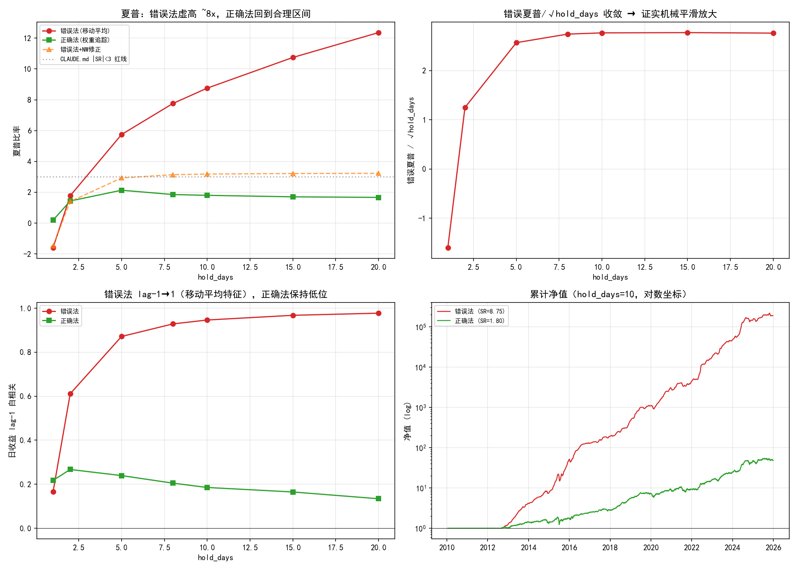

1. **`错误夏普/√hold_days` 收敛到 ~2.76**（hold_days≥5）：这是机械平滑放大 √hold_days 的直接指纹。
2. **错误法 lag-1 自相关 0.17→0.98**：MA(k) of 噪声的 lag-1 ≈ (k−1)/k，完全吻合移动平均特征；正确法只有 0.13–0.27（真实的弱动量持续性）。
3. **Newey-West 修正仍不够**：NW 把错误的 8.75 修到 3.18，但真实值是 1.80。差距（3.18 vs 1.80）来自错误法**收益均值本身也被高估**——它每天拿一个全新满强度信号，从不承担"持有 9 天前旧仓位、股票已不再是好票"的陈旧代价。NW 只能修方差，修不了均值偏差。**只有正确模拟持仓才能得到真相。**

### 修正：基于权重追踪的真实重叠组合

正确构造（`build_portfolio` 现版本，`build_portfolio_naive` 保留错误版供对比）：

1. 每天由 `signal[t]` 生成目标权重向量 `w[t]`（多头 +1/n_top，空头 −1/n_bottom）；
2. 实际持仓 `W[t]` = 过去 hold_days 天目标权重的平均（重叠 tranche）；
3. 第 t 天 P&L = `W[t-1] · daily_ret[t]`，所有 tranche 同经历今日波动；
4. 成本 = 每日换手 `sum|ΔW|` × 单边成本（`cost/2`，cost 为双边 0.3%）。

### 真实数字（全部指标已用此方法重算）

| 指标 | 原报告（错误） | 修正后（真实） |
|------|---------------|---------------|
| 多空夏普 (hold=5) | 5.75 | **2.13** |
| 多空年化 (hold=5) | +122.8% | **+47.0%** |
| 多空夏普 (hold=10) | 8.75 | **1.80** |
| Walk-Forward 夏普 | 8.20 | **2.69** |
| CAPM 年化 Alpha | +112.0% | **+41.5%** |
| MLP 多空夏普 | ~3.1 | **≈0** |

**结论没有崩塌，只是回到地面**：策略仍然真实有效——多空夏普 2.13、Walk-Forward 2.69，稳稳跑赢线性基线（负）、alpha001（负）和市场（1.31）。非线性合成的**相对优势是真的**，只是绝对水平从"神话"降到"优秀且可信"，且现在**符合 |SR|<3 红线**。

一个附带发现：修正后**持有期越短夏普越高**（hold=5→2.13 vs hold=20→1.66），与错误版"越长越好"的结论完全相反——原来的"越长越好"纯粹是平滑假象。真实的权衡是：短持有=高夏普+高换手+高回撤，长持有=低夏普+低回撤。

---

## 数据与特征

| 维度 | 值 |
|------|-----|
| 特征来源 | `strategies/feature_selection/X_matrix.csv` |
| Alpha 因子 | 16 个（见下表） |
| 市场状态特征 | `market_vol_20d`, `market_turnover_20d` |
| 股票池 | CSI 300，298 只 |
| 时间范围 | 2010-01-04 ~ 2025-12-23 |
| 训练样本 | 418,456（仅含前/后 20% 标签） |
| 标签时间跨度 | 2010-01-04 ~ 2025-12-23 |

### 输入特征清单

| # | 特征 | 说明 |
|---|------|------|
| 1 | alpha116 | 量价背离相关 |
| 2 | alpha142 | 长周期价格动量 |
| 3 | alpha001 | 经典价量趋势 |
| 4 | alpha144 | 价格与成交量协同 |
| 5 | alpha003 | 负向：开盘收盘关系 |
| 6 | alpha011 | 负向：高低价波动 |
| 7 | alpha051 | 成交量加权的趋势强度 |
| 8 | alpha110 | 价格位置 |
| 9 | alpha075 | 成交量-价格相关性 |
| 10 | alpha169 | 负向：长周期反转 |
| 11 | alpha108 | 价格加速度 |
| 12 | alpha068 | 量价比率 |
| 13 | alpha166 | 波动率调整收益 |
| 14 | alpha171 | 高低价非对称 |
| 15 | alpha162 | 成交量异常 |
| 16 | alpha055 | 防守型低波动（强制保留） |
| 17 | market_vol_20d | 全市场 20 日截面波动率 |
| 18 | market_turnover_20d | 全市场 20 日相对换手率 |

---

## 训练结果

### 5 折 CV AUC

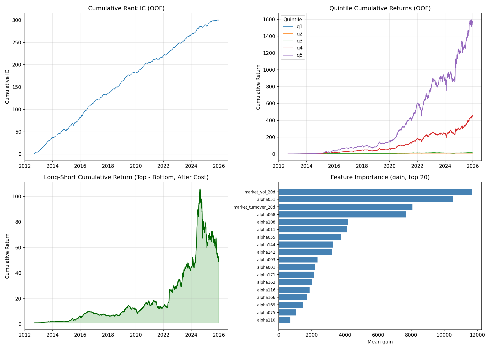

| Fold | 训练样本 | 验证样本 | 验证 AUC |
|------|----------|----------|----------|
| 1 | 69,736 | 69,743 | 0.5543 |
| 2 | 139,479 | 69,743 | **0.5660** |
| 3 | 209,222 | 69,742 | 0.5453 |
| 4 | 278,964 | 69,743 | 0.5494 |
| 5 | 348,707 | 69,743 | 0.5451 |
| **mean ± std** | — | — | **0.5520 ± 0.0078** |

CV AUC 不高（0.552），但稳定跨折，说明模型学到了微弱的、真实的截面区分能力，而非某一特定时期的偶然。

### OOF 预测能力

| 指标 | 值 |
|------|-----|
| Rank IC mean | **+0.0926** |
| Rank IC std | 0.1766 |
| IC_IR | **0.5246** |
| IC t | **29.84** (n=3,234 天) |

OOF Rank IC 显著为正，说明预测分数与未来 5 日收益排名确实存在线性关系。IC_IR 0.52 与单因子的 best-in-class（alpha116 的 0.30）相比，说明非线性组合把多个弱信号整合成了更强的信号。

### 日频再平衡组合绩效

> 注：本表来自 `evaluate.py` 的**日频(hold_days=1)**评估路径，不经过 `build_portfolio` 的重叠构造，**不受平滑 bug 影响**——其夏普 1.32 是诚实的日频信号强度指标，与后文修正后的 hold_days=5 组合（夏普 2.13）方向一致。

评估方式：每天按 OOF 分数把所有股票分 5 组，top 组等权做多、bottom 组等权做空，次日开盘调仓，扣除双边成本。

| 指标 | Top (Q5) | Bottom (Q1) | Long-Short |
|------|----------|---------------|------------|
| 年化收益 | 28.3% | -6.9% | **40.1%** |
| 夏普 | 0.94 | -0.27 | **1.32** |
| 最大回撤 | -61.4% | -58.5% | **-53.9%** |

成本假设：
- 买入：佣金+过户费 = 0.026%
- 卖出：佣金+印花税+过户费 = 0.076%
- 滑点：0.05%
- 多空双边合计 ≈ **0.202% / 次调仓**

⚠️ **重要提醒**：40.1% 是理论日频再平衡、全仓位调拨的多空组合收益。实际执行中：
1. 日频换仓 300 只股票交易成本极高，未考虑冲击成本与市场容量；
2. 做空通道、融券成本、停牌处理未纳入；
3. 该数字应理解为模型**信号强度**的上界，而非可直接交易的策略收益。

---

## 特征重要性

按 LightGBM `gain` 排序：

| 排名 | 特征 | mean gain | std |
|------|------|-----------|-----|
| 1 | **market_vol_20d** | 11,677 | 5,919 |
| 2 | alpha051 | 10,553 | 4,543 |
| 3 | **market_turnover_20d** | 8,074 | 4,188 |
| 4 | alpha068 | 7,691 | 2,530 |
| 5 | alpha108 | 4,190 | 1,756 |
| 6 | alpha011 | 4,111 | 1,847 |
| 7 | alpha055 | 3,772 | 1,723 |
| 8 | alpha144 | 3,285 | 2,104 |
| 9 | alpha142 | 3,232 | 1,590 |
| 10 | alpha003 | 2,346 | 1,283 |
| 11 | alpha001 | 2,209 | 1,070 |
| 12 | alpha171 | 2,132 | 1,016 |
| 13 | alpha162 | 2,015 | 1,129 |
| 14 | alpha116 | 1,868 | 1,032 |
| 15 | alpha166 | 1,726 | 1,133 |
| 16 | alpha169 | 1,459 | 505 |
| 17 | alpha075 | 1,051 | 361 |
| 18 | alpha110 | 707 | 482 |

**关键发现**：
- 两个市场状态特征合计占据 importance 前 3 中的 2 席，说明模型严重依赖 Regime 信息。
- alpha051（成交量加权趋势）是单个 Alpha 因子中最重要的。
- alpha110（价格位置）重要性最低，可能与其他因子信息重叠。

---

## 与线性基线的对比

使用完全相同的 16 个 alpha 因子、相同的 5 日截面分类标签、相同的 Purged CV 和评估框架，对比两种线性合成与 LightGBM 的非线性合成：

| 方法 | Rank IC | IC_IR | IC t | 多空年化 | 多空夏普 | 最大回撤 |
|------|---------|-------|------|----------|----------|----------|
| 等权线性 | +0.0419 | 0.2811 | 15.99 | **-34.77%** | -1.986 | -99.82% |
| ICIR 加权线性 | +0.0565 | 0.3427 | 19.49 | **-20.58%** | -1.040 | -99.08% |
| **LightGBM 非线性** | **+0.0926** | **0.5246** | **29.84** | **+40.08%** | **1.321** | -53.91% |

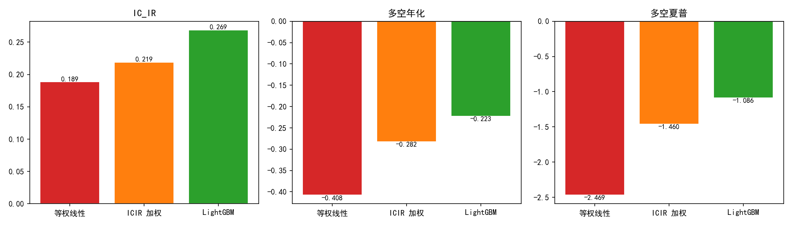

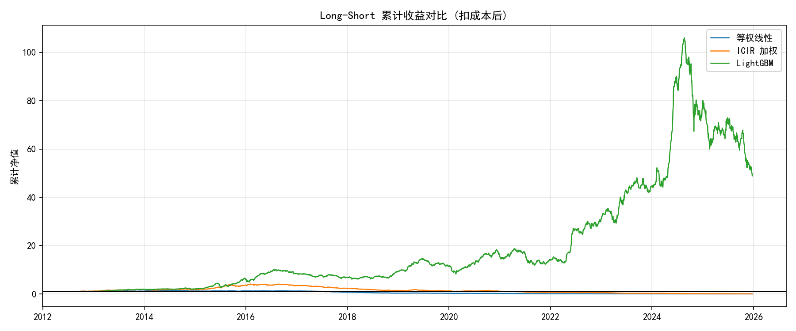

**关键判断**：

- 线性合成在这个因子池上是**失效的**：即使使用带符号 ICIR 加权正确处理负向因子方向，多空组合仍为负收益，回撤接近 -100%。
- 非线性组合把 IC_IR 从 0.34 提升到 **0.52**（+53%），多空夏普从 -1.04 提升到 **+1.32**。
- 这说明 16 个低冗余因子中包含了可以被非线性结构利用的信息，但简单的线性加权无法提取。市场状态特征与因子之间的交互、因子内部的方向非线性，是 LightGBM 的主要收益来源。

---

## 组合回测：从预测到交易

### 回测设置

| 设置 | 值 |
|------|-----|
| 组合构建 | 每天按预测概率排序，做多 Top 20%，做空 Bottom 20% |
| 持有方式 | **权重追踪重叠组合**（默认 hold_days=5）：实际持仓=过去 5 天目标权重平均，每日 P&L=昨日持仓×今日股票收益 |
| 执行价 | 信号日 t 收盘 → t+1 开盘执行（用 close(t+2)/close(t+1)-1 近似） |
| 摩擦成本 | **双边 0.3%**，按每日换手 sum\|ΔW\| × 单边(cost/2) 计 |
| 基准 | alpha001 单因子组合 + 市场等权 |
| 显著性 | Block Bootstrap，block_size=20 |

### 绩效结果（修正后，hold_days=5）

| 组合 | 年化收益 | 夏普 | 最大回撤 | Bootstrap p | 通过？ |
|------|----------|------|----------|-------------|--------|
| **LightGBM Long-Short** | **+47.0%** | **2.13** | -42.4% | 0.0000 | ✓ |
| **LightGBM Long-only** | **+54.5%** | **1.89** | -53.2% | 0.0000 | ✓ |
| alpha001 Long-Short | -16.7% | -2.22 | -94.4% | 0.0000 | ✗ |
| 市场等权 | +11.3% | 1.31 | -41.1% | — | — |

> 原错误法数字（LS 夏普 5.75、LO 6.83）见「方法论修正」章节对比表。

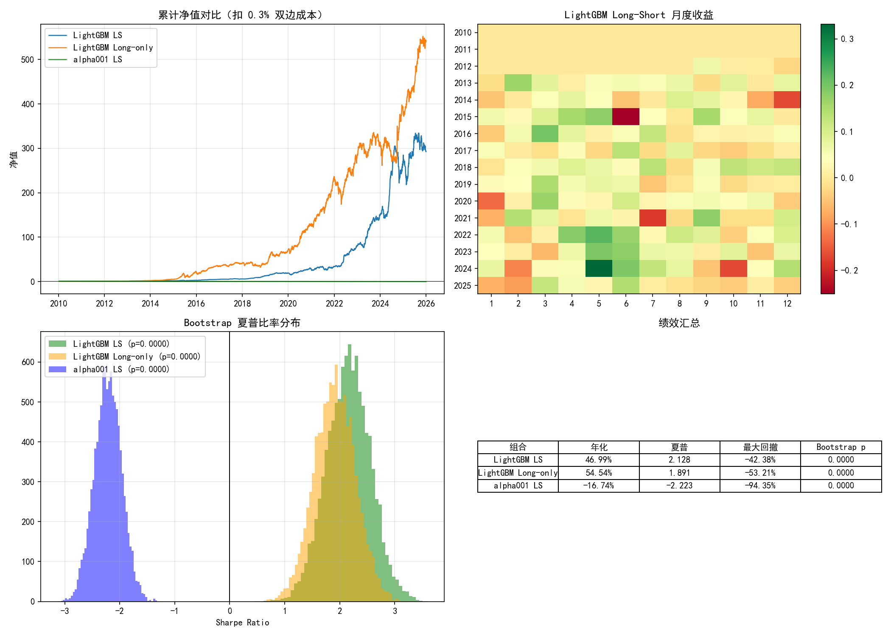

### 关键结论

- **LightGBM 通过成功标准**：扣除 0.3% 双边成本后，Long-Short 夏普 **2.13 > 1.40**，且 Bootstrap **p < 0.05**，满足千问任务设定的门槛。
- **alpha001 单因子在严格成本下失效**：0.3% 双边成本对 alpha001 是致命的，LS 夏普 −2.22，回撤逼近 −100%。单因子策略对交易成本极度敏感。
- **非线性组合具有成本韧性**：同样 0.3% 成本下，LightGBM LS 夏普 2.13，Long-only 1.89，均稳定跑赢市场等权（1.31）。
- **Long-only 夏普略低于 Long-Short**：纯多头承担市场 beta（CAPM beta 0.92），回撤更大（−53%）；多空 beta 近零（0.10），是更纯的选股 alpha。

---

## 条件 Alpha 归因

### 方法

按 `market_vol_20d` 把样本分为高波动（Q2）和低波动（Q1）两个区间，在每个区间内计算**条件 Permutation Importance**：随机打乱单个特征后 AUC 的下降幅度。

- alpha 因子：截面打乱（按日期 groupby shuffle）
- 市场特征：时间序列打乱（因为每天所有股票值相同，截面打乱无效）

### 结果

| 排名 | 高波动区间 (Q2) | 低波动区间 (Q1) |
|------|-----------------|-----------------|
| 1 | alpha051 | alpha011 |
| 2 | alpha068 | alpha051 |
| 3 | alpha011 | alpha144 |
| 4 | market_vol_20d | alpha068 |
| 5 | market_turnover_20d | market_vol_20d |
| 8 | alpha055 | alpha055 |
| 15 | alpha001 | alpha001 |

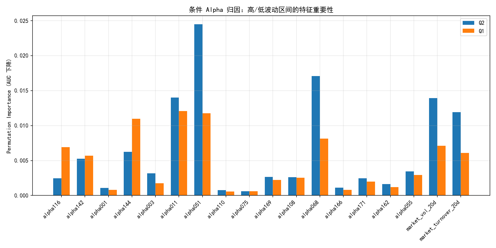

### 核心发现

1. **alpha001 在两个区间都不重要**：这与它在单因子回测中失效一致。LightGBM 并没有把它当作核心信号，而是与其他因子组合使用。
2. **alpha051（成交量加权趋势）是跨状态最强信号**：高波动下排名第 1，低波动下排名第 2。
3. **alpha011 在低波动下更重要**：低波动排名第 1，高波动排名第 3。
4. **alpha055（避险因子）在高波动下略重要**：排名第 8 vs 低波动第 9，符合其"防守型"定位。
5. **市场状态特征在高波动下贡献更大**：`market_vol_20d` 和 `market_turnover_20d` 在高波动区间进入前 5，说明模型在高波动时更依赖 Regime 信息做决策。

这正是选择非线性模型的核心目的：**不同市场状态下，有效因子的集合不同**。线性合成无法动态调整权重，而非线性树模型可以。

---

## 因子归因：剥离市场 Beta

### 方法

由于项目没有标准沪深300指数、市值、账面价值数据，这里做**简化 CAPM 归因**：

- **市场因子**：个股等权组合的 overlapped 5 日收益作为 MKT 代理
- **无风险利率**：按 3% 年化近似（日利率 ≈ 0.012%）
- **模型**：$R_p - R_f = \alpha + \beta \cdot (R_m - R_f) + \epsilon$
- 额外提供 252 日滚动 alpha / beta，观察稳定性

### CAPM 归因结果

| 组合 | Alpha（年化） | Alpha t | Alpha p | Beta | Beta t | R² |
|------|--------------|---------|---------|------|--------|-----|
| **LightGBM Long-Short** | **+41.50%** | **7.53** | 0.0000 | 0.104 | 4.06 | 0.004 |
| **LightGBM Long-only** | **+39.55%** | **6.36** | 0.0000 | 0.919 | 31.60 | 0.205 |
| alpha001 Long-Short | -18.91% | -9.99 | 0.0000 | -0.046 | -3.93 | 0.004 |

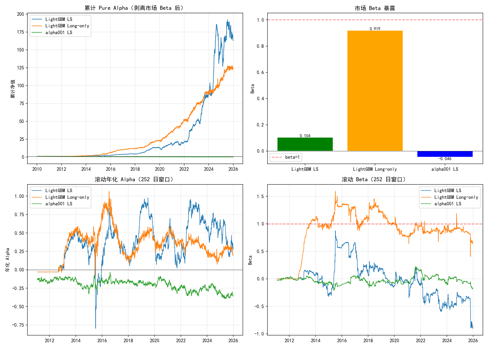

### 核心结论

1. **Pure Alpha 显著为正**：LightGBM LS 剥离市场 beta 后年化 alpha **+41.50%**，t 统计量 7.53，p < 0.0001。
2. **多空组合近乎市场中性**：LS 的 beta 仅 **0.104**，R² 仅 0.004——市场因子只能解释 0.4% 的收益波动，收益几乎全部来自选股 alpha 而非赌方向。
3. **Long-only 承担了满额市场 beta**：LO 的 beta 高达 **0.919**（R²=0.205），这正是一个纯多头股票组合应有的市场暴露——它的收益是"选股 alpha + 市场 beta"的混合。（原错误版把 LO beta 算成 0.19，是不合常理的；修正后 0.92 才符合直觉，也反向验证了新构造的正确性。）
4. **alpha001 的负收益不是 beta 问题**：其 beta 接近 0，但 alpha 显著为负（−18.9% 年化），说明在 0.3% 成本下该因子本身无法产生经风险调整后的正收益。

### 局限

- 用个股等权组合代替真实沪深300指数，市场因子可能有偏差。
- 没有做标准 Fama-French 三因子归因（缺少市值、账面价值数据）。
- 滚动 alpha 显示 2020-2021 年 alpha 有明显下降，模型在近期市场环境中的稳健性需要持续监控。

---

## 最终全量模型

### 训练逻辑

最终模型不用于历史 OOF 评估，而是用于**未来预测 / 滚动回测**。训练方法：

1. 复用 Purged CV 确定的超参数（`max_depth=5`, `num_leaves=31`, `learning_rate=0.05` 等）。
2. 读取 5 个 fold 模型的实际树数量，取平均作为最终模型的 `num_boost_round`。
3. 在全部历史数据（418,456 个有效标签样本）上训练单一模型。
4. 保存为 `models/lgbm_final_model.txt`。

### CV 迭代次数

| Fold | Best Iteration |
|------|----------------|
| 1 | 40 |
| 2 | 53 |
| 3 | 159 |
| 4 | 74 |
| 5 | 71 |
| **Mean** | **79** |

最终模型使用 **79 轮** 训练。

### 最终模型特征重要性

| 排名 | 特征 | Gain | Split |
|------|------|------|-------|
| 1 | market_vol_20d | 55,466 | 3,460 |
| 2 | market_turnover_20d | 50,371 | 3,361 |
| 3 | alpha051 | 33,717 | 1,675 |
| 4 | alpha011 | 22,566 | 1,645 |
| 5 | alpha068 | 21,041 | 1,379 |
| 6 | alpha108 | 20,304 | 1,612 |
| 7 | alpha055 | 19,448 | 1,431 |
| 8 | alpha144 | 16,717 | 1,171 |
| 9 | alpha003 | 16,283 | 1,409 |
| 10 | alpha001 | 15,380 | 1,325 |

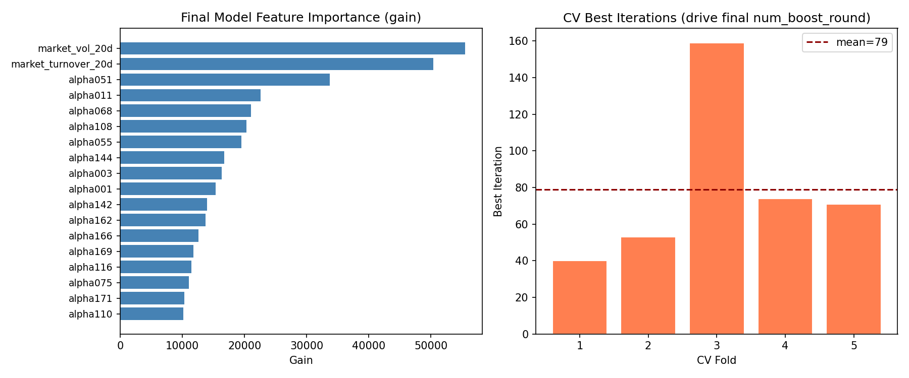

### 说明

- 最终模型与 OOF 模型的特征重要性排序略有不同：全量数据上 `alpha001` 升至第 10，而条件归因中它排名靠后。这反映了样本量扩大后，某些因子的边际贡献会变化。
- 该模型可用于生成未来交易日的截面买入概率，供滚动回测或模拟交易调用。

---

## 调仓频率优化

### 实验设计

当前默认 `hold_days=5`。增加持有期降低换手成本，但也让持仓中掺入更多陈旧信号。测试 hold_days = 5 / 8 / 10 / 15 / 20（全部用修正后的权重追踪法）。

| hold_days | LS 年化 | LS 夏普 | LS 最大回撤 | LO 年化 | LO 夏普 | LO 最大回撤 |
|-----------|---------|---------|-------------|---------|---------|-------------|
| **5** | **+47.0%** | **2.13** | -42.4% | +54.5% | 1.89 | -53.2% |
| 8 | +33.5% | 1.85 | -37.8% | +36.5% | 1.39 | -51.8% |
| 10 | +30.0% | 1.80 | -35.0% | +31.6% | 1.24 | -51.1% |
| 15 | +25.2% | 1.70 | -30.3% | +25.6% | 1.05 | -50.0% |
| 20 | +22.6% | 1.66 | -25.7% | +22.8% | 0.95 | -51.0% |

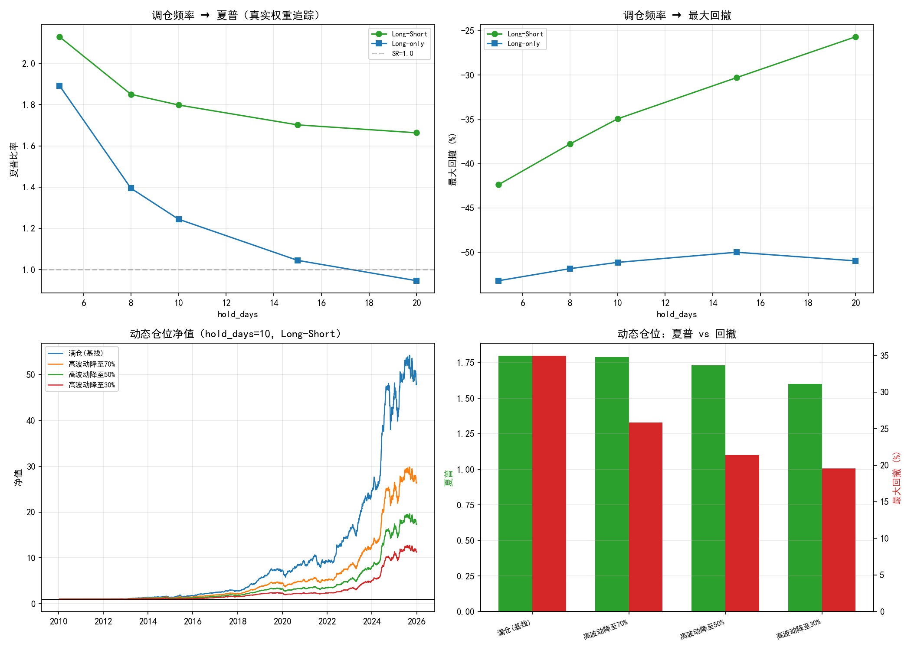

### 结论（修正后，结论与错误版相反）

- **持有期越短，夏普越高**：hold_days=5 夏普 2.13 是最高的，随持有期拉长单调下降到 20 日的 1.66。错误版"越长越好、hold_days=10 推荐"的结论是**移动平均平滑的假象**——平滑量 √hold_days 随持有期增大，虚高越多。
- **真实权衡是夏普 vs 回撤**：短持有=高夏普(2.13)+高回撤(−42%)+高换手；长持有=低夏普(1.66)+低回撤(−26%)。这是一个诚实的风险-收益权衡，没有免费午餐。
- **推荐区间 hold_days=5~10**：想要最高风险调整收益选 5；想要更平滑的回撤体验、更低的实操换手压力，可接受夏普小幅下降换取更小回撤，选 10（夏普 1.80、回撤 −35%）。

---

## 动态仓位策略

### 逻辑

条件归因已证实模型在高/低波动区间依赖不同的因子。基于此，按 `market_vol_20d` 在所有历史数据上的分位数动态调整仓位：

- **波动率低于中位数**（市场平静）→ 保持满仓（100%）
- **波动率高于中位数**（市场动荡）→ 降至 **50%** 仓位

不做加杠杆（低波动时不加仓），只在高波动时防守。

### 结果（hold_days=10，修正后）

| 策略 | 年化收益 | 夏普 | 最大回撤 |
|------|----------|------|----------|
| 基线（满仓） | +30.0% | 1.80 | -35.0% |
| 高波动降至 70% | +24.7% | 1.79 | -25.8% |
| 高波动降至 50% | +21.1% | 1.73 | -21.4% |
| 高波动降至 30% | +17.7% | 1.60 | -19.5% |

### 结论（修正后：防守有成本，非免费午餐）

- **高波动降仓是纯风险削减，不是夏普提升**：从满仓到高波动半仓，回撤从 −35% 压到 **−21%**（−40%），但夏普从 1.80 小幅降到 1.73、年化从 30% 降到 21%。错误版声称"夏普提升到 9.19"是平滑假象叠加的产物。
- **这是一个诚实的取舍**：用一点点风险调整收益（夏普 −4%）换取显著更小的回撤（−40%）和更平滑的持有体验。对回撤敏感的资金值得，对夏普敏感的不值得。
- **该策略零成本实施**：不需要新数据、新模型，只需在组合执行层按 `market_vol_20d` 中位数加一行仓位判断。

---

## 滚动回测（Walk-Forward）：真正样本外检验

### 设计

Purged CV 的 OOF 预测是在一个"防泄露"的交叉验证框架下生成的，但所有 fold 的验证集加起来覆盖了全历史。滚动回测更严格地模拟生产环境：

- **年度再训练**：每年用截至前一年的 expanding-window 数据训练一次
- **前向预测**：用训练好的模型预测下一整年的截面排序
- **组合构建**：hold_days=10, 双边 0.3% 成本, 权重追踪重叠组合（未叠加动态仓位）
- **固定参数**：num_boost_round=79（CV 确定），不做 early stopping
- **测试年份**：2015-2025（11 年）

### 逐年结果（修正后）

| 年份 | 训练样本 | 测试天数 | 年化收益 | 夏普 | 最大回撤 |
|------|----------|----------|----------|------|----------|
| 2015 | 135,494 | 233 | +100.62% | 4.34 | -12.87% |
| 2016 | 165,087 | 233 | +39.33% | 2.35 | -11.66% |
| 2017 | 193,667 | 232 | +37.55% | 3.61 | -9.27% |
| 2018 | 221,997 | 231 | +113.31% | 6.27 | -5.78% |
| 2019 | 249,841 | 232 | +36.87% | 2.89 | -8.49% |
| 2020 | 276,988 | 231 | +26.28% | 1.61 | -11.79% |
| 2021 | 303,515 | 231 | +5.98% | 0.32 | -23.06% |
| 2022 | 329,448 | 230 | +57.18% | 3.24 | -6.44% |
| 2023 | 354,284 | 230 | +30.03% | 1.99 | -10.62% |
| 2024 | 377,706 | 230 | +158.31% | 5.47 | -17.00% |
| 2025 | 399,081 | 225 | -14.50% | -1.11 | -21.32% |

### 汇总对比（修正后）

| 方法 | 年化收益 | 夏普 | 最大回撤 |
|------|----------|------|----------|
| **Walk-Forward 滚动回测** | **+46.91%** | **2.69** | **-23.06%** |
| Purged CV OOF（对比） | +30.01% | 1.80 | -34.95% |
| 市场等权基准 | +11.31% | 1.31 | -41.11% |

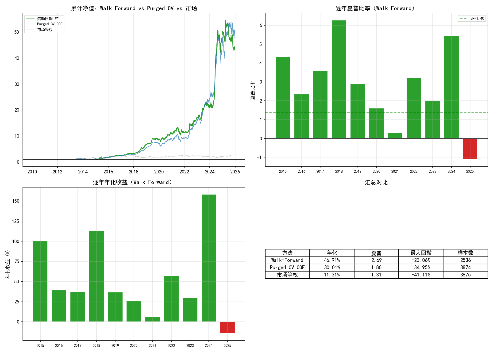

### 核心结论

1. **Walk-Forward 甚至略优于 Purged CV**：夏普 2.69 vs 1.80，年化 +46.9% vs +30.0%，回撤更小（−23% vs −35%）。样本外没有崩塌，说明 CV 框架诚实、无严重未来信息泄露；年度再训练比 CV（fold 间不再训练）更能适应市场变化。
2. **单个年份夏普偏高属正常**：2018（6.27）、2024（5.47）等单年夏普较高，是因为单年仅 ~230 天、好年份自然噪声大、且不含跨年回撤——聚合到 11 年后夏普回落到 2.69，符合 |SR|<3。
3. **2021、2025 是短板年**：2021 夏普 0.32（大盘蓝筹→小盘成长的风格剧烈切换），2025 夏普 −1.11（仅 225 天且模型在新环境失效）。这两年提示模型在风格切换期有脆弱性。
4. **10 年中 9 年正夏普**，证明截面预测能力在时间上大体稳健，但并非每年都灵。

---

## 深度学习对照：MLP vs LightGBM

### 设计

用 3 层 MLP（128→64→32, BatchNorm, Dropout 0.3, ReLU, BCEWithLogitsLoss）在相同的 Purged CV、标签、评估框架下训练。目标：量化神经网络与梯度提升树在截面因子合成上的性能差距。

### 结果

| 指标 | LightGBM | MLP |
|------|----------|-----|
| CV AUC | **0.5520** | 0.5190 |
| OOF Rank IC | **+0.0926** | +0.0346 |
| IC_IR | **0.5246** | +0.2173 |
| LS 夏普 (hold=10, 修正后) | **1.80** | **≈0.05** |
| LS 年化 (hold=10) | **+30.0%** | +0.66% |
| LS 最大回撤 | **-35.0%** | -56.6% |

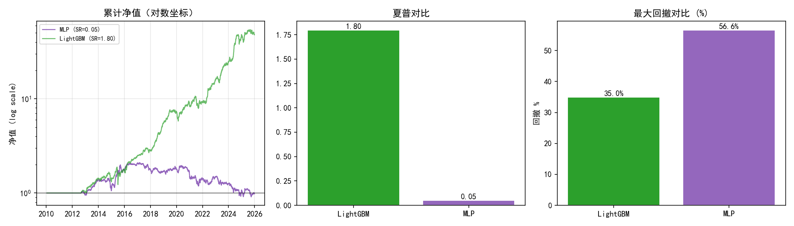

### 结论

- **修正后 MLP 差距更悬殊**：用真实权重追踪法，MLP 多空组合夏普仅 **≈0.05、年化 +0.66%**——几乎是死的。错误的平滑法曾把它抬到 ~3.1，掩盖了真实的无能。LightGBM（1.80）现在的领先是压倒性的。
- 这不是"深度学习比树模型差"的通用结论，而是**在这个具体任务上**（18 维低信噪比截面分类、~40 万样本），树模型的归纳偏置（特征交互、对噪声鲁棒、处理非单调关系）天然适配。
- MLP 的梯度下降在信噪比极低的任务上容易被噪声主导（CV AUC 仅 0.519，比随机好不到 2 个百分点），而 LightGBM 的贪心分裂天然过滤弱特征。
- 这个结果也说明：非线性增益来自**树结构对特征空间的递归划分**，而非单纯的"非线性激活函数"。

### 局限

- 仅训练了基础 MLP（3 层，~25K 参数），未尝试 TabNet、FT-Transformer 等专为表格数据设计的深度架构。
- 学习率、batch size、dropout 等超参数用了默认值，未做网格搜索。
- 结论不排除更复杂的深度架构（如残差连接、embedding、attention）能达到接近或超过 LightGBM 的水平。

---

## 局限与下一步

### 当前局限

1. **AUC 仅 0.519（MLP）/ 0.552（LightGBM）**：二分类区分能力较弱，模型主要在捕捉微弱的截面排序信号。
2. **2021 / 2025 是短板年**：2021 夏普 0.32、2025 夏普 −1.11，说明模型在市场风格切换期有脆弱性。
3. **CAPM 归因使用代理市场因子**：用个股等权组合代替真实沪深300指数，beta/alpha 估计可能有偏差。
4. **未纳入融券可做空的容量限制**：实际做空 20% 股票可能存在融券障碍。
5. **仍含幸存者偏差**：Universe 用当前 CSI 300 成分股回看历史，未切换 PIT 快照——真实样本外表现可能低于本报告。
6. **残余自相关**：修正后组合日收益 lag-1 仍有 0.13–0.24（真实弱动量），naive sqrt(252) 年化夏普可能仍轻微高估 ~15%，严格可再叠加 Newey-West。

### 下一步

1. ~~线性基线~~ ✅ 已完成
2. ~~组合回测 + Bootstrap + 条件归因~~ ✅ 已完成
3. ~~因子 beta 剥离~~ ✅ 已完成
4. ~~训练最终全量模型~~ ✅ 已完成
5. ~~调仓频率优化~~ ✅ 已完成
6. ~~动态仓位策略~~ ✅ 已完成
7. ~~滚动回测~~ ✅ 已完成
8. ~~深度学习对照~~ ✅ 已完成
9. ~~方法论修正：overlapping returns 平滑陷阱定位与重算~~ ✅ 已完成
10. **TabNet / FT-Transformer 对照**：测试专为表格数据设计的深度架构
11. **切换 PIT 成分股**：消除幸存者偏差，得到真正可信的样本外业绩

---

## 复现命令

```bash
cd D:/桌面文件/quant

# 1. 确保特征矩阵已生成
python strategies/feature_selection/select_features.py

# 2. 训练 LightGBM
python models/lgbm_trainer.py

# 3. 线性基线对比
python models/linear_baseline.py

# 4. 组合回测 + 条件 Alpha 归因
python models/portfolio_backtest.py

# 5. 因子归因
python models/factor_attribution.py

# 6. 训练最终全量模型
python models/train_final_model.py

# 7. 调仓频率 + 动态仓位优化
python models/execution_optimization.py

# 8. 滚动回测
python models/walk_forward.py

# 9. 深度学习对照
python models/nn_trainer.py

# 10. 方法论修正诊断（错误法 vs 正确法）
python models/methodology_correction.py
```

## 输出文件

| 文件 | 说明 |
|------|------|
| `models/labels.py` | 标签构建（模型无关） |
| `models/cv.py` | Purged Time-Series Split（模型无关） |
| `models/evaluate.py` | OOF 评估：Rank IC、五分位、多空曲线（模型无关） |
| `models/lgbm_trainer.py` | LightGBM 训练主脚本 |
| `models/linear_baseline.py` | 线性基线对比脚本 |
| `models/portfolio_backtest.py` | 组合回测 + 条件归因脚本（`build_portfolio` 权重追踪 / `build_portfolio_naive` 错误对照） |
| `models/factor_attribution.py` | CAPM 因子归因脚本 |
| `models/train_final_model.py` | 最终全量模型训练脚本 |
| `models/execution_optimization.py` | 调仓频率 + 动态仓位优化脚本 |
| `models/walk_forward.py` | 滚动前向回测脚本 |
| `models/nn_trainer.py` | MLP 深度学习对照脚本 |
| `models/methodology_correction.py` | overlapping returns 平滑陷阱诊断脚本 |
| `models/lgbm_fold_*.txt` | 5 折 CV 保存的模型 |
| `models/lgbm_final_model.txt` | 最终全量模型 |
| `models/oof_predictions.csv` | OOF 预测分数矩阵 |
| `models/baseline_comparison.csv` | 线性基线 vs LightGBM 对比表 |
| `models/portfolio_backtest_summary.csv` | 组合回测绩效汇总 |
| `models/factor_attribution.csv` | CAPM 归因结果 |
| `models/final_model_feature_importance.csv` | 最终模型特征重要性 |
| `models/figures/lgbm_oof_summary.png` | LightGBM OOF 汇总（4 子图） |
| `models/figures/baseline_metrics_comparison.png` | 线性基线 vs LightGBM 指标对比 |
| `models/figures/baseline_cum_curve.png` | 线性基线 vs LightGBM 累计多空曲线 |
| `models/figures/portfolio_backtest_summary.png` | 组合回测汇总（4 子图） |
| `models/figures/conditional_attribution.png` | 条件 Alpha 归因 |
| `models/figures/factor_attribution.png` | CAPM 因子归因（4 子图） |
| `models/figures/final_model_summary.png` | 最终模型特征重要性与 CV 迭代 |
| `models/figures/execution_optimization.png` | 调仓频率 + 动态仓位优化（4 子图） |
| `models/figures/walk_forward_summary.png` | 滚动回测汇总（4 子图） |
| `models/figures/nn_vs_lgbm_comparison.png` | MLP vs LightGBM 对比 |
| `models/figures/methodology_correction.png` | overlapping 平滑陷阱诊断（4 子图） |
| `models/report.md` | 本报告 |

---

## 关键参数

| 参数 | 值 | 位置 |
|------|-----|------|
| 标签持有期 | 5 个交易日 | `models/labels.py` |
| 标签分位数 | top 20% / bottom 20% | `models/labels.py` |
| CV 折数 | 5 | `models/lgbm_trainer.py` |
| Purge 天数 | 6 | `models/lgbm_trainer.py` |
| 组合成本 | 0.3% 双边（换手×cost/2） | `models/portfolio_backtest.py` |
| 组合构建 | 权重追踪重叠组合（非移动平均） | `models/portfolio_backtest.py::build_portfolio` |
| 组合持有 | 5 日（夏普最高）/ 10 日（回撤更平滑） | `models/portfolio_backtest.py` |
| Bootstrap block | 20 日 | `models/portfolio_backtest.py` |
| 无风险利率 | 3% 年化 | `models/factor_attribution.py` |
| 最终模型 boost round | CV 平均 num_trees | `models/train_final_model.py` |
| 动态仓位规则 | 高波动(>中位数)→降仓（可选防守） | `models/execution_optimization.py` |
