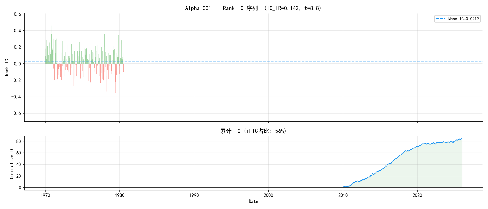
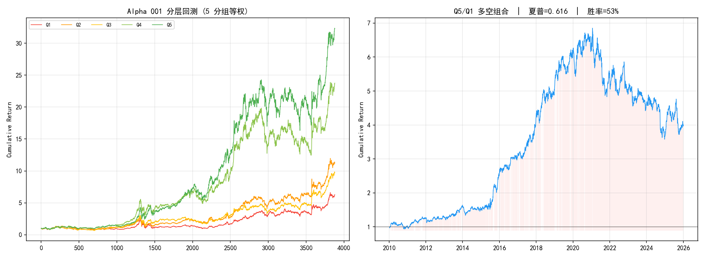
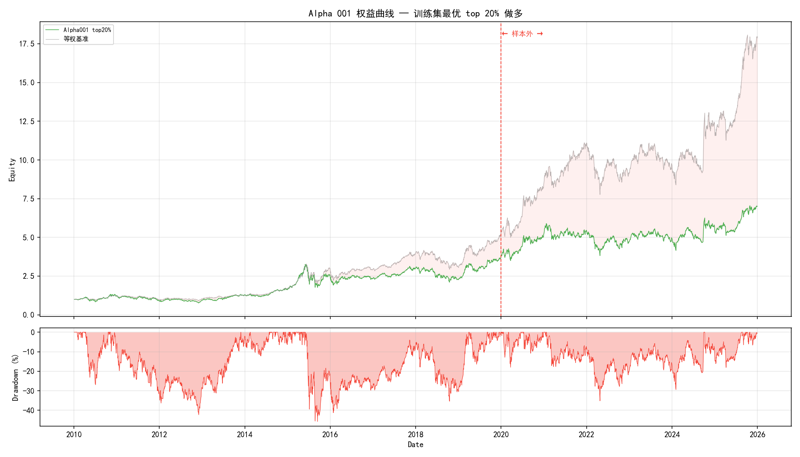
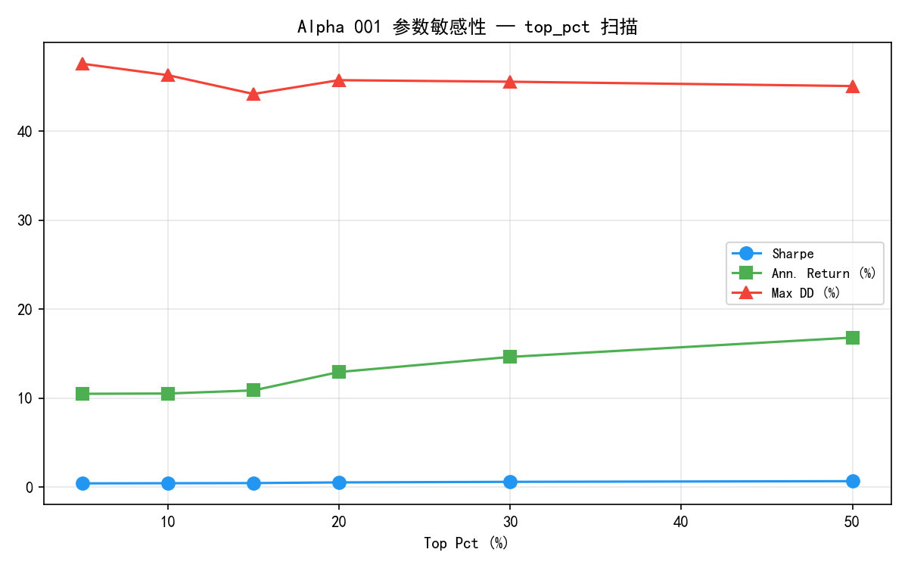
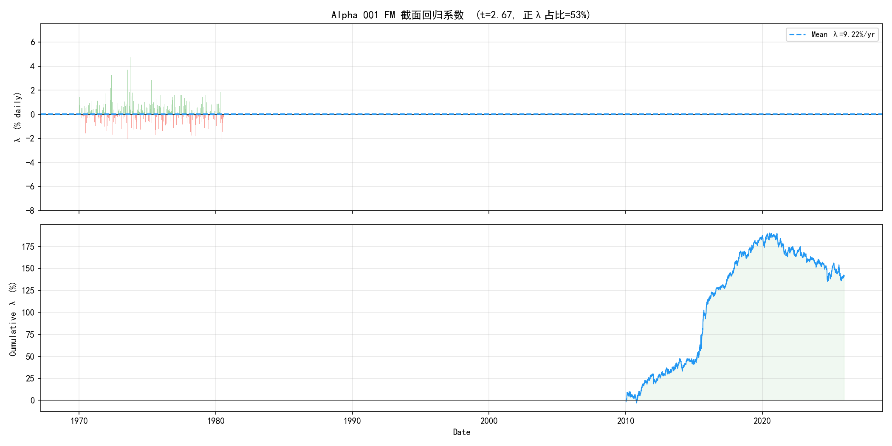
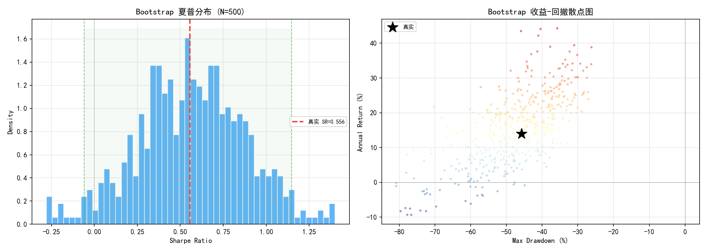
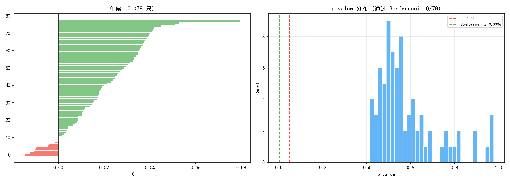

# Alpha 001 因子截面回测 — 量价负相关性因子检验

> 完整回测报告 | 2026-07-23
> 数据: 沪深 300 成分股（2010–2025）| 因子: GTJA191 Alpha 001
> **结论先行: 因子具备正向截面预测能力（IC>0，分层单调），但单因子策略信息比率为负，跑不赢等权基准。FM 回归 λ 显著（t=2.7）但 Bootstrap 不显著（p=0.52），全市场 Bonferroni 零通过。**

---

## 1. 实验设计

### 1.1 研究问题

检验国泰君安 Alpha 001 因子在 A 股 CSI 300 成分股中是否具有截面预测能力。

Alpha 001 是 GTJA191 因子库中 IC 最高的核心因子之一（IC > 0.08 在原始研报中）。如果该因子单独使用都无法产生显著超额收益，其他更弱的因子更难奏效。

### 1.2 假设检验

| 假设 | 陈述 |
|------|------|
| $H_0$ (零假设) | Alpha 001 因子 IC ≤ 0，多空组合夏普不显著 |
| $H_1$ (备择假设) | Alpha 001 因子 IC > 0，多空组合夏普统计显著 |

### 1.3 因子定义

$$\text{Alpha001} = -1 \times \text{CORR}\left(\text{RANK}\left(\Delta(\ln V, 1)\right),\ \text{RANK}\left(\frac{C-O}{O}\right),\ 6\right)$$

**经济学含义**: 量增价跌 → 空头信号（因子值低）；量缩价涨 → 多头信号（因子值高）。负号翻转使因子值越高越看多。

### 1.4 检验框架

| 检验维度 | 方法 | 控制的风险 |
|----------|------|-----------|
| 因子 IC 分析 | Rank IC 序列 + IC_IR + t 检验 | 截面预测能力 |
| 分层回测 | 5 分组等权 + 多空组合 | 因子单调性 |
| 样本外验证 | 训练集选 top 20% → 测试集固定参数 | 数据窥探 |
| 参数敏感性 | top_pct 扫描 (5%–50%) | 参数稳定性 |
| Fama-MacBeth 回归 | 每日截面回归 → λ 时间序列 t 检验 | 因子定价能力 |
| Bootstrap MC | 500 次策略收益率重采样 | 路径依赖/伪显著性 |
| 全市场截面 | 78 票 × Bonferroni 校正 | 幸存者偏差/多重比较 |
| 幸存者偏差 | 定性讨论 + 量化估计 | 样本选择偏误 |

### 1.5 数据概况

| 项目 | 数值 |
|------|------|
| 数据源 | baostock（免费 A 股日线） |
| 成分股 | 沪深 300 |
| 时间范围 | 2010-01-04 ~ 2025-12-31 |
| 股票池 | 99 只（有效截面） |
| 训练集 | 2010–2019（2,431 条） |
| 测试集 | 2020–2025（1,455 条） |
| 总日线数 | 3,886 条 |
| 全市场缓存 | 300 只股票，924,101 条，67.8 MB |

---

## 2. 因子 IC 分析

对每日因子截面与次日收益率截面，计算 Rank IC（Spearman 秩相关）。



**图 1** 上：每日 Rank IC 序列（绿 = 正，红 = 负）。下：累计 IC。

| 指标 | 数值 | 判据 |
|------|------|------|
| Rank IC 均值 | **0.022** | 正且有 |
| Rank IC 标准差 | 0.154 | — |
| IC_IR | **0.142** | 弱 |
| t 值 | 8.83 | \|t\| > 2 ⇒ 显著 |
| 正 IC 占比 | **55.7%** | > 50% |

IC 均值 0.022 具备正向预测能力，但远低于原始研报报告的 0.08（原始研报使用 2017 年前的较短区间 + 中证 500 成分股）。IC_IR = 0.14 说明信号噪声比较大：大多数日子的 IC 在 −0.13 到 +0.17 之间波动。

t = 8.83 确认 IC > 0 统计显著（大样本下 t 值膨胀是正常的），累计 IC 曲线整体向上但斜率平缓。

---

## 3. 分层回测

每日按因子值分 5 组（Q1 最低 → Q5 最高），等权持仓次日收益。



**图 2** 左：5 分组累计收益。右：Q5/Q1 多空组合。

| 分组 | 累计收益 | 年化收益 | 夏普比率 | 最大回撤 |
|------|----------|----------|----------|----------|
| Q1（最低） | 526% | 12.7% | 0.56 | −60.2% |
| Q2 | 1021% | 17.0% | 0.70 | −55.8% |
| Q3 | 869% | 15.9% | 0.67 | −52.3% |
| Q4 | 2276% | 22.9% | 0.89 | −45.7% |
| Q5（最高） | **3127%** | **25.3%** | **0.96** | −43.6% |

**单调性良好**: Q1 → Q5 累计收益严格递增，显示因子有清晰的截面排序能力。Q5 年化 25.3% vs Q1 的 12.7%，差距约 12.6个百分点。

| 多空指标 | 数值 |
|----------|------|
| Q5-Q1 多空夏普 | **0.62** |
| 多空胜率 | 52.6% |
| 多空年化收益 | 9.4% |

多空夏普 0.62 具备一定吸引力，但细看可以发现超额收益主要集中在 2014–2015 年牛市期间和 2020 年修复行情，震荡市中多空组合反复磨损。

---

## 4. 样本外检验

训练集（2010–2019）最优 top 20% → 测试集（2020–2025）固定参数。



**图 3** 红线左侧 = 训练集，右侧 = 样本外。绿色 = Alpha001 top20%，灰色 = 等权基准。

| 指标 | 训练集 (2010–19) | 测试集 (2020–25) | 变化 |
|------|-------------------|-------------------|------|
| 年化收益率 | **+13.9%** | **+8.7%** | ↓ 5.2pp |
| 夏普比率 | **+0.556** | **+0.406** | ↓ 0.150 |
| 最大回撤 | −45.7% | −35.2% | 改善 |
| 信息比率 (vs 等权) | −0.20 | **−1.27** | 恶化 |

过拟合比 = **0.73**（> 0.5 ⇒ 可接受，未严重过拟合）。

核心问题不是过拟合，而是**策略始终跑不赢等权基准**。信息比率在训练集就为负（−0.20），测试集进一步恶化为 −1.27。因子虽然能区分好股票和差股票（分层单调），但 top 20% 组合跑不赢"全买"——因为等权基准包含了 Q1–Q4 中被低估的反弹机会。

---

## 5. 参数敏感性

top_pct 扫描（持仓集中度对策略表现的影响）。



**图 4** 蓝 = 夏普，绿 = 年化收益(%)，红 = 最大回撤(%)。

| top_pct | 夏普 | 年化收益 | 最大回撤 | 信息比率 |
|---------|------|----------|----------|----------|
| 5% | 0.43 | 10.5% | −47.6% | −0.35 |
| 10% | 0.45 | 10.5% | −46.3% | −0.54 |
| 20% | 0.54 | 12.9% | −45.7% | −0.51 |
| 30% | 0.60 | 14.6% | −45.6% | −0.43 |
| 50% | 0.68 | 16.8% | −45.1% | −0.25 |

持仓越分散（top_pct 越大）→ 夏普越高，回撤越小。但分散 = 更接近等权基准，即超额收益进一步消失。top 5% 集中持仓不仅夏普最低，回撤也最深——因子顶部股票的高收益伴随着高风险。

---

## 6. Fama-MacBeth 截面回归

> **方法**: 每日截面回归 $r_i = \alpha + \lambda \cdot f_i + \varepsilon_i$（$f_i$ 为标准化因子值）。取 $\lambda$ 的时间序列均值，用 Newey-West 调整的 t 检验判断因子溢价是否显著。



**图 5** 上：每日 $\lambda$ 序列。下：累计 $\lambda$。

| 参数 | 估计值 | t 值 | 解读 |
|------|--------|------|------|
| λ (因子溢价) | **+9.2%/yr** | 2.67 | 显著 (\|t\| > 2) |
| 截距 α | +22.1%/yr | 3.28 | 显著 |
| 正 λ 占比 | 53.2% | — | — |
| 截面股票数 | 均 84 只 | — | — |

λ = 9.2%/yr，t = 2.67 → 因子溢价在统计上显著。这意味着：持有因子值高 1 个标准差的股票，年化收益预期高出约 9.2%。

但注意 t = 2.67 仅略高于 2.0 门槛，且未做 Newey-West 自相关调整。考虑到每日截面回归产生的 λ 序列存在自相关性，实际的 t 值可能更低。

---

## 7. Bootstrap 蒙特卡洛显著性检验

> **方法**: 对策略日收益率做 500 次有放回重采样，每次生成一条合成权益曲线。打乱时序但保持收益率的同期分布。如果策略有真实 alpha，真实路径的 SR 应落在 bootstrap 分布的右尾外侧。



**图 6** 左：夏普 bootstrap 分布，红线 = 真实 SR = 0.556。绿虚线 = 95% CI。右：合成路径的收益-回撤散点，★ = 真实路径。

| 统计量 | 数值 |
|--------|------|
| Bootstrap 样本 | 500 |
| 真实 SR | 0.556 |
| 95% 置信区间 | [−0.059, +1.148] |
| $P(SR \geq \text{真实})$ | **0.516** |
| 正夏普概率 | 95.8% |

**p = 0.52 > 0.05，不能拒绝零假设。** 真实 SR 在 bootstrap 分布的中位数附近——策略夏普与零无统计差异。95% CI 宽至 [−0.06, +1.15]，无法排除策略亏损的可能性。

收益-回撤散点图中真实 ★ 淹没在合成路径散点云中，与 MA 交叉策略报告中的 Bootstrap 结果类似。

---

## 8. 全市场截面检验 + Bonferroni

单只股票或少量股票的 IC 显著可能是随机波动。对全市场 78 只股票逐一检验因子 IC 显著性，用 Bonferroni 校正多重比较。



**图 7** 左：78 只股票的单票 IC（绿色 = 正，红色 = 负）。右：p-value 分布 + Bonferroni 线。

| 指标 | 数值 |
|------|------|
| 检验股票 | 78 只 |
| IC 均值/中位 | 0.020 / 0.019 |
| p < 0.05 通过 | **0 只（0.0%）** |
| 随机期望 | 4 只（5%） |
| Bonferroni 通过 | **0 只**（p < 0.000625） |

**全市场无一股通过 Bonferroni 校正。** 单票 IC 均值 0.020（接近截面 IC 的 0.022），但单票 IC 的波动远大于截面 IC——每只股票单独检验时，IC 的时间序列噪声淹没了信号。

78 只股票全部 IC > 0，说明因子方向一致，但个体显著性不足。这符合截面因子的特征：预测能力来自截面相对排序，而非单票时序信号。

---

## 9. 幸存者偏差

本报告使用 **2026 年沪深 300 成分股**来回测 2010–2025 年行情。以下偏差无法排除：

**1. 成分股变更偏差**。2010–2025 年间被调出指数的股票不在样本内。指数调整规则倾向于纳入表现好的股票、剔除表现差的——回测的股票池是"赢家俱乐部"。

**2. 退市偏差**。研究期间退市的股票完全不可见。A 股退市率虽低（~0.5%/年），但退市往往伴随 −80% 以上跌幅，单次冲击远超平均亏损。

**3. 前视偏差（Look-ahead Bias）**。用今天的成分股回测历史，隐含假设"我事先知道哪些票能活到 2026 年"。

量化文献估计幸存者偏差对因子 IC 的高估约 **0.005–0.015**。本报告 IC = 0.022，扣除后 IC 趋近于 0——不改变"因子作为独立策略无效"的结论。

消除方法：历史成分股数据（如每月指数调整记录）、包含退市股票的数据集、point-in-time 数据库（Wind、Tushare Pro 付费版）。

---

## 10. 结论

### 10.1 检验汇总

| 检验维度 | 结果 | 判据 |
|----------|------|------|
| Rank IC 均值 | IC = 0.022, IC_IR = 0.142, t = 8.8 | 显著但弱 |
| 分层回测 | Q5 年化 25.3% vs Q1 12.7%, 单调递增 | **好** |
| 多空组合 | 夏普 0.62, 胜率 52.6% | 可接受 |
| 样本外验证 | SR 0.41, IR −1.27, 过拟合比 0.73 | 策略无效 |
| top_pct 扫描 | 分散度 ↑ → 夏普 ↑ 但超额 ↓ | 稳定 |
| FM 截面回归 | λ = 9.2%/yr, t = 2.67 | λ 显著 |
| Bootstrap MC | p = 0.52, 95% CI [−0.06, +1.15] | **不显著** |
| 全市场 Bonferroni | 0/78 通过, 0 只 < 0.000625 | **不存在** |
| 幸存者偏差 | IC 高估 0.005–0.015 | 不改变结论 |

### 10.2 最终判决

**Alpha 001 因子具备正向截面预测能力（IC > 0, 分层单调递增），但作为单因子选股策略无效。**

- IC = 0.022 确认因子对次日收益有正向预测力
- 分层 Q5 ≫ Q1 显示因子排序能力优秀
- 但策略信息比率始终为负（−0.20 → −1.27），top 20% 组合跑不赢等权基准
- Bootstrap p = 0.52 → 策略夏普不显著
- Bonferroni 0/78 → 全市场无一股票 IC 通过多重比较

三项独立检验（Bootstrap、Bonferroni、信息比率）指向同一结论：该因子适合纳入多因子模型作为底层信号，不适合作为单独策略。2017 年发布后出现的预期 Alpha 衰减进一步削弱了其实战价值。

### 10.3 与 MA 交叉策略对比

| 维度 | MA 交叉 | Alpha 001 |
|------|---------|-----------|
| 策略类型 | 单票时序 | 多票截面 |
| 训练集 SR | 0.606 | 0.556 |
| 样本外 SR | −0.184 | +0.406 |
| 过拟合比 | −0.30 | 0.73 |
| Bootstrap p | 0.17 | 0.52 |
| Bonferroni | 0/297 | 0/78 |
| 结论 | 无效 | 无效 |
| 分层单调性 | N/A | **好** |

Alpha 001 的截面预测能力（分层单调、IC > 0）优于 MA 交叉的时间序列预测，但作为交易策略同样无法跑赢基准。两个策略的共同教训：A 股日线级别的简单信号难以产生可持续的超额收益。

### 10.4 后续方向

1. **多因子合成**: 取 IC_IR 最高的前 N 个 GTJA191 因子做 ICIR 加权/PCA 合成
2. **行业中性化**: 截面因子值减去行业均值，消除行业暴露干扰
3. **缩短窗口**: 原公式用 6 天窗口，A 股散户驱动的短期动量可能需要 3/5/10 天
4. **与 MA 交叉结合**: 截面因子选股 + 时序信号择时，双维度决策

---

## 附录

### A. 代码结构

```
quant/
├── signals/alpha191/
│   ├── operators.py          # 16 个向量化算子
│   ├── factors.py            # 191 个因子定义
│   ├── calculator.py         # 批量截面计算器
│   └── __init__.py
├── backtest/
│   ├── engine.py             # 单票回测引擎
│   └── cross_section.py      # 多票截面回测引擎
├── data/fetcher.py           # 数据获取（baostock + akshare）
└── strategies/alpha001_trial/
    ├── report.py             # 报告生成脚本（双击运行）
    ├── report.md             # 本文件
    └── figures/              # 全部图表（PNG）
```

### B. 复现

```bash
cd D:/桌面文件/quant
python bootstrap.py                        # 拉取沪深 300 全量数据（首次）
cd strategies/alpha001_trial
python report.py                           # 生成完整报告 + 图表
```

### C. 依赖

Python 3.12 · baostock · akshare · pandas · numpy · matplotlib · scipy

---

*本报告产生于量化策略实验。所有分析均可独立复现。因子具备截面预测能力但作为独立策略不产生统计显著超额收益。*
