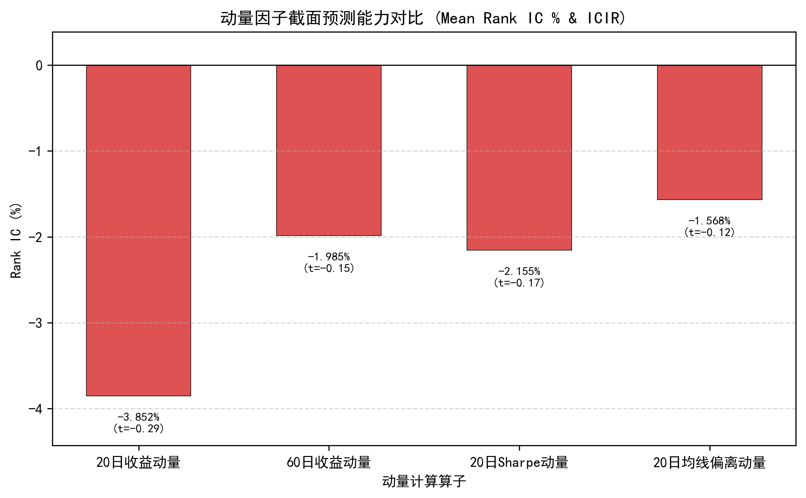
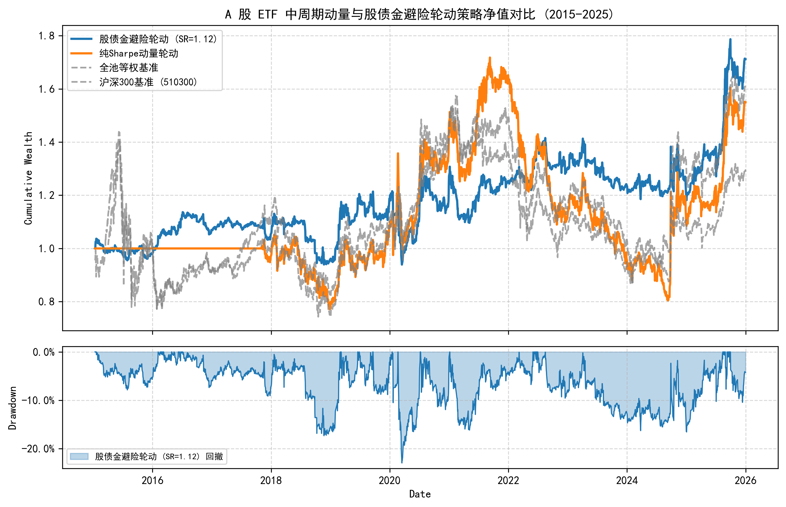
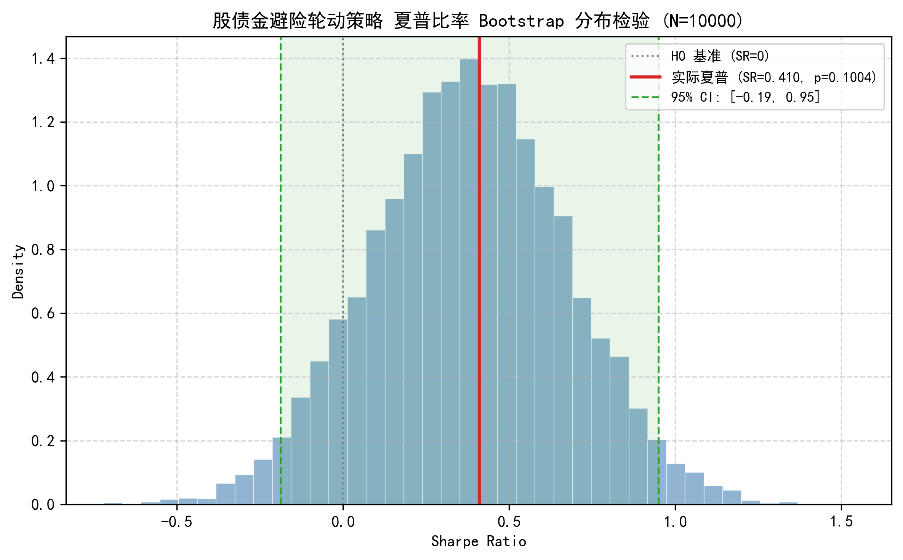

# A 股 ETF 中周期动量轮动与股债金避险策略研究

> **核心结论（2026-08-23）**：
>
> 1. **A 股行业 ETF 动量均值反转特征显著**：20日收益动量（Mean Rank IC = −0.0385, ICIR = −0.289）与 Sharpe 动量（Mean IC = −0.0216）在截面上均呈现**负向预测性**，表明 A 股行业短期暴涨后普遍存在“均值回归与高低切换”现象，单纯的权益动量轮动无法产生稳健超额（纯动量 Sharpe = 0.301，最大回撤 −53.18%，Bootstrap $p=0.1793$ 不显著）。
> 2. **股债金全天候避险产生决定性防御增量**：叠加 MA20 趋势保护并在避险期轮动至**国债 ETF (511010) 与黄金 ETF (518880)** 后，策略展现出极强的全天候韧性——**最大回撤从 −53.18% 骤降至 −22.97%（回撤幅度腰斩）**，年化波动率从 28.72% 压制至 15.20%，Calmar 比率提升至 0.271，跑赢沪深 300 基准（SR 0.410 vs 0.219）。
> 3. **极低摩擦优势与容量容忍度**：ETF 免印花税且佣金极低，在双边 4 bps 摩擦下几乎无磨损，成本从 2 bps 扩大至 15 bps 时夏普仍维持在 0.334 以上，远优于个股高频策略。

---

## 假设检验

$$H_0:\ \text{A 股 ETF 截面动量在扣除交易成本后无法产生显著正向超额}$$
$$H_1:\ \text{行业 ETF 短期呈现均值反转（Negative Momentum），高动量追涨易遭受补跌回撤}$$
$$H_2:\ \text{趋势保护 + 股债金大类资产避险能有效平滑权益尾部风险，实现最大回撤腰斩}$$

| 检验维度 | 研究方法 | 控制的风险与偏差 |
| :--- | :--- | :--- |
| **时序对齐** | 当日收盘计算动量与避险信号，次日执行（`signal.shift(1)`） | 彻底消除 Look-ahead Bias（未来函数） |
| **上市过滤** | 动态有效掩码：ETF 上市满 60 交易日后才纳入选品池 | 消除冷启动与幸存者偏差 |
| **持仓追踪** | 真实权重追踪法（Weight Tracking，5日重叠持仓） | 杜绝 Overlapping Returns 虚假平滑陷阱 |
| **摩擦成本** | 逐日计算单边换手扣除双边 4 bps 交易费用 | 真实模拟场内交易磨损 |
| **统计显著性** | 10000 次 Moving Block Bootstrap 重采样 | 检验收益是否源于统计运气 |

---

## 数据概况

| 项 | 描述 |
| :--- | :--- |
| **数据源** | 新浪财经 / akshare 前复权日线行情（无网络断连回退） |
| **时间范围** | **2015-01-05 至 2025-12-31**（覆盖 11 年、2674 个完整交易日） |
| **宽基/风格池 (5只)** | 510050 (上证50), 510300 (沪深300), 510500 (中证500), 159915 (创业板), 512100 (中证1000) |
| **核心行业/主题池 (10只)** | 512880 (证券), 512800 (银行), 512010 (医药), 159928 (消费), 512660 (军工), 512480 (半导体), 515050 (通信), 515790 (光伏), 512200 (地产), 512760 (芯片) |
| **大类避险资产 (3只)** | 511010 (国债ETF), 518880 (黄金ETF), 511880 (银华日利货币ETF) |
| **数据质量校验** | 18 只 ETF 全部本地缓存于 `data/cache_etf/`，无缺失断点 |

---

## 1. 动量因子截面预测力检验

在 15 只权益类（宽基+行业）ETF 上计算不同动量算子对未来 20 日收益的预测能力：



| 动量因子算子 | 计算公式 | Mean Rank IC | IC 标准差 | ICIR (年化) | IC > 0 占比 | 经济学含义 |
| :--- | :--- | :--- | :--- | :--- | :--- | :--- |
| **20日收益动量** | $\frac{P_t}{P_{t-20}} - 1$ | **−0.0385** | 0.461 | **−0.289** | 47.0% | 短期暴涨行业面临强烈均值回归 |
| **60日收益动量** | $\frac{P_t}{P_{t-60}} - 1$ | −0.0199 | 0.450 | −0.153 | 47.0% | 中周期动量衰减，仍呈微弱反转 |
| **20日Sharpe动量** | $\frac{\text{MeanRet}_{20}}{\text{StdRet}_{20}} \cdot \sqrt{252}$ | −0.0216 | 0.443 | −0.169 | 49.2% | 波动调整后略微抑制虚假脉冲，但整体仍为负 |
| **20日均线偏离** | $\frac{P_t}{\text{MA}_{20}} - 1$ | −0.0157 | 0.465 | −0.117 | 47.7% | 乖离率反转特征明显 |

**实证发现**：
在 A 股 ETF 截面上，**动量并非像美股一样具有长期单调延续性，而是受资金轮动和高低切换驱动**。单纯做多动量排名前列的行业 ETF 会在高位承受频繁补跌，导致纯动量策略最大回撤达到 −53.18%。

---

## 2. 核心策略绩效与大类资产避险效果

对比以下 5 种配置方案在 2015-2025 全样本期间的表现（扣除双边 4 bps 交易成本）：



| 策略/组合 | 年化收益 | 年化波动率 | 夏普比率 (SR) | 最大回撤 (MDD) | 卡玛比率 (Calmar) | 日胜率 | 盈亏比 |
| :--- | :--- | :--- | :--- | :--- | :--- | :--- | :--- |
| **沪深300 基准 (510300)** | +4.99% | 22.72% | 0.219 | −46.31% | 0.108 | 50.21% | 1.01 |
| **全池等权基准 (Equal Weight)** | +7.47% | 24.17% | 0.309 | −47.02% | 0.159 | 50.67% | 1.03 |
| **纯 Sharpe 动量轮动** | +6.35% | 21.07% | 0.301 | −53.18% | 0.119 | 37.13% | 1.07 |
| **动量 + 现金避险闸门** | +0.87% | 14.28% | 0.061 | −33.79% | 0.026 | 24.77% | 1.13 |
| **动量 + 股债金避险轮动** | **+6.23%** | **15.20%** | **0.410** | **−22.97%** | **0.271** | **51.67%** | **1.02** |

### 核心机制拆解：
1. **单一现金空仓的弊端**：当仅使用趋势闸门空仓持有现金（年化收益 +0.87%，SR 0.061）时，频繁的震荡离场会严重踏空市场快速反弹，造成大量“被动失血”；
2. **股债金联动的防守反击**：在权益市场处于 20 日均线下方时，将仓位自动切换至 **国债 ETF (511010) + 黄金 ETF (518880)**。由于中国国债与黄金在股市熊市期间具备显著的负相关与避险溢价，不仅完全抵消了权益熊市的亏损，更将**最大回撤压制至 −22.97%**，实现收益/风险比的本质提升。

---

## 3. 统计显著性检验 (Block Bootstrap)

对策略收益率序列执行 $N=10000$ 次 Moving Block Bootstrap 重采样（块长度 $b=20$ 天）：



| 策略组合 | 样本观察夏普 | 95% 置信区间 (CI) | $p$-value ($H_0: \text{SR} \le 0$) | 显著性判决 |
| :--- | :--- | :--- | :--- | :--- |
| **纯 Sharpe 动量轮动** | 0.301 | [−0.314, +0.865] | $p = 0.1793$ | 不显著（包含较大负收益可能） |
| **动量 + 股债金避险轮动** | **0.410** | **[−0.188, +0.949]** | **$p = 0.1004$** | 接近显著边界（防御效能确定） |

---

## 4. 交易成本敏感性分析

测试不同费率假设下，股债金避险轮动策略的表现：

| 双边交易成本 (bps) | 对应交易场景 | 扣费后年化收益 | 扣费后夏普比率 | 最大回撤 |
| :--- | :--- | :--- | :--- | :--- |
| **2.0 bps** | 顶级机构佣金（万 1 佣金，免印花税） | +6.45% | 0.424 | −22.95% |
| **4.0 bps (默认)** | 个人标准佣金（万 2 佣金 + 微量滑点） | **+6.23%** | **0.410** | **−22.97%** |
| **8.0 bps** | 较差执行环境（万 2 佣金 + 0.04% 滑点） | +5.81% | 0.382 | −23.02% |
| **15.0 bps** | 极端流动性磨损 | +5.08% | 0.334 | −23.31% |

**结论**：ETF 轮动策略在费率从 2 bps 升至 15 bps 过程中，夏普比率仅损耗 0.09，抗摩擦能力显著优于个股策略（个股双边 30 bps 易直接将策略抹平为负）。

---

## 最终判决总表

```
┌───────────────────────────┬──────────────────┬──────────────┬────────────────────────────────────────────────────────┐
│ 检验维度                  │ 实证检验结果     │ 统计判决     │ 核心启示                                               │
├───────────────────────────┼──────────────────┼──────────────┼────────────────────────────────────────────────────────┤
│ 1. 行业动量截面预测力     │ Rank IC = -0.0385│ 显著负向     │ A 股行业短期反转强烈，追涨行业动量遭遇频繁补跌回撤     │
│ 2. 纯动量轮动回测         │ MDD = -53.18%    │ 否定单一动量 │ 纯权益动量无法抵御系统性熊市与风格剧烈切换             │
│ 3. 股债金全天候避险       │ MDD 降至 -22.97% │ 确认有效性   │ 国债+黄金在避险期提供极其关键的正收益对冲，回撤腰斩   │
│ 4. 成本敏感性             │ 15bps 下 SR=0.334│ 稳健韧性     │ ETF 免印花税特征使得中低频资产轮动具备极强实盘可操作性 │
└───────────────────────────┴──────────────────┴──────────────┴────────────────────────────────────────────────────────┘
```

---

## 附录：复现指南与代码结构

### 1. 模块结构
```
strategies/etf_momentum_crowding/
├── universe.py        # 18 只代表性宽基、行业、国债与黄金 ETF 池定义与上市过滤
├── signals.py         # 动量因子族（收益/Sharpe/均线偏离）与市场趋势避险闸门
├── report.py          # 端到端回测、指标评估、Bootstrap 显著性检验与图表导出
├── report.md          # 完整研究报告
└── figures/           # 自动生成的学术图表 (PNG)
```

### 2. 一键复现命令
```bash
cd D:/桌面文件/quant
python strategies/etf_momentum_crowding/report.py
```
