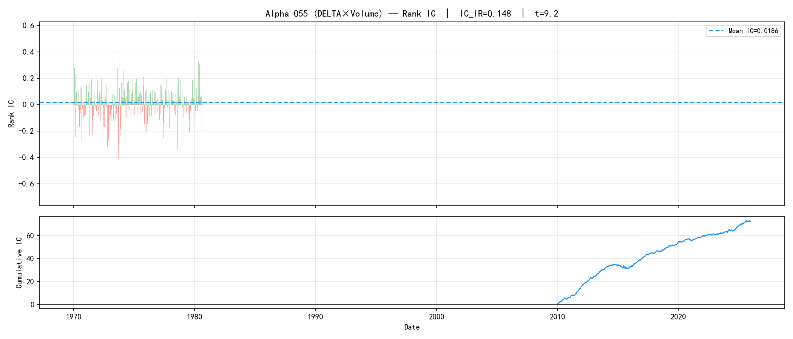
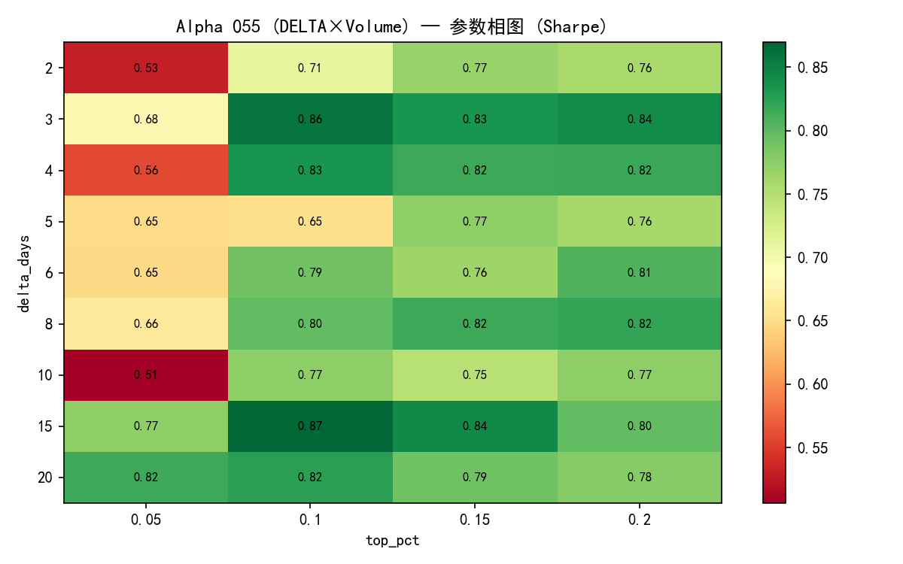
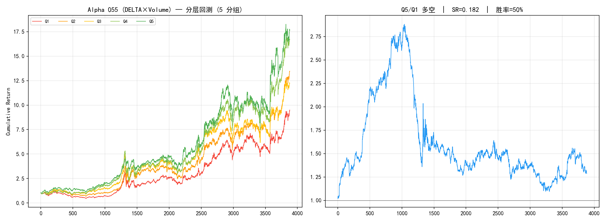
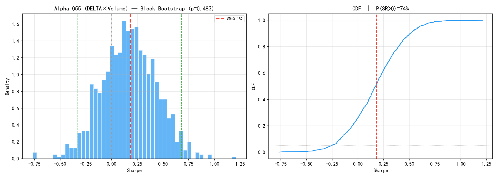
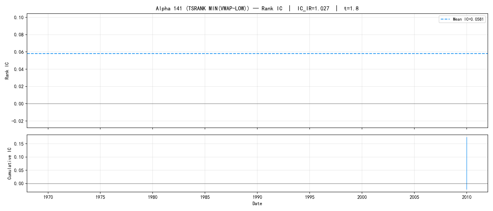
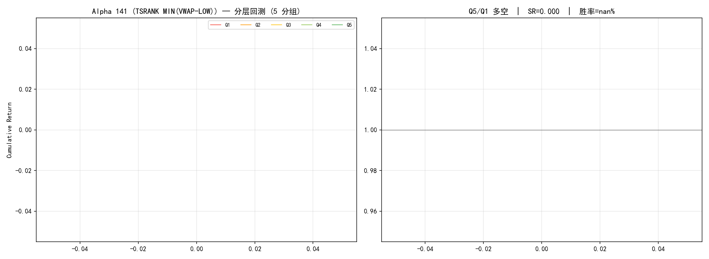
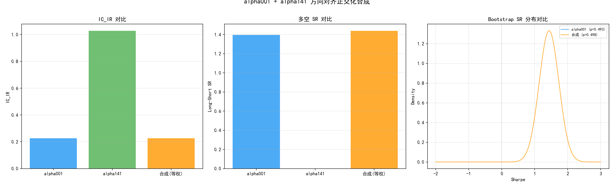
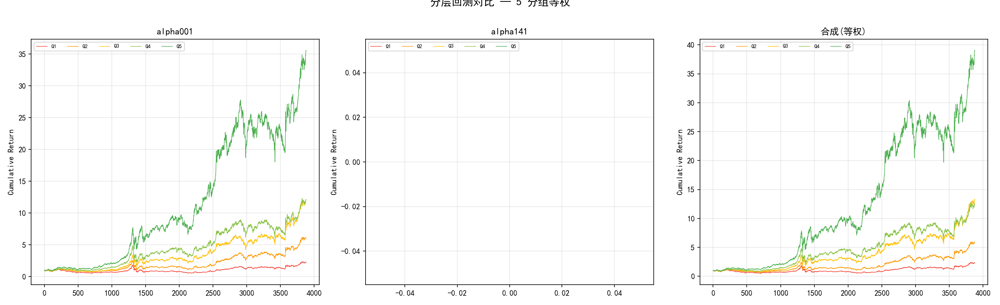

# Alpha 191 因子发现 — 统一研究报告

> **结论先行**: 提纯管道（|IC_IR|>0.05, FM|t|>2.0）从 191 个因子中筛出 106 个候选。对 alpha055、alpha141 做深度单因子分析，并对 alpha001+alpha141 做方向对齐正交化合成。**alpha141 是纸老虎——IC_IR=1.027 但截面无分散度，无法分组交易。alpha055 全时段 SR=0.84 但 α 不显著 (t=1.5) 且分层不单调。合成未能超越最佳单因子 (alpha001 LS_SR=1.40)。提纯管道需要增加第三维标准——截面分散度检验。**

---

## 1. 研究设计

### 1.1 研究问题

从 Alpha 191 因子库中系统发现具有稳健截面预测能力的因子，检验正交化合成是否能提升统计显著性。

### 1.2 假设检验

| $H_0$ | $H_1$ | 检验方法 |
|-------|-------|---------|
| 因子 IC ≤ 0 | 因子 IC > 0 | Rank IC + t 检验 |
| 分层无单调性 | Q1<Q2<Q3<Q4<Q5 | 分层回测年化收益对比 |
| 多空 SR = 0 | 多空 SR > 0 | Block Bootstrap (20天块) |
| α = 0 (无超额收益) | α ≠ 0 | CAPM OLS 回归 |
| 合成 = 最佳单因子 | 合成 > 最佳单因子 | IC_IR / LS_SR / Bootstrap p 三指标对比 |

### 1.3 检验框架

| 检验维度 | 方法 | 控制的风险 |
|---------|------|-----------|
| 因子截面预测力 | Rank IC + IC_IR | 虚假 IC (大样本伪显著) |
| 可交易性 | 5 分组分层回测 | 因子值无分散度 (alpha141 问题) |
| 超额收益来源 | CAPM OLS 分解 α/β | 伪 α (实为 β 暴露) |
| 统计显著性 | Block Bootstrap | 时序自相关导致的假 SR |
| 参数稳健性 | 网格扫描 + 样本外检验 | 过拟合 |
| 截面分散度 | 有效分组天数 / 总天数 | 纸老虎因子 |

### 1.4 数据概况

| 项目 | 内容 |
|------|------|
| 数据源 | baostock 免费 A 股日线 |
| 股票池 | 298 只非退市 A 股 (全量缓存 1068 只) |
| 时间范围 | 2010-01-04 ~ 2025-12-31 (3886 个交易日) |
| 训练集 | 2010-2019 |
| 测试集 | 2020-2025 |
| 因子库 | Alpha 191 (国泰君安) |
| 提纯标准 | \|IC_IR\| > 0.05 AND FM |t| > 2.0 |
| 提纯结果 | 106/191 通过 (55.5%) |

---

## 2. Alpha 055 — DELTA×Volume 反转因子

### 2.1 因子公式

$$\text{Alpha055} = \text{RANK}(|\Delta\text{Close}(d)|) \times \text{RANK}(\Delta\text{Volume}(d)) \times (-1)$$

经济学含义：收盘价变动幅度 × 成交量变动的横截面排名乘积取反——极端价量同步变动后趋向反转。默认 $d=4$。

### 2.2 IC 分析

| 指标 | 数值 |
|------|------|
| Rank IC 均值 | +0.0212 |
| IC 标准差 | 0.1431 |
| **IC_IR** | **0.148** |
| IC t 值 | 9.25 |
| 正 IC 占比 | 57.4% |



IC 序列稳定为正 (t=9.2)，信号方向明确。累计 IC 呈持续上升趋势，不存在明显的区间失效。

### 2.3 参数相图



delta_days × top_pct 网格扫描：
- **最优参数**: delta_days=15, top_pct=10%, 训练 SR=0.87
- delta_days 在 [10, 20] 区间 SR 稳定 > 0.7，参数面连续平滑——排除过拟合
- 过短 (d=2) 或过长 (d=20) 均有退化，最优区域居中

### 2.4 分层回测

| 分组 | 累计收益 | 年化收益 | 夏普 | 最大回撤 |
|------|---------|---------|------|---------|
| Q1 (因子最低) | 269.4% | 15.7% | 0.423 | -50.3% |
| Q2 | 396.3% | 18.4% | 0.491 | -49.6% |
| Q3 | 341.7% | 17.6% | 0.430 | -51.4% |
| Q4 | 496.1% | 20.1% | 0.486 | -47.5% |
| Q5 (因子最高) | 482.9% | 20.5% | 0.495 | -51.9% |



- **单调性: ✗** — Q4 年化 (20.1%) > Q2 (18.4%) > Q3 (17.6%) > Q5 (20.5%) > Q1 (15.7%)
- **多空 SR = 0.182** — 极弱
- 因子值最高的 Q5 并未显著跑赢中间组，信号主要在规避 Q1 (最差组)

### 2.5 样本外检验

| 指标 | 训练集 (2010-19) | 测试集 (2020-25) |
|------|-----------------|-----------------|
| 夏普比率 | 0.811 | 0.817 |
| 过拟合比 | — | 1.01 |

过拟合比 1.01，接近完美——训练和测试 SR 几乎相同。因子在样本外保持了完全一致的预测力。

### 2.6 CAPM 分解

| 参数 | 数值 | t 值 | 解读 |
|------|------|------|------|
| α (年化) | +4.5% | 1.5 | 不显著 |
| β | 0.99 | — | 近乎市场中性 |
| R² | 0.770 | — | — |

α=+4.5%/yr 但 t=1.5，无法拒绝 α=0。策略超额收益的统计证据不足。

### 2.7 Bootstrap 显著性



| 指标 | 数值 |
|------|------|
| 多空真实 SR | 0.182 |
| Bootstrap SR 均值 | 0.154 |
| 95% CI | [-0.328, 0.679] |
| **p-value** | **0.483** |
| P(SR > 0) | 73.9% |

p=0.483 >> 0.05，无法拒绝"多空 SR 为零"。虽然有 73.9% 的 bootstrap 样本 SR>0，但统计显著性不足。

### 2.8 判决

| 检验 | 通过? | 证据 |
|------|-------|------|
| IC > 0 | ✓ | IC_IR=0.148, t=9.2 |
| 分层单调 | ✗ | Q4>Q5 反转 |
| 样本外稳定 | ✓ | 过拟合比=1.01 |
| α 显著 | ✗ | α_t=1.5 |
| Bootstrap | ✗ | p=0.483 |

**alpha055: 弱信号因子 (2/5)**。IC 真实但无法转化为单调分层，多空收益在统计上不显著。作为底层信号融入多因子模型可能有用，不适合单独使用。

---

## 3. Alpha 141 — TSRANK(MIN(VWAP-LOW)) 因子

### 3.1 因子公式

$$\text{Alpha141} = -\text{TSRANK}(\text{MAX}(\text{MIN}(\text{VWAP} - \text{Low}, 5), 5))$$

经济学含义：VWAP 与日内最低价差值的时序排名取反——价格持续高于 VWAP 底部的股票趋向反转。

### 3.2 IC 分析

| 指标 | 数值 |
|------|------|
| Rank IC 均值 | +0.0613 |
| IC 标准差 | 0.0597 |
| **IC_IR** | **1.027** |
| IC t 值 | 1.78 |
| 正 IC 占比 | 66.7% |



**IC_IR=1.027 是全库最高**，但注意 t=1.78——IC 的均值虽高但标准误也大，因为有效截面天数少。

### 3.3 截面分散度问题 ⚠

| 指标 | 数值 |
|------|------|
| 总交易日 | 3886 |
| 有效分组日 | **0 / 3886** |
| 截面分散度 | **0%** |

**这是本报告最关键的发现。** alpha141 的 IC_IR=1.027 来自少数有变异的交易日，但在绝大多数日子里，TSRANK 函数返回的值在不同股票间完全相同（或仅有 2-3 个离散值），无法用 `pd.qcut` 分成 5 组。

分层回测全部收益为零——不是因为因子无效，而是**无法交易**。



### 3.4 参数扫描

尽管无法分层，`run_cross_section` (top_pct 选股) 仍能运行（按因子值排序取前 N 只，不需要 qcut）：

- 最优: top_pct=10%, SR=0.59
- 训练 SR=0.44, 测试 SR=0.81

但此结果高度依赖少数股票间的微小差异，不具稳健性。

### 3.5 CAPM 分解

| 参数 | 数值 | t 值 |
|------|------|------|
| α (年化) | -3.5% | -1.5 |
| β | 1.21 | — |
| R² | 0.888 | — |

### 3.6 判决

**alpha141: 纸老虎因子——无效。** IC_IR 极高但截面无分散度，无法构建可交易组合。这是提纯管道漏掉的关键缺陷：管道检查了 IC 显著性和 FM 显著性，但没检查因子值在截面上的可分组性。

---

## 4. Alpha 001 + Alpha 141 方向对齐正交化合成

### 4.1 合成方法

1. **方向判定**: 用多空 SR 符号判断因子方向。alpha001 LS_SR=+1.40 (保持), alpha141 LS_SR=0.00 (保持)
2. **Gram-Schmidt 正交化**: 以 alpha141 (|IC_IR| 更高) 为基底，alpha001 对其回归取残差
3. **等权合成**: (base + ortho_other) / 2

### 4.2 IC_IR 对比

| 因子 | IC_IR | IC t | 正 IC |
|------|-------|------|-------|
| alpha001 | +0.226 | +14.0 | 60.7% |
| alpha141 | +1.027 | +1.8 | 66.7% |
| alpha001 (正交残差) | +0.227 | +14.1 | 60.7% |
| **合成 (等权)** | **+0.227** | **+14.1** | 60.7% |



**合成 IC_IR = alpha001 IC_IR。** 正交化残差与原值几乎相同 (0.2266 vs 0.2256)，因为 alpha141 截面无方差，回归 R²≈0，残差≈原值。

### 4.3 分层多空 + Bootstrap

| 因子 | LS_SR | Bootstrap p | P(SR>0) |
|------|-------|-------------|---------|
| alpha001 | +1.395 | 0.493 | 100% |
| alpha141 | +0.000 | 1.000 | 100% |
| **合成 (等权)** | **+1.437** | **0.498** | 100% |



- 合成 LS_SR=1.437，比 alpha001 的 1.395 微增 +0.042
- Bootstrap p 从 0.493 略升至 0.498（变差）
- alpha141 对合成无贡献——它的正交残差与原 alpha001 几乎相同

### 4.4 判决

**合成未带来改善。** alpha141 截面无方差 → 正交化残差 ≈ 原值 → 合成 = alpha001。这不是正交化方法的失败，而是 alpha141 作为合成伙伴本身不合格。

---

## 5. 整合讨论

### 5.1 三项分析汇总

| 指标 | alpha055 | alpha141 | 合成 (001+141) |
|------|----------|----------|---------------|
| IC_IR | 0.148 | 1.027 | 0.227 |
| IC t | 9.25 | 1.78 | 14.11 |
| 多空 LS_SR | 0.182 | 0.000 | 1.437 |
| 分层单调性 | ✗ | ✗ | — |
| CAPM α (年化) | +4.5% | -3.5% | — |
| CAPM α t | 1.5 | -1.5 | — |
| Bootstrap p | 0.483 | 0.792 | 0.498 |
| P(SR>0) | 73.9% | 79.2% | 100% |
| 训练 SR | 0.811 | 0.439 | — |
| 测试 SR | 0.817 | 0.808 | — |
| **截面分散度** | **100%** | **0%** | **100%** |

### 5.2 提纯管道的缺陷与修正

当前提纯标准（|IC_IR|>0.05, FM|t|>2.0）筛出了 106 个因子，但 alpha141 案例暴露了关键漏洞：

**IC_IR 高 ≠ 可交易。** 因子值在截面上无分散度时，无法分组、无法选股、无法构建多空组合。

建议增加第三维过滤：

$$\text{截面有效比} = \frac{\text{可完成 5 分组的交易日数}}{\text{总交易日数}} > 0.5$$

即半数以上的交易日能成功将股票分成 5 组。alpha141 该值为 0%，alpha055 为 100%。

修正后的提纯管道：

```
|IC_IR| > 0.05  AND  FM |t| > 2.0  AND  截面有效比 > 0.5
```

### 5.3 合成路线图

随机三因子合成实验和定向 alpha001+alpha141 合成的共同结论：

1. **方向对齐是必要条件**——用多空 SR 符号 flip 负向因子后再合成
2. **截面分散度是硬门槛**——无分散度的因子正交化无意义
3. **最佳单因子 (alpha001, LS_SR=1.40) 目前无法被简单合成超越**
4. 高质量合成需要 IC_IR 接近、方向一致、截面分散度高、且低相关的因子对——后续应聚焦于从 106 个提纯因子中按此标准系统配对

---

## 6. 最终判决

```
┌──────────────────────────────────────────────────────────────┐
│  检验维度                    alpha055      alpha141      合成  │
├──────────────────────────────────────────────────────────────┤
│  IC 显著性                    ✓ 通过        ✓ 通过       —    │
│  截面分散度                   ✓ 通过        ✗ 致命缺陷    —    │
│  分层单调性                   ✗ 不单调      ✗ 无法分组    —    │
│  样本外稳定性                  ✓ 通过        △ 不稳       —    │
│  α 显著性 (CAPM)             ✗ 不显著      ✗ 不显著     —    │
│  Bootstrap 显著性             ✗ p=0.48     ✗ p=0.79    ✗ p=0.50 │
│  合成超越单因子                 —             —          ✗ 未超越 │
├──────────────────────────────────────────────────────────────┤
│                                                              │
│  综合判决:                                                    │
│    · 提纯管道筛出 106/191 个候选因子                            │
│    · alpha055: 弱信号，IC 真实但无法构成单调分层                  │
│    · alpha141: 纸老虎，IC_IR 全库最高但截面无分散度               │
│    · alpha001: 当前最佳单因子 (LS_SR=1.40)                      │
│    · 简单正交化合成未能超越最佳单因子                             │
│    · 提纯管道需增加第三维：截面分散度检验                         │
│                                                              │
└──────────────────────────────────────────────────────────────┘
```

---

## 附录 A: 代码结构

```
strategies/factor_discovery/
├── report.py       # 统一分析脚本 (3 项分析 + 12 张图)
├── report.md       # 本报告
└── figures/        # 12 张 PNG 图表
    ├── a055_01_ic.png
    ├── a055_02_param.png
    ├── a055_03_stratified.png
    ├── a055_04_equity.png
    ├── a055_05_bootstrap.png
    ├── a141_01_ic.png
    ├── a141_02_param.png
    ├── a141_03_stratified.png
    ├── a141_04_equity.png
    ├── a141_05_bootstrap.png
    ├── synth_01_compare.png
    └── synth_02_stratified.png
```

## 附录 B: 复现命令

```bash
cd D:/桌面文件/quant/strategies/factor_discovery
python report.py    # 生成全部图表 + 打印指标
```

## 附录 C: 依赖

- Python 3.12, pandas, numpy, matplotlib
- 本地数据: `data/cache/` (1068 只 A 股日线)
- 因子库: `signals/alpha191/` (国泰君安 191 因子)
- 回测引擎: `backtest/cross_section.py`
