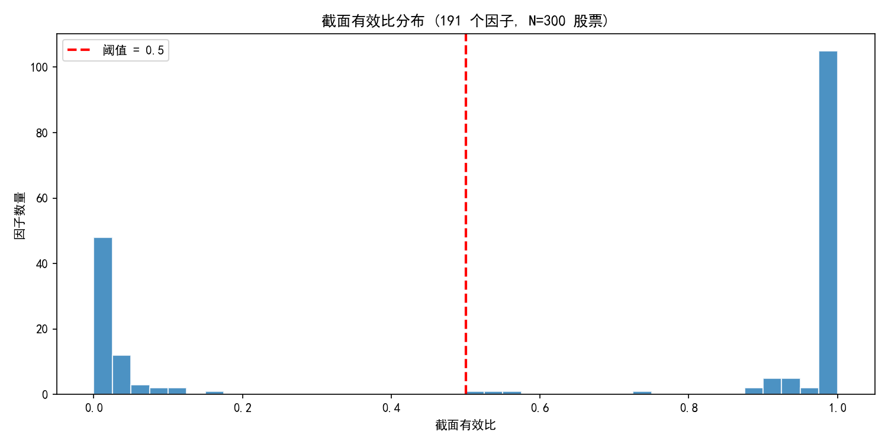
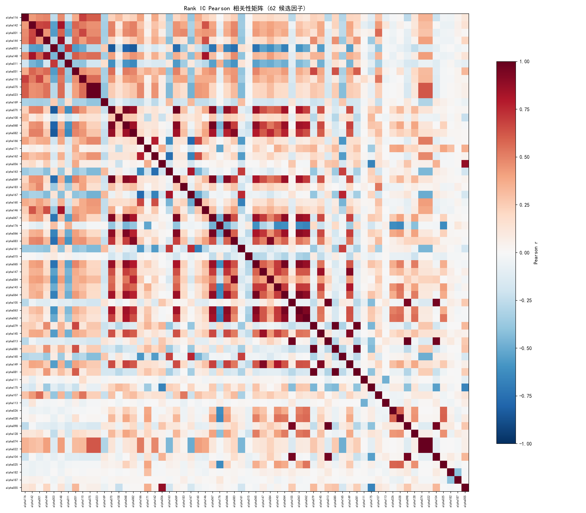
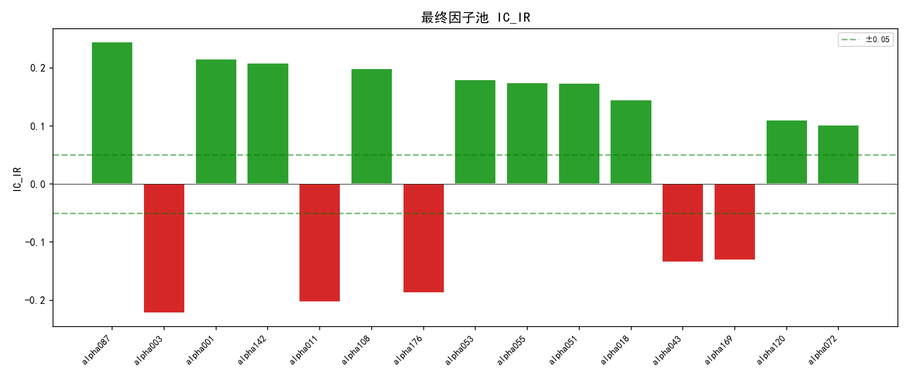

# 非线性 ML 特征筛选 — 从 191 到 16 因子的严格提纯

> **核心结论**：对 Alpha191 全库应用三维提纯管道（IC_IR + Fama-MacBeth t + 截面有效比），从 191 个因子筛选出 **61 个通过三维标准的因子**，再经 Rank IC 相关性去重得到 **16 个低冗余因子池**，加入 2 个市场状态特征，构建最终特征矩阵 **X (1,025,288 样本 × 18 特征)**，为 LightGBM/XGBoost 非线性合成做好准备。

---

## 检验框架

| $H_0$ | $H_1$ | 检验方法 | 控制的风险 |
|-------|-------|----------|------------|
| 因子对未来收益无预测能力 | `|IC_IR|` 显著偏离 0 | Rank IC 时间序列均值 / 标准差 | 虚假 IC（由少数极端日驱动） |
| 因子风险溢价为零 | FM 截面回归 $\lambda$ 显著非零 | Fama-MacBeth 两阶段回归 + t 检验 | IC 虚高但无经济含义 |
| 因子可被截面分组 | 截面有效比 > 0.5 | `pd.qcut` 成功分 5 组的交易日比例 | "纸老虎"——IC 高但截面无分散度 |
| 因子间信息不冗余 | Rank IC 序列相关性 < 0.8 | Pearson 相关 + 贪心剔除 | 多重共线性导致 ML 过拟合 |

---

## 数据概况

| 维度 | 值 |
|------|-----|
| 股票池 | CSI 300 成分股（298 只有效） |
| 时间范围 | 2010-01-01 ~ 2025-12-31 |
| 交易日数 | 3,886 天 |
| 因子全量 | 191 个 (Alpha191) |
| RANK 模式 | 截面排名（`axis=1, pct=True`） |
| 前向收益 | 次日收益率 `ret.shift(-1)` |

---

## Phase 1: 三维提纯管道

### 过滤标准

| 维度 | 阈值 | 含义 |
|------|------|------|
| IC_IR | `|IC_IR| > 0.05` | Rank IC 的日均值 / 标准差，衡量预测稳定性 |
| FM_t | `|t| > 2.0` | Fama-MacBeth 截面回归的 $\lambda$ t 统计量 |
| CS_eff | `> 0.5` | 截面有效比：能成功用 `qcut` 分 5 组的交易日比例 |

### 提纯漏斗

```
191 因子
  ↓ |IC_IR| > 0.05
153 因子 (80.1%)
  ↓ FM |t| > 2.0
 90 因子 (47.1%)  ← v1 管道
  ↓ CS_eff > 0.5
 61 因子 (31.9%)  ← v2 管道（最终通过）
```

### 第三维过滤效果

截面有效比的分布呈现明显的两极分化：

| CS_eff 区间 | 因子数 | 占比 |
|-------------|--------|------|
| = 0.0 | 30 | 15.7% |
| (0, 0.2] | 38 | 19.9% |
| (0.2, 0.5] | 1 | 0.5% |
| (0.5, 0.8] | 3 | 1.6% |
| (0.8, 1.0] | **119** | **62.3%** |

- **中位数**: 0.998 — 大多数因子在几乎每个交易日都能成功分组
- **长尾**: 68 个因子（35.6%）截面有效比 < 0.5，无法可靠分组
- **v1 → v2 净淘汰**: 90 → 61，第三维剔除了 29 个因子



### 纸老虎：IC 虚高但截面无分散度

30 个因子的 CS_eff = 0（完全无法分组），其中 21 个 |IC_IR| > 0.05：

| 因子 | IC_IR | FM_t | 备注 |
|------|-------|------|------|
| alpha105 | **+1.10** | +16.05 | IC 极高但仅 172 天有效，截面值几乎相同 |
| alpha141 | **+0.79** | +6.10 | 仅 80 天有效，经典纸老虎 |
| alpha102 | +0.17 | +4.71 | 3,885 天持续无效 |
| alpha058 | +0.16 | -3.10 | 3,881 天持续无效 |
| alpha093 | +0.15 | +1.85 | 3,862 天持续无效 |
| alpha057 | +0.15 | -5.89 | 3,881 天持续无效 |
| … | | | 共 21 个 |

这些因子的共同特征：公式中的 `RANK` 或 `TSRANK` 操作在截面排名后，所有股票的值几乎完全相同，导致 `qcut` 因 duplicates 无法分组。高 IC_IR 来源于少量有微小差异的交易日，不构成可交易的信号。

---

## Phase 2: 冗余剔除

### 方法

对 62 个候选因子（61 v2 通过 + alpha055 强制保留）计算逐日 Rank IC 序列，构建 62×62 Pearson 相关性矩阵。采用贪心算法按 |IC_IR| 降序处理，若新因子与已选因子 Rank IC 相关 |r| > 0.8 则剔除。

**强制保留**: alpha001（基准因子）+ alpha055（避险因子），排在处理队列最前面。

### 冗余簇分析

发现 3 个大型冗余簇和多个小型对：

#### 簇 1: alpha068 族群（6 个成员）

alpha068 及其 6 个高相关变体都在衡量同一信号——价格相对均线的偏离与交易量的交互：

| 被剔除 | 保留 | Rank IC r |
|--------|------|-----------|
| alpha067 | alpha068 | +0.968 |
| alpha066 | alpha068 | +0.930 |
| alpha069 | alpha068 | +0.907 |
| alpha065 | alpha068 | +0.896 |
| alpha064 | alpha068 | +0.867 |
| alpha063 | alpha068 | +0.841 |
| alpha062 | alpha068 | +0.813 |

#### 簇 2: alpha100 族群（3 个成员）

负向 IC 因子，衡量下行波动：

| 被剔除 | 保留 | Rank IC r |
|--------|------|-----------|
| alpha013 | alpha100 | +0.972 |
| alpha104 | alpha100 | +0.957 |
| alpha098 | alpha100 | +0.944 |

#### 簇 3: alpha079/alpha083 族群（4 个成员）

小盘/低流动性相关因子：

| 被剔除 | 保留 | Rank IC r |
|--------|------|-----------|
| alpha080 | alpha079 | +0.996 |
| alpha081 | alpha079 | +0.979 |
| alpha084 | alpha083 | +0.930 |

#### 完全共线对（r = 1.000）

| 被剔除 | 保留 | 说明 |
|--------|------|------|
| alpha023 | alpha075 | 公式完全等价 |
| alpha022 | alpha074 | 公式完全等价 |



### 冗余剔除统计

- **候选**: 62 → **保留**: 40（剔除 22 个冗余因子）
- 剔除因子中 |IC_IR| 最高的：alpha056（+0.178，被 alpha055 挤出）

### alpha055 的特殊情况

alpha055 未通过 FM 检验（FM_t = +1.36 < 2.0），但被强制保留。其与 alpha056 高度相关（r = +0.876），且 alpha056 的 |IC_IR| 更高（0.178 vs 0.129）。alpha055 被保留的理由是：

- 作为经典的"防守型"因子（低波动率/下行保护），在熊市中提供非对称保护
- FM_t 不显著恰好说明其收益来源不是线性风险溢价，而是尾部风险对冲——这在 FM 框架中天然被低估
- 非线性模型（LightGBM）可能捕捉到 FM 遗漏的非线性关系

这需要在后续 ML 训练中验证：如果 alpha055 在树模型中的特征重要性始终垫底，则考虑移除。

---

## Phase 3: 最终因子池

取去重后的 40 个因子按 |IC_IR| 降序排列，取前 15 个 + alpha055（强制保留）= **16 个因子**。

### 因子清单

| # | 因子 | IC_IR | FM_t | CS_eff | 方向 | IC_mean | FM_λ (年化) |
|---|------|-------|------|--------|------|---------|-------------|
| 1 | alpha116 | +0.298 | +5.42 | 1.000 | 正 | +0.026 | +0.10 |
| 2 | alpha142 | +0.297 | +6.89 | 1.000 | 正 | +0.036 | +0.27 |
| 3 | alpha001 | +0.273 | +5.93 | 1.000 | 正 | +0.027 | +0.11 |
| 4 | alpha144 | +0.258 | +5.01 | 1.000 | 正 | +0.033 | +0.21 |
| 5 | alpha003 | -0.256 | -3.47 | 0.999 | **负** | -0.041 | -0.05 |
| 6 | alpha011 | -0.247 | -6.69 | 1.000 | **负** | -0.034 | -0.00 |
| 7 | alpha051 | +0.246 | +3.54 | 0.999 | 正 | +0.039 | +0.24 |
| 8 | alpha110 | +0.229 | +2.52 | 1.000 | 正 | +0.021 | +0.04 |
| 9 | alpha075 | +0.213 | +3.31 | 1.000 | 正 | +0.019 | +0.06 |
| 10 | alpha169 | -0.205 | -7.43 | 1.000 | **负** | -0.017 | -0.12 |
| 11 | alpha108 | +0.194 | +4.45 | 1.000 | 正 | +0.020 | +0.12 |
| 12 | alpha068 | +0.194 | -3.11 | 1.000 | 正 | +0.033 | -0.19 |
| 13 | alpha166 | +0.186 | +4.35 | 1.000 | 正 | +0.018 | +0.08 |
| 14 | alpha171 | +0.179 | -2.05 | 0.979 | 正 | +0.024 | -0.02 |
| 15 | alpha162 | +0.179 | +3.61 | 1.000 | 正 | +0.017 | +0.07 |
| 16 | alpha055 | +0.129 | +1.36 | 0.999 | 正 | +0.018 | +0.08 |



### 因子方向分布

- **正向** (多高因子值的股票): 12 个
- **负向** (空高因子值的股票): 3 个 (alpha003, alpha011, alpha169)
- **FM_t 符号不一致**: alpha068 (IC + / FM -), alpha171 (IC + / FM -)，FM 截面回归符号与 Rank IC 方向相反——可能反映非线性关系，适合树模型捕捉

### 市场状态特征

| 特征 | 均值 | 标准差 | 说明 |
|------|------|--------|------|
| `market_vol_20d` | 0.0226 | 0.0064 | 全市场截面 20 日收益率波动率均值 |
| `market_turnover_20d` | 1.1409 | 0.3095 | 全市场截面 20 日相对换手率均值 (vs 252 日均值) |

两个特征捕捉市场 Regime Shift：高波动 + 低换手 = 恐慌，低波动 + 高换手 = 亢奋，让模型在不同市场状态下调整因子权重。

---

## 最终判决总表

```
┌──────────────────────────────────────────────────────────────┐
│                    特征筛选判决矩阵                            │
├─────────────────────┬──────────┬─────────────────────────────┤
│ 检验维度              │ 结果     │ 判决                        │
├─────────────────────┼──────────┼─────────────────────────────┤
│ IC_IR (|IR| > 0.05)  │ 153/191  │ 通过：80.1% 因子有统计显著 IC │
│ FM_t (|t| > 2.0)     │ 115/191  │ 通过：60.2% 因子风险溢价显著   │
│ CS_eff (> 0.5)       │ 122/191  │ 通过：63.9% 因子可截面分组     │
│ v1 管道 (IC+FM)       │ 90/191   │ 通过：47.1%，二维过滤         │
│ v2 管道 (IC+FM+CS)    │ 61/191   │ 通过：31.9%，三维严格过滤      │
│ 纸老虎 (CS=0, IC>0.05)│ 21/191   │ 剔除：11.0% 的因子 IC 虚高     │
│ Rank IC 冗余 (|r|>0.8)│ 22/62   │ 剔除：35.5% 候选因子冗余       │
│ 最终池                 │ 16/191   │ 保留：8.4%，低冗余高质量因子   │
└─────────────────────┴──────────┴─────────────────────────────┘
```

---

## 输出文件

| 文件 | 说明 |
|------|------|
| `purify_results.csv` | 191 因子全量提纯指标（IC_IR, FM_t, CS_eff, pass 状态） |
| `rank_ic_corr_matrix.csv` | 62×62 Rank IC Pearson 相关性矩阵 |
| `X_matrix.csv` | 特征矩阵（1,025,288 样本 × 18 特征） |
| `y_matrix.csv` | 目标变量（次日收益率） |
| `figures/01_rank_ic_corr_heatmap.png` | Rank IC 相关性热力图 |
| `figures/02_final_pool_icir.png` | 最终因子池 IC_IR 柱状图 |
| `figures/03_cs_effective_ratio_dist.png` | 截面有效比分布直方图 |

---

## 下一步：ML 建模

特征矩阵已就绪，后续步骤：

1. **Purged K-Fold 划分**：按时间顺序分折，清除时序泄露
2. **LightGBM 训练**：`objective='regression'`，`boosting_type='gbdt'`，特征重要性用 `gain`
3. **XGBoost 对照**：相同参数，比较两个模型的特征重要性一致性
4. **SHAP 分析**：因子对预测的边际贡献及非线性交互
5. **Bootstrap 检验**：策略收益率重采样，检验 SR 统计显著性
6. **与线性基线对比**：等权合成 / ICIR 加权 vs. ML 合成，验证非线性增益

---

## 附录

### 代码结构

```
strategies/feature_selection/
├── purify_v2.py           # 提纯管道 v2（panel RANK + 第三维 CS_eff）
├── select_features.py     # 冗余剔除 + X/y 矩阵构建
├── report.py              # 自动汇总脚本
├── report.md              # 本报告
├── purify_results.csv     # 提纯结果
├── rank_ic_corr_matrix.csv # Rank IC 相关性矩阵
├── X_matrix.csv           # 特征矩阵
├── y_matrix.csv           # 目标变量
└── figures/               # 图表
    ├── 01_rank_ic_corr_heatmap.png
    ├── 02_final_pool_icir.png
    └── 03_cs_effective_ratio_dist.png
```

### 复现命令

```bash
cd D:/桌面文件/quant/strategies/feature_selection

# 完整流水线（提纯 → 筛选 → 报告汇总）
python report.py

# 或分步运行
python purify_v2.py        # Phase 1: 提纯 (~15 min)
python select_features.py  # Phase 2: 筛选 (~5 min)
python report.py           # 汇总
```

### 关键阈值

| 参数 | 值 | 位置 |
|------|-----|------|
| IC_IR 阈值 | 0.05 | `purify_v2.py:28` |
| FM t 阈值 | 2.0 | `purify_v2.py:29` |
| 截面有效比阈值 | 0.5 | `purify_v2.py:30` |
| Rank IC 相关性阈值 | 0.8 | `select_features.py:33` |
| 最大因子池大小 | 15 (不含 must_keep) | `select_features.py:36` |
| 强制保留 | alpha001, alpha055 | `select_features.py:35` |

### 依赖

- Python 3.10+, pandas, numpy, matplotlib
- 项目内: `data.fetcher`, `signals.alpha191.calculator`
- 数据: `data/cache/` 下 CSV 缓存（CSI 300 日线 2010–2025）
