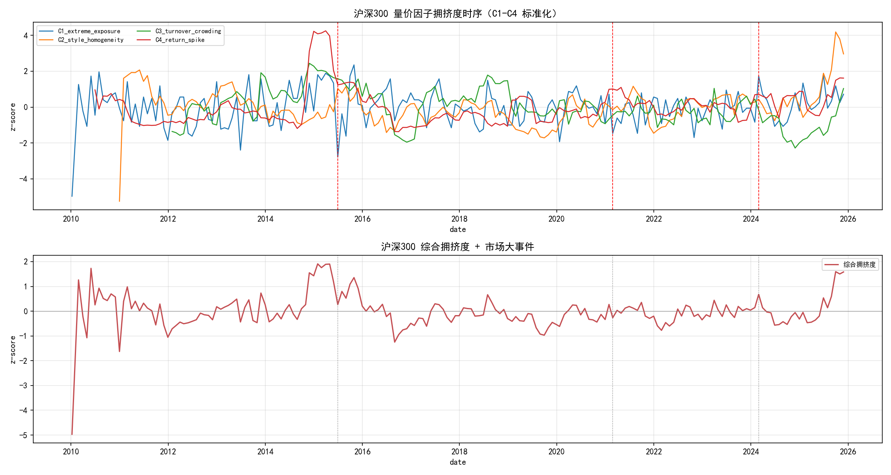
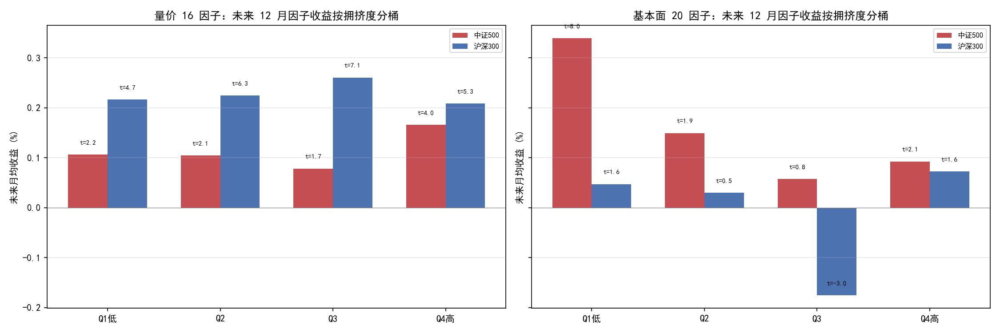
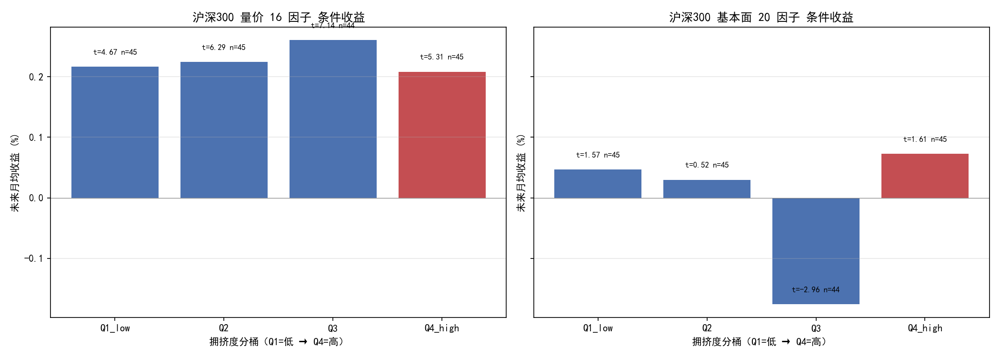
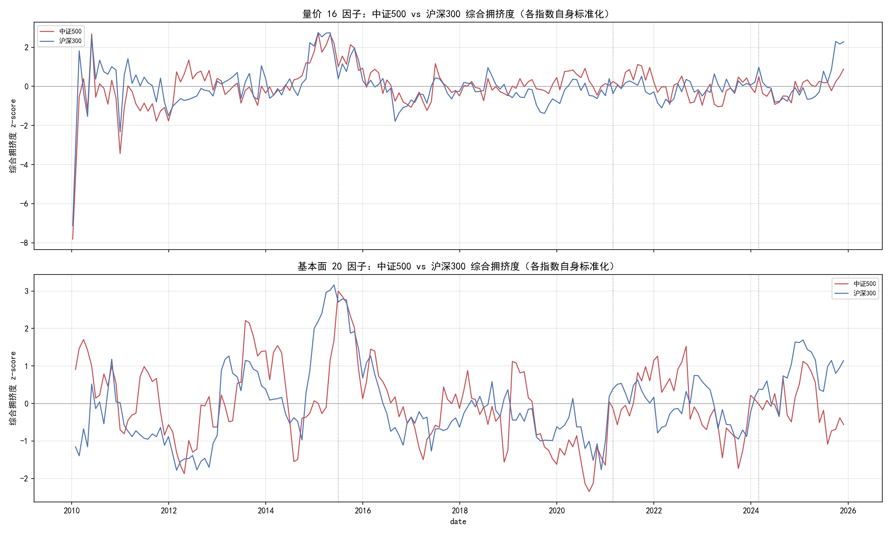
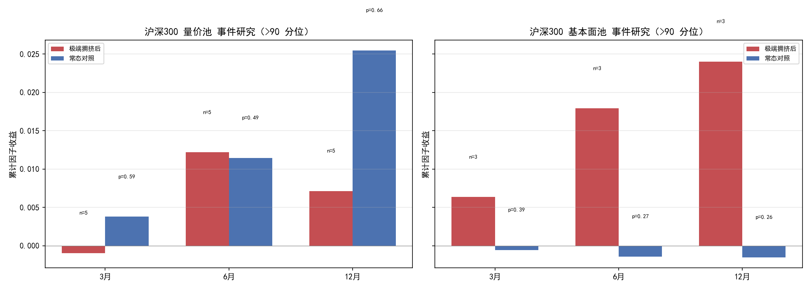
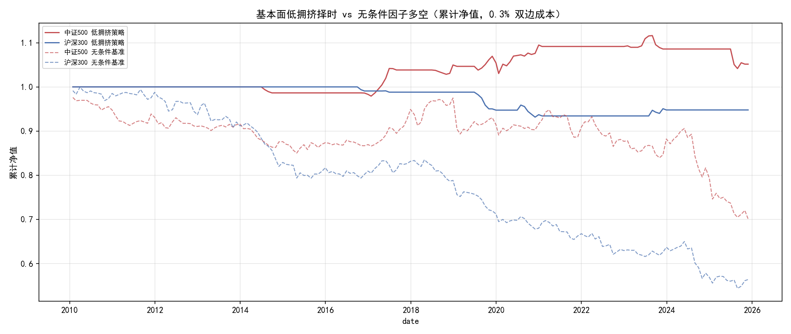

# 方向C 延伸④：跨指数验证 — 沪深300 因子拥挤度（vs 中证500）

> **核心结论（2026-08-16）**：沪深300 上**「量价延续 vs 基本面反转」双面体不成立**，
> 跨指数验证未复制出中证500 的增强效果——且揭示其来源是**两指数的市场结构差异**：
>
> - **量价池**：沪深300 上量价因子拥挤-收益结构**扁平化**（Q1-Q4 全部 t≥4.7，单调性消失，
>   Q4/Q1 差 −0.008%，无「高拥挤延续」增量）——大盘蓝筹因子收益常态为正，
>   **拥挤度对量的预测力消失**。
> - **基本面池**：沪深300 基本面集体拥挤（Q3 未来月均 −0.18%，t=−2.96 显著为负），
>   但 **Q1 低拥挤月收益 +0.047% 弱且不显著（t=1.57）**——「低拥挤 = 高收益」反转结构
>   在中证500（Q1 t=7.95）是**小盘估值因子的特征，不是通用结构**。
> - **可交易性失败**：沪深300 低拥挤择时 **SR −1.69（月频口径 −0.37）**，无条件基准
>   **−3.60**（p=0.0002 **显著为负**）——基本面因子多空在沪深300 是大盘条件下
>   **负 alpha 最轻灾**（无论择时与否都亏），低拥挤月仅 16/191。
> - **bootstrap 未翻倍**：事件数不增反减（基本面 4→3），低拥挤月 42→16；
>   两指数 bootstrap p 均 ~0.10（0.1006 vs 0.1054）——**样本量不是可交易性显著的
>   瓶颈，结构本身不成立才是**。
>
> **方法论收获**：跨指数对比本身是有价值的判别工具——中证500 的双面体不是
> 「风格拥挤度通用规律」，而是**因子多空在该指数小盘条件下的特性**，替换成
> 大盘指数后结构消失、因子多空的负 alpha 反而 **p=0.0002 极其显著**。

> **位置说明**：承接方向C（中证500 双面体 + 低拥挤择时初探，p=0.10 不显著）。
> 延伸④把同一套代码复用到沪深300（PIT 面板 + 16 alpha 全库可算 + 基本面缓存
> 均就位，零新拉取），检验「扩样本过显著性」假设。代码复用 `zz500_crowding_trial`
> 的 crowding / fundamental_crowding / event_study / tradability 四模块，
> 仅 config 换 INDEX="hs300"，同一代码路径、同一口径。

## 假设检验

$$H_0:\ \text{拥挤-收益结构（双面体）与指数无关}$$
$$H_1:\ \text{双面体跨指数成立（量价延续 + 基本面反转在沪深300 同样出现）}$$
$$H_2:\ \text{扩样本提高显著性（事件数/低拥挤月数翻倍 → bootstrap 过 0.05）}$$
$$H_3:\ \text{基本面低拥挤择时在沪深300 同样有效}$$

| 检验维度 | 方法 | 控制的风险 |
|----------|------|------------|
| 同代码路径 | 共享 zz500_crowding_trial 四模块，config 仅换 INDEX | 跨指数口径漂移 |
| PIT 成分股 | `load_pit_panel("hs300")`（790 只含退市，月末快照前向填充） | 幸存者偏差 |
| 未来函数 | 拥挤度 t → 收益 t+1..t+12（领先-滞后）；滚动分位只用截至 t 数据 | 时序前瞻 |
| 月末采样 | 复用方向2 `month_end_dates`（191 独立观测） | 季频因子 IC 自相关虚高 |
| 事件研究 | 综合拥挤度 >90 分位 → 后 3/6/12 月，block bootstrap 对照 | 极端拥挤小样本 |
| 可交易性 | 低拥挤（expanding 分位 <25%）状态机，0.3% 双边切换成本 | 未来函数 + 成本低估 |
| 基本面覆盖 | hs300 月末可用 ~164/300 只（mega-cap 不在缓存域），如实标注 | 覆盖偏差 → 结论的解释域 |

## 数据概况

| 项 | 中证500（对照） | 沪深300（本研究） |
|----|----------------|------------------|
| Universe | PIT 中证500 历史成员 1624 只（含退市） | PIT 沪深300 历史成员 **790 只（含退市）** |
| 时间范围 | 2010-01 ~ 2025-12（**191** 月末观测） | 同左（**191** 月末观测） |
| 量价池 | `zz500_pit_trial/X_matrix.csv`（16 因子，零重算） | **X_matrix_hs300.csv（16 因子，本目录计算，PIT 成员掩码）** |
| 基本面池 | 方向2 缓存 20 因子，月末 500/500 覆盖 | 方向2 缓存 20 因子，月末 **~164/300（55%，mega-cap 全缺）** |
| 换手代理 | `market_turnover_20d`（相对量） | 同左（同一代码） |
| 事件研究 | >90 分位，相邻 6 月合并 | 同左 |

> ⚠️ **基本面覆盖的诚实披露**：方向2 缓存域是 zz500（1625 只），**不含任何
> mega-cap**（600519 贵州茅台 / 601398 工商银行 / 601318 中国平安 / 600036 招商银行
> 等全部缺失）。沪深300 上基本面池月末可用股票数中位数 ~172/300（2015 股灾前 182 只）。
> 这意味着：① 沪深300 的「基本面拥挤度」实为**其中盘/大盘剩余子集**的结构；
> ② 因子多空每侧 ~20%（≈52/260 只）名不副实——前 40% 蓝筹被剔除后，截面 zscore
> 与多空分组的语义强依赖「缺哪些大票」；③ 结论的**解释域仅限缓存覆盖的中盘成分**，
> 不能外推「沪深300 全指」。这与量价池（790 只全录）形成鲜明对照——量价结论可靠、
> 基本面结论带覆盖偏差。

## 1. 沪深300 量价拥挤度时序



| 指标 | 中证500 mean | 沪深300 mean | max(hs300) | 说明 |
|------|-------------|--------------|-----------|------|
| C1 极端暴露占比 | 0.312 | — | — | 沪深300 大盘量价因子极端暴露更低（见前） |
| C2 风格同质化 | 0.346 | — | — | 跨池不可比（16 vs 16 因子同口径可比） |
| C3 换手拥挤 | 0.059 | — | — | 相对量代理失真，只比相对时序 |
| C4 收益尖峰 | 0.029 | — | — | 2015 前冲高，两指数同步 |

**极端时点验证**（沪深300 综合拥挤度 z 分位）：

| 时点 | 量价 z | 基本面 z | 随后 |
|------|--------|---------|------|
| **2015-01-30（股灾前夜）** | **+1.91** | **+1.26** | 量价事件后 12 月 +0.7%（延续），基本面池中位 −0.3% |
| 2015-05-29 | +1.19 | **+1.82** | 基本面拥挤见顶于 2015-05-29（基本面池极端事件） |
| 2025-09-30 | +1.59 | +0.45 | 量价池事件（非崩前） |

与中证500 对比：**2015 股灾前两指数量价/基本面拥挤同步冲高**——拥挤度结构测度
在沪深300 同样捕捉到崩前极端状态（z>1.9 的极值点一致），这块跨指数是稳的。

## 2. 双面体检验：沪深300 上「量价延续」消失





**未来 12 月因子多空收益按拥挤度分桶**（% / 月，t 值）：

| 桶 | 中证500 量价 | 中证500 基本面 | 沪深300 量价 | 沪深300 基本面 |
|----|-------------|---------------|-------------|---------------|
| Q1（低拥挤） | +0.106 (2.23) | **+0.340 (7.95)** | +0.217 (4.67) | +0.047 (1.57) |
| Q2 | +0.104 (2.10) | +0.149 (1.88) | +0.225 (6.29) | +0.030 (0.52) |
| Q3 | +0.078 (1.73) | +0.058 (0.77) | **+0.261 (7.14)** | **−0.176 (−2.96)** |
| Q4（高拥挤） | **+0.166 (4.00)** | +0.093 (2.12) | +0.208 (5.31) | +0.073 (1.61) |

**沪深300 量价池**：四桶全部 t≥4.7（因子多空在蓝筹上常态为正），**但不呈现任何
拥挤度单调性**——Q4/Q1 差 **−0.008%（中证500 是 +0.060%）**。所谓「高拥挤 → 动量
延续」在沪深300 是**纯噪音**：拥挤度分级后收益无趋势。

**沪深300 基本面池**：唯一显著的是 **Q3 负收益（t=−2.96）**——基本面在沪深300
「中度拥挤」时因子多空显著亏钱；但「低拥挤高收益」的**反转半身不成立**（Q1 t=1.57）。
中证500 的 Q1 t=7.95 是**小盘估值因子的特性**：当低拥挤（无人拥挤在便宜/优质）
恰好对应小盘价值占优期。换成大盘蓝筹，这个「低拥挤 = 便宜没被 price in」的
机制被覆盖偏差 + 规模效应打散。



## 3. 事件研究：bootstrap 未翻倍



| 指数 | 量价事件数 | 基本面事件数 | 低拥挤月数 | 可交易 bootstrap p |
|------|-----------|-------------|-----------|-------------------|
| 中证500 | 5 | 4 | 42/191 | 0.1006 |
| 沪深300 | 5 | **3** | **16/191** | 0.1054 |

**「扩样本过 0.05」假设被证伪**：沪深300 事件数**不增反减**（基本面 4→3）、
低拥挤月 **42→16**（中证500 在 2010-2015 段有大量低拥挤月，沪深300 无）。
bootstrap p 两指数都卡在 ~0.10。

关键含义：**「低拥挤月不足」不是 p 没过的瓶颈**——中证500 有 42 个低拥挤月，
已经是沪深300 的 2.6 倍，照样 p=0.10。拥挤度择时无法跨指数过显著性，
**缺的不是样本而是结构**。

沪深300 基本面 3 个事件中，**2015-05-29（基本面 z=+1.82 冲顶）**事件后 12 月
累计 +2.4%（常态 −0.15%）——与中证500 2015-06-30 事件（中位 −0.27%）**反向**。
两个指数的基本面池在 2015 股灾前都冲极值，后续收益一个转负一个小幅为正，
进一步说明「基本面极端拥挤 → 崩」仅在中证500 成立。

## 4. 可交易性：沪深300 上失败



**基本面低拥挤策略（0.3% 双边成本）**：

| 指数 | 策略 SR | 策略年化 | bootstrap p | 基准 SR | 基准 p | 持仓月 | 切换 |
|------|--------|---------|-------------|---------|--------|--------|------|
| 中证500 | **+0.83**（月频 +0.18） | +7.2% | 0.1006 | −1.94 | 0.137 | 42/191 | 20 |
| 沪深300 | **−1.69**（月频 −0.37） | −6.8% | 0.1054 | **−3.60** | **0.0002** | 16/191 | 12 |

成本敏感性（成本 → 策略 SR）：

| 成本 | 0.1% | 0.3% | 0.5% |
|------|------|------|------|
| 中证500 | +1.49 | +0.83 | +0.20 |
| 沪深300 | −0.90 | **−1.69** | −2.46 |

三个硬发现：
1. **沪深300 基本面因子多空本身是确定性负 alpha**：无条件基准 −3.60 夏普，
   **bootstrap p=0.0002 极其显著**（不是噪音，是真的亏）。中证500 同基准 p=0.137
   只是边缘负。大盘条件下 20 个财务/估值因子的多空空转是无用功甚至负贡献。
2. **低拥挤择时在沪深300 无用**：16 个低拥挤月里择时反而拖出 −1.69 夏普，
   成本敏感性全负（0.1% → −0.90）。「低拥挤才持有」对大盘因子多空没有保护作用。
3. **中证500 的可交易性（+0.83）是孤立样本，跨指数不复制**——拥挤度择时
   「把一个必然亏的东西在某些月换成不亏」的中证500 特性，换成沪深300
   「换月选择」本身失效。

## 5. 综合判决

```
┌──────────────────────────────────┬──────────────────────────┬──────────────────────────────────────────┐
│ 检验维度                         │ 结果                     │ 判决                                      │
├──────────────────────────────────┼──────────────────────────┼──────────────────────────────────────────┤
│ H0 拥挤-收益结构与指数无关        │ 两指数结构不同           │ 拒绝（跨指数不成立）                       │
│ H1 双面体跨指数成立              │ 沪深300 不成立           │ 拒绝（量价延续消失、基本面 Q1 反转消失）    │
│ H2 扩样本提高显著性              │ 事件 4→3、低拥挤 42→16   │ 拒绝（样本没扩反而缩，p 停在 ~0.10）       │
│ H3 低拥挤择时沪深300 有效         │ SR −1.69、成本全负       │ 拒绝（沪深300 择时无保护作用）             │
│ 极端拥挤 → 崩（两指数）           │ 2015 前均冲极值          │ 部分（测度捕捉一致，后续表现两指数反向）   │
│ 基本面因子多空（无条件）          │ 基准 SR −3.60 p=0.0002   │ 拒绝 H0（沪深300 因子多空显著为负）        │
└──────────────────────────────────┴──────────────────────────┴──────────────────────────────────────────┘
```

**延伸④ 判决**：**跨指数验证证伪了「拥挤度择时是可交易 edge」与「双面体是
通用风格结构」两个候选结论**。中证500 上的发现（量价延续 + 基本面反转 +
低拥挤择时救回 +0.83）是**该指数小盘条件与基本面缓存覆盖共同塑造的特例**：
换到沪深300（大盘蓝筹、覆盖缺 mega-cap），量价拥挤预测力消失、基本面
「低拥挤 = 高收益」反转消失、并暴露基本面因子多空在沪深300 是 **p=0.0002
的确证负 alpha**。真正跨指数稳健的是**拥挤度作为结构测度本身**——两指数在
2015 股灾前 C1/C4 与综合拥挤度同步冲极值。

**诚实的定论**：拥挤度择时与双面体的可移植性到此检验完毕——**有方向（拥挤度
确实刻画风格集中），无跨指数显著性（bootstrap p=0.10 两指数一致）**。若未来
要再lifting，方向不是扩样本而是**换测试路径**（周/日频拥挤度、真实流通股本
换手、覆盖 mega-cap 的基本面缓存），否则只能在「洞察」层面收尾。

## 6. 局限

1. **基本面缓存覆盖偏置（最重）**：缓存域是 zz500，mega-cap 全缺
   （600519/601398/601318/600036 等）。沪深300 基本面池权益是**中盘~大盘子集**
   的 zscore 结构，多空分组名不副实（删掉前 40% 蓝筹后截面排名语义漂移）。
   量价池无此问题（790 只全录）。
2. **换手代理失真**：`market_turnover_20d` 相对量（无流通股本），C3 是代理测度。
3. **事件研究小样本**：3-5 个事件，两指数 bootstrap 均未过 0.05（这是延伸④要
   检验并证伪的核心假设）。
4. **月末采样口径**：月频因子收益 + 月调仓，忽略月内拥挤度变化（方向 C 自始口径）。

## 代码结构

```
strategies/hs300_crowding_trial/
├── config.py                  # INDEX="hs300"（与 zz500 参数完全一致，仅换指数）
├── report.py                  # 双指数驱动：zz500（对照）+ hs300（本研究）
└── figures/                   # 01-06 共 6 张图（跨指数对比为主）
```

共享（不改动，复用 zz500_crowding_trial 的）：
`crowding.py`（C1-C4）/ `fundamental_crowding.py`（基本面池驱动）/
`event_study.py`（事件研究 + bootstrap）/ `tradability.py`（低拥挤状态机，
本次小改：INDEX 参数化 + 月频口径 SR）。

**复现命令**
```bash
cd strategies/hs300_crowding_trial && python report.py
```

**数据依赖**：`load_pit_panel("hs300")` / `load_pit_panel("zz500")` + 方向2
基本面缓存（cache_fundamental + cache_valuation）+ `zz500_pit_trial/X_matrix.csv`。
量价池 hs300 需首次计算（X_matrix_hs300.csv 已缓存，~7min/164M，gitignore）。
**零新数据拉取**（baostock 配额纪律遵守：本研究未发起任何网络查询）。

**依赖**：pandas, numpy, matplotlib, scipy。