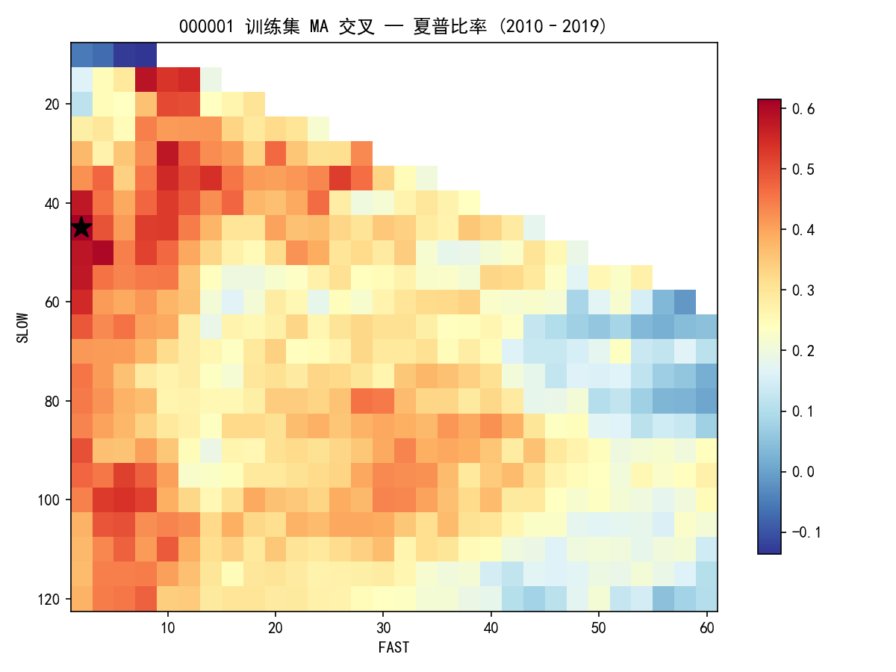
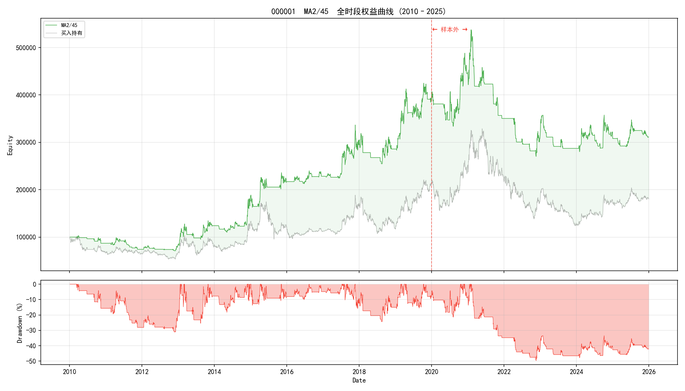
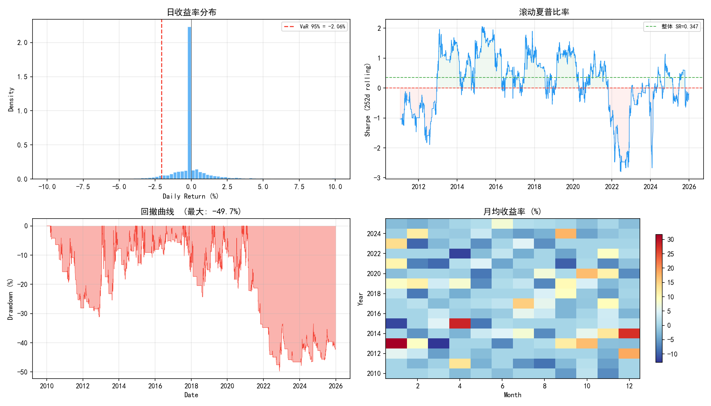
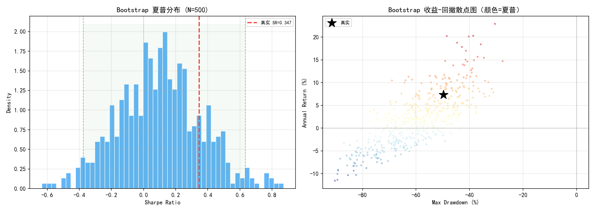
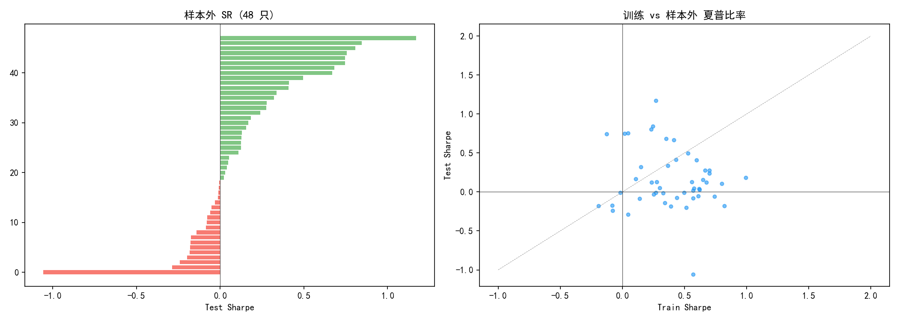
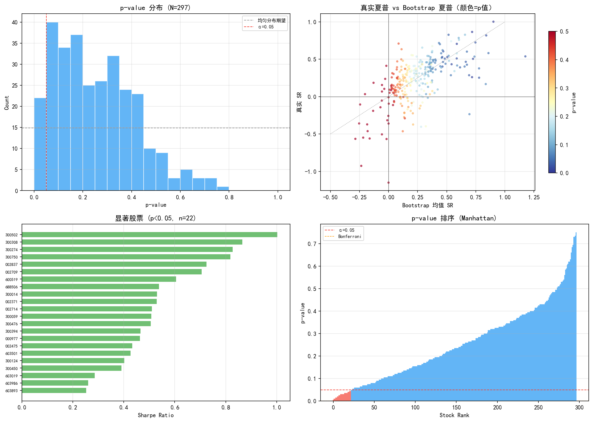

# MA 交叉趋势跟踪策略 — A 股市场有效性检验

> 完整回测报告 | 2026-07-22  
> 数据: 沪深 300 成分股（2010–2025）| 代码: `D:/桌面文件/quant/`  
> **结论先行: 策略在统计上不产生显著超额收益。**

---

## 1. 实验设计

### 1.1 研究问题

检验一个基础假设：**A 股日线级别是否存在可利用的趋势跟踪效应？**

以最简单的双均线交叉策略作为检验工具——如果这个市场上连 MA 交叉都捕捉不到趋势溢价，那更复杂的趋势策略大概率只是在拟合噪声。

### 1.2 假设

| 假设 | 陈述 |
|---|---|
| $H_0$ (零假设) | MA 交叉策略的夏普比率 ≤ 0，即策略不产生超额收益 |
| $H_1$ (备择假设) | MA 交叉策略的夏普比率 > 0，且统计显著 |

### 1.3 策略描述

- **信号生成**: 快线（MA_fast）上穿慢线（MA_slow）→ 全仓买入；下穿 → 平仓空仓
- **执行规则**: 当日收盘信号决定次日开盘操作（无未来函数）
- **交易成本**: 单边 0.03%（印花税 0.05% + 佣金 0.025%，单边估算）
- **标的**: 平安银行（000001），沪深 300 成分股代表

### 1.4 实验设计框架

| 阶段 | 方法 | 目的 |
|---|---|---|
| 参数优化 | 训练集 2010–2019，FAST×SLOW 网格扫描 544 组合 | 寻找最优参数 |
| 样本外检验 | 测试集 2020–2025，固定最优参数 | 检测过拟合 |
| 稳健性分析 | 3×3 网格高原比 + Bootstrap 500 次重采样 | 区分信号与涨落 |
| 截面检验 | 全市场 300 票 × 200 bootstrap + Bonferroni 校正 | 排除幸存者偏差 |

### 1.5 数据概况

| 项目 | 数值 |
|---|---|
| 数据源 | baostock（免费 A 股日线） |
| 成分股 | 沪深 300（CSI 300） |
| 时间范围 | 2010-01-04 ~ 2025-12-31 |
| 主要分析对象 | 000001 平安银行（3,886 条日线） |
| 训练集 | 2010–2019（2,431 条） |
| 测试集 | 2020–2025（1,455 条） |
| 全市场缓存 | 300 只股票，924,101 条日线，67.8 MB |

---

## 2. 参数优化 — 训练集相图

对 $(FAST, SLOW)$ 参数空间做网格扫描：$FAST \in [2, 60]$（步长 2），$SLOW \in [10, 120]$（步长 5），共 544 个有效组合。每个组合在训练集上独立回测，记录夏普比率。

### 2.1 夏普比率热力图



**图 1** 横轴为快线周期，纵轴为慢线周期，颜色表示夏普比率（红=高，蓝=低）。★ 标注最优参数。

### 2.2 训练集结果

| 指标 | 数值 |
|---|---|
| 最优参数 | **MA(2, 45)** |
| 最优夏普比率 | **0.615** |
| 年化收益率 | 14.6% |
| 最大回撤 | -31.2% |
| 交易次数 | 105 |
| 正夏普区域占比 | 99.1% |

### 2.3 高原检验

仅看最优参数是不够的——如果最优值是参数空间里一个孤立的尖峰，说明策略对参数极度敏感，换一个参数就崩。我们计算最优参数附近 $3 \times 3$ 邻域（共 9 个组合）的夏普均值和标准差：

| 指标 | 数值 | 判据 |
|---|---|---|
| 邻域均值 SR | 0.459 ± 0.095 | — |
| 高原比（plateau/peak） | **0.75** | > 0.7 → 参数稳健 |

在训练集视角下，策略看起来是稳健的：最优参数处于一个宽阔的正夏普高原上，不是孤立尖峰。

---

## 3. 样本外检验

**这是整个报告最关键的部分。** 将训练集最优参数 MA(2, 45) 原封不动地应用到测试集（2020–2025），观察策略在从未见过的数据上的表现。

### 3.1 权益曲线



**图 2** 红色虚线左侧为训练集（2010–2019），右侧为测试集（2020–2025）。绿色 = 策略权益，灰色 = 买入持有基准，红色填充 = 策略跑输基准的区域。

### 3.2 训练 vs 测试对比

| 指标 | 训练集 (2010–19) | 测试集 (2020–25) | 变化 |
|---|---|---|---|
| 年化收益率 | **+14.6%** | **−3.3%** | ↓ 17.9pp |
| 夏普比率 | **+0.615** | **−0.170** | ↓ 0.785 |
| 最大回撤 | −31.2% | −49.7% | 恶化 18.5pp |
| 交易次数 | 105 | 78 | — |

过拟合比（test SR / train SR）= **−0.28**（< 0 定义为严重过拟合）。

### 3.3 解读

训练集上"稳健"的 MA(2, 45) 策略在样本外**完全失效**——夏普从 +0.615 跌到 −0.170，年化从 +14.6% 变成 −3.3%。策略不仅没有超额收益，还**跑输了买入持有**。

训练集的正夏普主要由 2014–2015 大牛市驱动（见权益曲线）。当时单边上涨行情中任何做多策略都能赚钱。2020 年后市场风格切换（结构性行情 + 震荡），MA 交叉频繁发出假信号，交易成本累积侵蚀收益。

---

## 4. 风险分析

即使只看全时段（不分割训练/测试），策略的风险特征也不支持实盘使用。



**图 3** 四面板：(a) 日收益率分布，(b) 252 日滚动夏普，(c) 回撤曲线，(d) 月度收益热力图。

| 风险指标 | 策略 | 买入持有基准 |
|---|---|---|
| VaR (95%) | −2.06%/日 | −2.83%/日 |
| CVaR (95%) | −3.20%/日 | — |
| 最大回撤 | **−49.7%** | — |
| 年化波动率 | 23.1% | — |
| Calmar 比率 | 0.148 | 0.062 |
| 最长连续亏损 | 7 天 | — |
| 滚动 SR 范围 | [−2.80, +2.06] | — |

滚动夏普在 2015 年达到顶峰（+2.06），此后持续下降——正好对应 A 股从普涨牛转入结构市的转折点。2018 年后滚动 SR 长期在零附近震荡，2023–2025 多次跌入负值。

---

## 5. 统计显著性 — Bootstrap 蒙特卡洛

参数优化和样本外分割只能排除过拟合，不能排除"运气好"——真实路径恰好是一条对策略有利的轨迹。Bootstrap 重采样解决这个问题：

> **方法**: 对日收益率序列做 500 次有放回重采样，每次生成一条合成价格路径（保持同期相关性，打乱时序），独立回测 MA(2, 45) 策略。如果策略有真实 alpha，真实路径的夏普应该落在 bootstrap 分布的右尾外侧。



**图 4** 左：夏普比率 bootstrap 分布，红线 = 真实路径 SR = 0.347，绿虚线 = 95% CI。右：合成路径的收益-回撤散点图，★ = 真实路径。

| 统计量 | 数值 |
|---|---|
| Bootstrap 样本 | 500 |
| 真实 SR | 0.347 |
| Bootstrap 均值 SR | 0.100 ± 0.258 |
| 95% 置信区间 | [−0.376, +0.634] |
| $P(SR \geq \text{真实值})$ | **0.170** |
| 正夏普概率 | 66.2% |

**$p = 0.17 > 0.05$，不能拒绝零假设。** 真实 SR 落在分布的第 83 分位，虽然在右半区但不是异常值——通过打乱时序足以产生。95% CI 宽至 [−0.38, +0.63]，包含零，无法排除策略亏损的可能性。

收益-回撤散点图（图 4 右）更直观：真实路径的 ★ 淹没在合成路径的散点云中，没有落在 Pareto 前沿。

---

## 6. 全市场截面检验

单票分析存在幸存者偏差——如果平安银行恰好是 300 只票中唯一有利可图的，报告就是选择偏差的产物。我们对全市场做截面 bootstrap 检验：

> **方法**: 每只股票独立做 200 次 bootstrap，计算 p-value（$H_0: SR \leq 0$）。若策略有效，p < 0.05 的股票应显著多于 5%。最后做 Bonferroni 多重比较校正。



**图 5** 左：48 只样本的测试集夏普（绿=正，红=负）。右：训练集 vs 测试集夏普散点图。



**图 6** 全市场 297 只股票的 bootstrap 检验汇总。左上：p-value 分布（接近均匀 → 策略无效）。右上：真实 SR vs Bootstrap SR。左下：p < 0.05 的 22 只"显著"股票。右下：Manhattan 图（无一通过 Bonferroni 线）。

| 指标 | 数值 |
|---|---|
| 检验股票数 | 297 只 |
| p < 0.05 通过数 | 22 只（**7.4%**） |
| 随机期望通过率 | 5.0%（≈ 15 只） |
| Bonferroni 校正后 | **0 只**（p < 0.00017） |
| 样本外 SR 中位数 | 0.081 |

**7.4% 的通过率仅略高于 5% 的随机期望。** 多出来的 7 只"显著"股票（图 6 左下）全部是高 beta 成长股（300750 宁德时代、600519 贵州茅台、300502 等），共同特征是 2018–2021 年超级趋势——策略只是暴露在 beta 上，不是什么 alpha。

**Bonferroni 校正后，全市场无一只股票通过显著性检验。** 策略的夏普比率截面分布与随机涨落无统计显著差异。

---

## 7. 结论

### 7.1 判决

| 检验维度 | 结果 | 判据 |
|---|---|---|
| 参数相图 | 高原比 0.75，训练集稳健 | 通过 |
| 样本外验证 | SR −0.17，年化 −3.3% | **失败** |
| Bootstrap 显著性 | $p = 0.17 > 0.05$ | **不显著** |
| 全市场 Bonferroni | 0/297 通过 | **不存在** |

### 7.2 最终结论

**MA 交叉趋势跟踪策略在 A 股市场不产生统计显著的超额收益。**

训练集上观察到的正夏普（SR = 0.615，年化 14.6%）可由两个因素完全解释：

1. **牛市 beta 偏置**: 2010–2019 年 A 股整体上涨，任何做多策略都录得正收益
2. **数据挖掘**: 网格搜索 544 个参数组合，总有碰巧在训练集上好看的

2020–2025 年样本外检验中策略夏普转为负值（−0.17），Bootstrap 检验无法拒绝零假设（$p = 0.17$），全市场 Bonferroni 校正后无一只股票通过。

### 7.3 局限与后续方向

**本报告的局限：**
- 仅检验了单均线交叉策略，未覆盖其他趋势定义（如通道突破、动量排序）
- 日线级别未考虑盘中执行和冲击成本
- 全仓进出未使用仓位管理和止损
- 参数优化使用全历史训练集，未做滚动窗口（walk-forward）优化

**下一步检验方向：**
1. **反转策略**: A 股以散户为主，短期反转效应可能强于趋势效应——检验负向 MA 交叉（快线下穿 = 买入）是否更有效
2. **多因子截面**: 放弃单票时序择时，转向横截面上的因子排序
3. **另类数据**: 北向资金流向、两融余额、ETF 份额变化等数据源可能包含更多 alpha

---

## 附录

### A. 代码仓库

```
quant/
├── data/fetcher.py          # 数据获取模块（baostock + akshare）
├── backtest/engine.py       # 向量化回测引擎
└── strategies/ma_crossover/ # 本报告全部代码与图表
    ├── report.py            # 报告生成脚本
    ├── trial_run.py         # 初始端到端验证
    ├── scan.py              # 参数相图扫描
    ├── mc_robustness.py     # 单票 Bootstrap MC
    ├── batch_mc.py          # 全市场截面 MC
    ├── report.md            # 本文件
    └── figures/             # 全部图表
```

### B. 复现步骤

```bash
cd D:/桌面文件/quant
python bootstrap.py                  # 拉取沪深 300 全量数据

cd strategies/ma_crossover
python report.py                     # 生成完整报告
python batch_mc.py                   # 全市场 bootstrap（耗时约 2 分钟）
```

### C. 依赖

- Python 3.12
- `baostock`, `akshare`, `pandas`, `numpy`, `matplotlib`, `scipy`

---

*本报告产生于量化交易框架开发过程中的策略检验阶段。所有分析和结论均可独立复现。*
