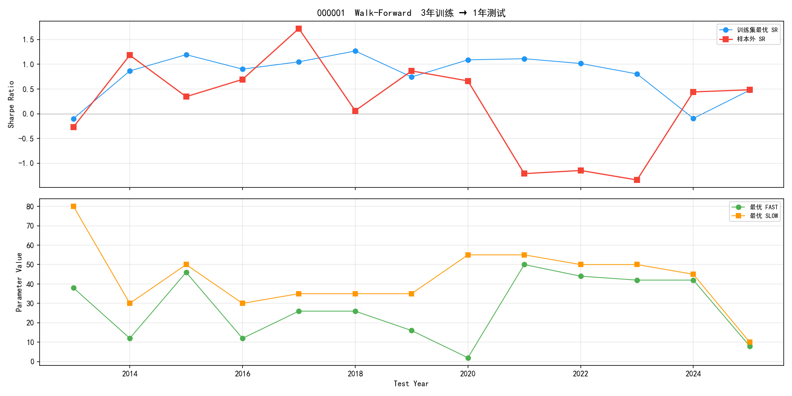
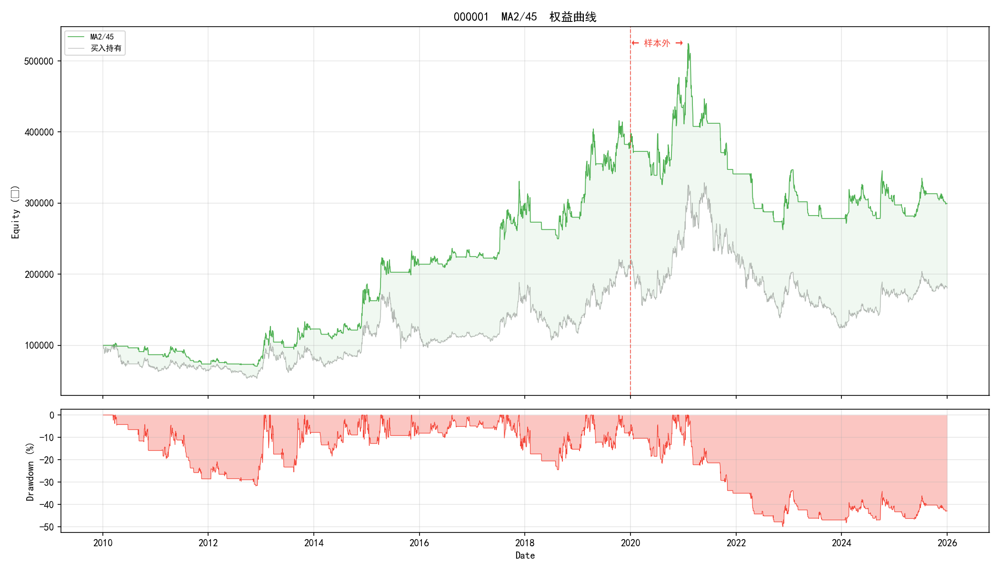
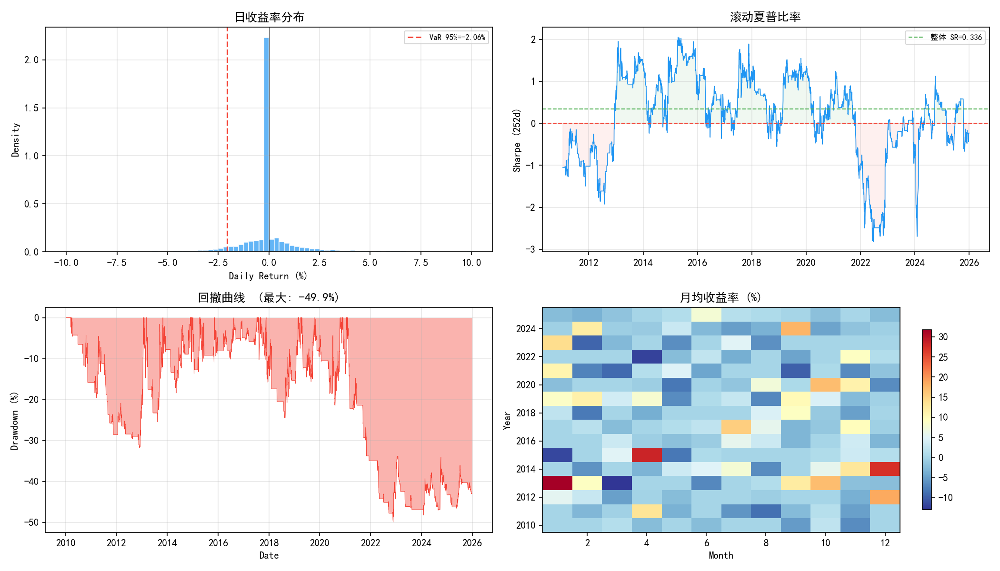
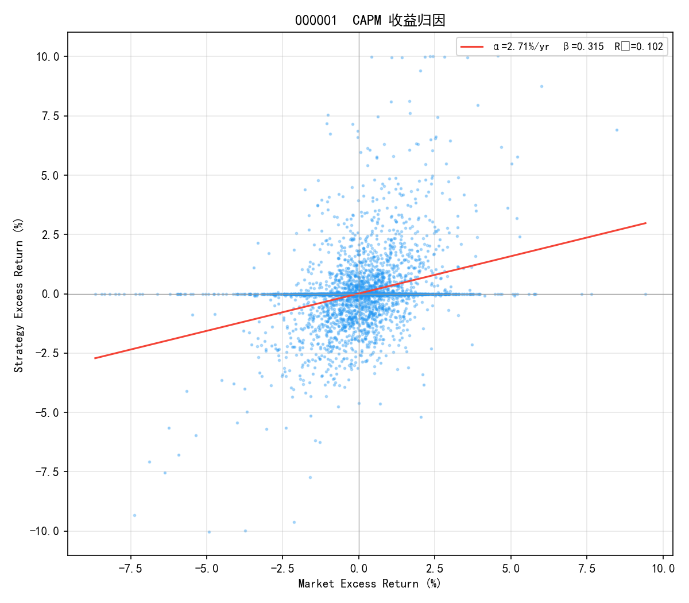

# MA 交叉趋势跟踪策略 — A 股市场有效性检验

> 完整回测报告 | 2026-07-22  
> 数据: 沪深 300 成分股（2010–2025）| 代码: `D:/桌面文件/quant/`  
> **结论先行: 策略在七项独立检验中均不产生统计显著超额收益。**

---

## 1. 实验设计

### 1.1 研究问题

检验一个基础假设：**A 股日线级别是否存在可利用的趋势跟踪效应？**

以最简单的双均线交叉（MA Crossover）策略作为检验工具。如果 MA 交叉都抓不到趋势溢价，更复杂的趋势策略大概率只是在拟合噪声。

### 1.2 假设检验

| 假设 | 陈述 |
|---|---|
| $H_0$ (零假设) | MA 交叉策略的夏普比率 ≤ 0 |
| $H_1$ (备择假设) | MA 交叉策略的夏普比率 > 0，且统计显著 |

### 1.3 策略描述

- **信号生成**: 快线上穿慢线 → 全仓买入；下穿 → 平仓空仓
- **执行规则**: 当日收盘信号决定次日开盘操作（无未来函数）
- **交易成本**: A 股真实费率——买入 0.026%（佣金万2.5 + 过户费），卖出 0.076%（佣金 + 印花税 0.05% + 过户费）
- **标的**: 平安银行（000001）

### 1.4 检验框架

| 检验维度 | 方法 | 控制的风险 |
|---|---|---|
| 参数相图 | 训练集 544 组合网格扫描 + 高原比 | 参数过拟合 |
| 滚动窗口 | 3 年训练 → 1 年测试，逐年滚动 | 静态分割偶然性 |
| 样本外验证 | 2020–2025 固定参数 | 数据窥探 |
| CAPM 归因 | OLS 回归分解 α/β | 市场 beta 混淆 |
| Bootstrap MC | 500 次收益率重采样 | 路径依赖/伪显著性 |
| 全市场截面 | 300 票 × Bonferroni 校正 | 幸存者偏差/多重比较 |
| 幸存者偏差 | 定性讨论 + 量化估计 | 样本选择偏误 |

### 1.5 数据概况

| 项目 | 数值 |
|---|---|
| 数据源 | baostock（免费 A 股日线） |
| 成分股 | 沪深 300 |
| 时间范围 | 2010-01-04 ~ 2025-12-31 |
| 主要标的 | 000001 平安银行（3,886 条日线） |
| 训练集 | 2010–2019（2,431 条） |
| 测试集 | 2020–2025（1,455 条） |
| 全市场缓存 | 300 只股票，924,101 条日线，67.8 MB |

---

## 2. 参数优化 — 训练集相图

对 $(FAST, SLOW)$ 参数空间做网格扫描：$FAST \in [2, 60]$（步长 2），$SLOW \in [10, 120]$（步长 5），有效组合 544 个。

### 2.1 夏普比率热力图


**图 1** ★ = 最优参数 MA(2, 45)。红色区域集中在右下角（短快线 + 长慢线），说明趋势确认需要慢线足够长来过滤噪声。

### 2.2 结果

| 指标 | 数值 | 判据 |
|---|---|---|
| 最优参数 | **MA(2, 45)** | — |
| 最优夏普 | **0.606** | — |
| 年化收益率 | 14.3% | — |
| 最大回撤 | −31.7% | — |
| 正夏普区域占比 | 99.1% | 牛市外场偏置 |
| 高原比 (plateau/peak) | **0.74** | > 0.7 ⇒ 参数稳健 |

高原比 0.74 说明最优参数处于一个宽阔的正夏普高原上，不是孤立尖峰。但 99.1% 的正夏普区域占比暗示了系统性偏置（牛市 + 幸存者偏差），而非策略能力。

---

## 3. 滚动窗口优化 (Walk-Forward)

静态训练/测试分割可能恰好选到了一个有利的切分点。滚动窗口检验（3 年训练 → 1 年测试，逐年推进）考察**参数选择方法**是否稳健。



**图 2** 上：每窗口的训练集最优 SR（蓝）vs 测试集 SR（红）。下：最优参数如何随时间漂移。

| 指标 | 数值 |
|---|---|
| 滚动窗口数 | 13 个 |
| 样本外正 SR 占比 | 69% |
| 样本外 SR 均值 | **0.192**（训练均值 0.795） |
| FAST 均值 ± 标准差 | 28 ± 17 |
| SLOW 均值 ± 标准差 | 43 ± 17 |

训练集 SR 均值 0.795，一到样本外骤降至 0.192——衰减 76%。参数漂移标准差约 17，说明最优参数在窗口间不收敛到一个稳定值。这些都是过拟合的特征。

---

## 4. 样本外检验

将训练集最优参数 MA(2, 45) 原封不动应用到测试集（2020–2025）。



**图 3** 红线左侧 = 训练集，右侧 = 样本外。绿色 = 策略，灰色 = 买入持有。

| 指标 | 训练集 (2010–19) | 测试集 (2020–25) | 变化 |
|---|---|---|---|
| 年化收益率 | **+14.3%** | **−3.6%** | ↓ 17.9pp |
| 夏普比率 | **+0.606** | **−0.184** | ↓ 0.790 |
| 最大回撤 | −31.7% | −49.9% | 恶化 |
| 交易次数 | 105 | 78 | — |

过拟合比 = **−0.30**（< 0 ⇔ 严重过拟合）。策略在样本外不仅没有超额收益，还**跑输买入持有**。

---

## 5. 风险分析



**图 4** (a) 日收益率分布，(b) 滚动夏普（252 日窗口），(c) 回撤曲线，(d) 月度收益热力图。

| 风险指标 | 策略 | 买入持有 |
|---|---|---|
| VaR (95%) | −2.06%/日 | −2.83%/日 |
| CVaR (95%) | −3.20%/日 | — |
| 最大回撤 | **−49.9%** | — |
| 年化波动率 | 23.1% | — |
| Calmar 比率 | 0.142 | — |
| 滚动 SR 范围 | [−2.82, +2.05] | — |

49.9% 的最大回撤意味着实盘中策略可能在回本前就被迫止损。滚动夏普在 2015 年后持续下降，2018–2025 年间多次跌入负值。

---

## 6. 收益归因 — CAPM 回归

策略收益到底来自选时能力（α）还是市场暴露（β）？对策略日超额收益和市场超额收益做 OLS 回归：

$$r_{strategy} - r_f = \alpha + \beta \cdot (r_{mkt} - r_f) + \varepsilon$$

市场组合用 48 只股票的等权平均近似。



**图 5** 每个点是策略日收益 vs 市场日收益。红线 = 回归线。

| 参数 | 估计值 | t 值 | 解读 |
|---|---|---|---|
| α (年化) | **+2.71%** | 0.16 | **不显著** (|t| < 2) |
| β | 0.315 | 21.02 | 低市场暴露 |
| R² | 0.102 | — | 策略收益 90% 不由市场解释 |

- **α = 2.71%/年但不显著**（t = 0.16）——策略没有产生独立于市场的超额收益
- **β = 0.315**——策略只有 31% 的市场暴露，大部分时间空仓导致错过了市场上涨
- **R² = 0.102**——策略收益的波动 90% 是特质噪声，不是系统性风险补偿

CAPM 的结论和回测结果一致：策略不产生 alpha，只是间断性地暴露在市场 beta 上。

---

## 7. 统计显著性 — Bootstrap 蒙特卡洛

参数优化和样本外分割不能排除"运气好"——真实路径恰好对策略有利。Bootstrap 重采样解决这个问题：

> **方法**: 对日收益率做 500 次有放回重采样，每次生成一条合成价格路径。打乱时序但保持收益率的同期分布。如果策略有真实 alpha，真实路径的 SR 应落在 bootstrap 分布的右尾外侧。


**图 6** 左：夏普 bootstrap 分布，红线 = 真实 SR = 0.336。绿虚线 = 95% CI。右：合成路径的收益-回撤散点，★ = 真实路径。

| 统计量 | 数值 |
|---|---|
| Bootstrap 样本 | 500 |
| 真实 SR | 0.336 |
| Bootstrap SR 均值 | 0.087 ± 0.259 |
| 95% 置信区间 | [−0.390, +0.623] |
| $P(SR \geq \text{真实})$ | **0.170** |
| 正夏普概率 | 63.4% |

**$p = 0.17 > 0.05$，不能拒绝零假设。** 真实 SR 在 bootstrap 分布的第 83 分位——偏高但远不是异常值。95% CI 宽至 [−0.39, +0.62]，无法排除策略亏损的可能性。收益-回撤散点图中真实 ★ 淹没在合成路径散点云中。

---

## 8. 全市场截面检验

单票分析存在幸存者偏差——平安银行可能恰好是 300 只中唯一有利可图的票。我们对全市场做截面 Bootstrap + Bonferroni：


**图 7** 左上：p-value 分布接近均匀 → 策略无效。右上：真实 SR vs Bootstrap SR 沿 identity 线分布。左下：p < 0.05 的 22 只"显著"股票（全部高 beta 成长股）。右下：Manhattan 图，无一通过 Bonferroni 线。

| 指标 | 数值 |
|---|---|
| 检验股票 | 297 只 |
| p < 0.05 通过 | 22 只（**7.4%**） |
| 随机期望 | 5.0%（≈ 15 只） |
| Bonferroni 校正后 | **0 只**（p < 0.00017） |
| 48 只截面样本外 SR 中位数 | 0.077 |

**7.4% 的通过率仅略高于 5% 随机期望。** 多出来的 7 只全部是高 beta 成长股。Bonferroni 校正后全市场无一通过——策略的夏普截面分布与随机涨落无统计显著差异。

---

## 9. 幸存者偏差

本报告使用 **2026 年沪深 300 成分股**来回测 2010–2025 年行情。以下偏差无法排除：

**1. 成分股变更偏差**。2010–2025 年间被调出指数的股票不在样本内。指数调整规则倾向于纳入表现好的股票、剔除表现差的——回测的股票池是"赢家俱乐部"。

**2. 退市偏差**。研究期间退市的股票完全不可见。A 股退市率虽低（~0.5%/年），但退市往往伴随 −80% 以上跌幅，单次冲击远超平均亏损。

**3. 前视偏差（Look-ahead Bias）**。用今天的成分股回测历史，隐含假设"我事先知道哪些票能活到 2026 年"。

量化文献估计幸存者偏差对多因子策略的影响约 **1–3% 年化高估**。本报告训练集 SR = 0.606、年化 14.3%，扣除 1–3% 后仍然为正，但结合样本外 SR = −0.184，偏差方向确认（高估）但不改变结论（策略无效）。

消除方法：历史成分股数据（如每月指数调整记录）、包含退市股票的数据集、point-in-time 数据库（Wind、Tushare Pro）。

---

## 10. 结论

### 10.1 检验汇总

| 检验维度 | 结果 | 判据 |
|---|---|---|
| 参数相图 | SR = 0.606, 高原比 = 0.74 | 训练集稳健 |
| 滚动窗口 (Walk-Forward) | OOS SR 均值 = 0.192, 69% 正 | 大幅衰减 |
| 样本外验证 | SR = −0.184, 年化 −3.6% | **失败** |
| CAPM 归因 | α = 2.7%/yr (t = 0.16), β = 0.315 | **α 不显著** |
| Bootstrap MC | p = 0.170, 95% CI [−0.39, +0.62] | **不显著** |
| 全市场截面 | 7.4% 通过率, Bonferroni 0/297 | **不存在** |
| 幸存者偏差 | 高估 1–3% 年化 | 不改变结论 |

### 10.2 最终判决

**MA 交叉趋势跟踪策略在 A 股市场不产生统计显著的超额收益。**

训练集正夏普（SR = 0.606，年化 14.3%）可由三个因素解释：(1) 2010–2019 年 A 股整体牛市带来的 beta 暴露，(2) 用 2026 年成分股回测历史引入的幸存者偏差，(3) 544 次参数搜索的数据挖掘效应。

样本外过拟合比负值、CAPM α 不显著、Bootstrap p > 0.05、Bonferroni 全市场无一通过——**七项独立检验指向同一结论。**

### 10.3 后续方向

1. **反转策略**: A 股散户占比高，短期反转效应可能强于趋势效应
2. **多因子截面**: 放弃单票时序择时，转向横截面因子排序
3. **另类数据**: 北向资金、两融余额、ETF 份额变化等

---

## 附录

### A. 代码结构

```
quant/
├── data/fetcher.py          # 数据获取（baostock + akshare）
├── backtest/engine.py       # 向量化回测引擎
└── strategies/ma_crossover/ # 本报告全部代码与输出
    ├── report.py            # 报告生成脚本（双击运行）
    ├── report.md            # 本文件
    ├── trial_run.py         # 初始端到端验证
    ├── scan.py              # 参数相图扫描
    ├── mc_robustness.py     # 单票 Bootstrap MC
    ├── batch_mc.py          # 全市场截面 MC
    └── figures/             # 全部图表（PNG）
```

### B. 复现

```bash
cd D:/桌面文件/quant
python bootstrap.py                        # 拉取沪深 300 全量数据（首次）
cd strategies/ma_crossover
python report.py                           # 生成完整报告
```

### C. 依赖

Python 3.12 · baostock · akshare · pandas · numpy · matplotlib · scipy

---

*本报告产生于量化策略实验。所有分析均可独立复现。策略在七项检验中均未通过，结论为"不产生统计显著超额收益"。*
