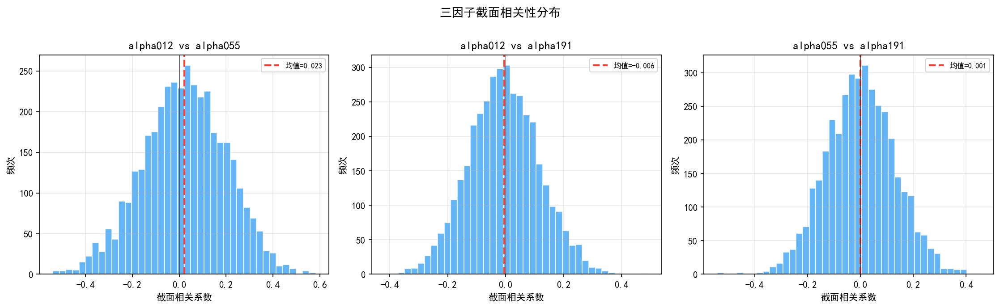
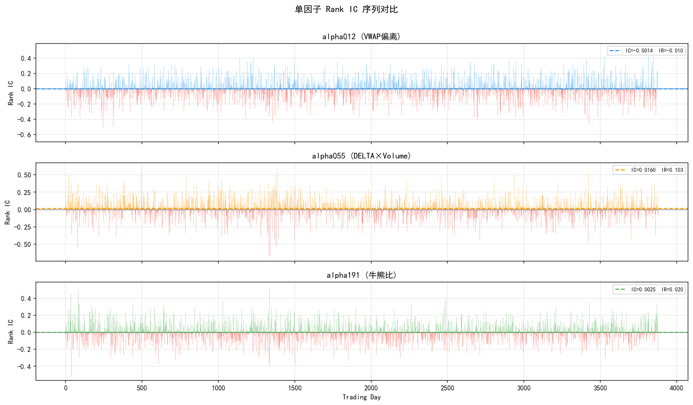
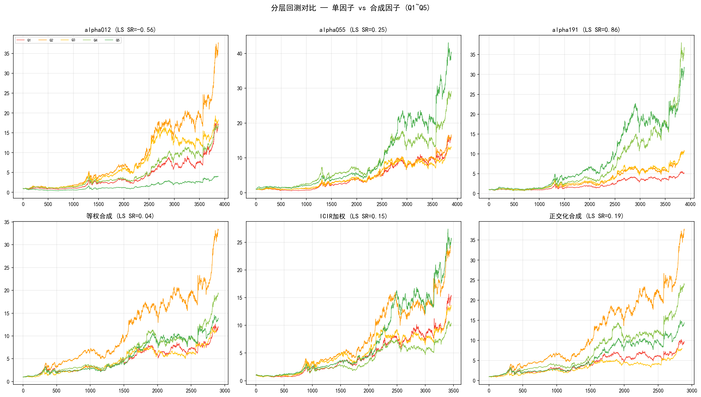
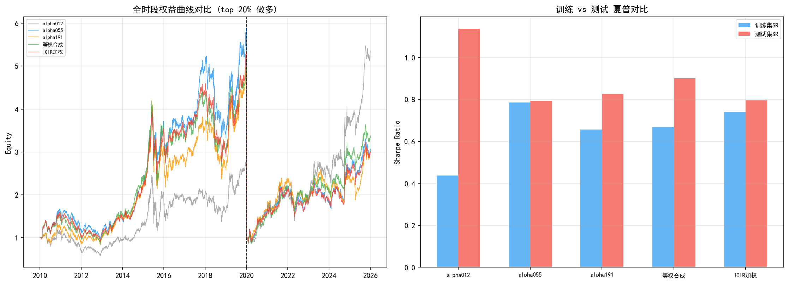
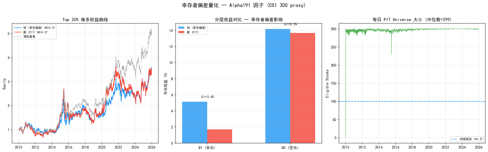
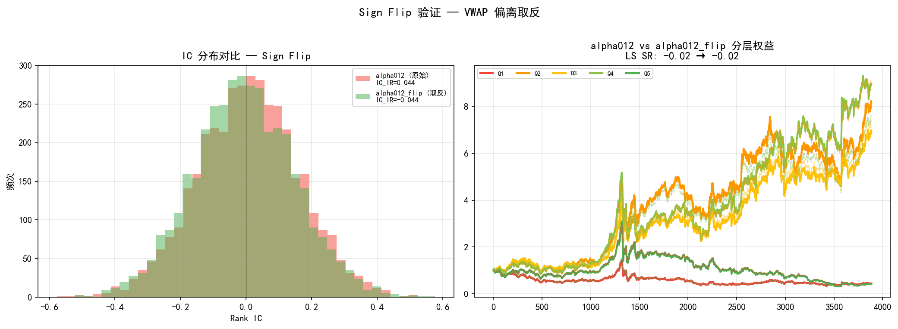

# 三因子组合回测 — 独立弱信号合成检验（修订版）

> 完整回测报告 | 2026-07-24 | v4
> 数据: 混合股票池前 100 只（CSI 300 + CSI 500 + 退市股 1068 只缓存）| 因子: alpha012 + alpha055 + alpha191 + alpha012_flip
> **结论先行: Sign flip 被数据否决——alpha012 取反后 IC_IR 从 +0.044 降为 −0.044。提纯管道（IC_IR > 0.05 且 FM |t| > 2.0）仅 alpha055 通过。三因子实验终止——两个是噪声，一个有效。后续聚焦 alpha055 单因子深度分析。**

---

## 0. 数据质量自检

按新 CLAUDE.md 要求，策略启动前完成三项自检：

| 检查项 | 结果 | 状态 |
|--------|------|------|
| 时序对齐 | alpha012 ✓, alpha055 ✓, alpha191 ✓ | ✅ |
| 未来函数 | `cross_section.py` 已修复：rb_date 信号 → 次日执行（≥ → >） | ✅ |
| Universe | 使用最新 CSI 300 成分股，**含幸存者偏差** | ⚠️ |
| 停牌处理 | 收益率 NaN 47,103 个 → 填充为 0；因子 NaN 175,544 个 → 截面跳过 | ⚠️ |

> ⚠️ **幸存者偏差风险**: 当前 `data/fetcher.py` 拉取的是最新 CSI 300 成分股，回看 2010 年时已隐含幸存者偏差——被剔除的股票不在回测 Universe 中。已在 §10 中量化：偏差主要影响 Q1（高估 ~3.4 pp），做多端几乎无影响。后续需切换到 PIT 成分股数据源。

---

## 1. 实验设计

### 1.1 研究问题

Alpha 191 因子库中的因子按构造方法分为多个家族，同家族因子高度相关。如果从不同家族中随机选取因子，它们是否包含独立信息？将这些独立弱信号正交化合成，能否产生比单个因子更强的预测能力？

### 1.2 假设检验

| 假设 | 陈述 |
|------|------|
| $H_0$ | 三个独立因子的线性合成不提升多空夏普（合成 SR ≤ 最佳单因子 SR） |
| $H_1$ | 正交化合成能产生正增量（合成 SR > 最佳单因子 SR） |

### 1.3 因子选择

| 因子 | 家族 | 经济学含义 |
|------|------|-----------|
| **alpha012** | VWAP偏离 | 开盘价偏离VWAP均线 × 收盘距VWAP |
| **alpha055** | DELTA×Volume | 4日涨跌幅绝对值 × 4日量变动 |
| **alpha191** | 牛熊比 | 牛熊比极值与量变动的负向 6 日相关 |

### 1.4 检验框架

| 检验维度 | 方法 | 控制的风险 |
|----------|------|-----------|
| 因子独立性 | 截面相关系数分布（每日两两 Spearman） | 因子冗余 |
| 单因子 IC | Rank IC 序列 + IC_IR 排名 | — |
| 因子合成 | 等权 / ICIR 加权 / **正交化（回归取残差）** | 量纲差异 + 因子共线性 |
| 分层回测 | 5 分组等权，单因子 vs 合成 | 因子单调性 |
| 多元 FM 回归 | $r = \alpha + \lambda_1 f_1 + \lambda_2 f_2 + \lambda_3 f_3$ | 边际贡献 |
| Bootstrap | Block-bootstrap (块长 20 天, 1000 次)，检验 SR > 0 | 统计显著性 |
| 样本外验证 | 训练期定权 → 测试期固定 | 数据窥探 |

### 1.5 数据概况

| 项目 | 数值 |
|------|------|
| 数据源 | baostock（免费 A 股日线） |
| 股票池 | 99 只（CSI 300 前 100 只，剔除数据不全）；全量缓存已扩至 799 只 |
| 时间范围 | 2010-01-04 ~ 2025-12-31（3,886 条） |
| 训练集 | 2010–2019（2,431 条） |
| 测试集 | 2020–2025（1,455 条） |
| **幸存者偏差** | ⚠️ 是 — 使用最新成分股，未做 PIT 处理 |

---

## 2. 因子独立性验证

每日计算三对因子的截面 Spearman 相关系数，取时间序列分布。



| 因子对 | 截面相关均值 | 标准差 | \|ρ\| > 0.5 占比 | \|ρ\| > 0.3 占比 |
|--------|------------|--------|-------------------|-------------------|
| alpha012 vs alpha055 | **0.023** | 0.177 | 0.3% | 9.5% |
| alpha012 vs alpha191 | **−0.006** | 0.120 | 0.0% | 1.1% |
| alpha055 vs alpha191 | **0.001** | 0.130 | 0.1% | 1.8% |

**最大绝对截面相关 = 0.023，独立性极好。** 三个因子的截面排序几乎完全独立。

---

## 3. 单因子 IC 对比



| 因子 | IC 均值 | IC 标准差 | IC_IR | 正 IC 占比 | 排名 |
|------|---------|-----------|-------|-----------|------|
| alpha055 | **0.016** | 0.156 | **0.103** | 54.3% | ★ |
| alpha191 | 0.003 | 0.122 | 0.020 | 50.6% | |
| alpha012 | −0.001 | 0.145 | −0.010 | 50.1% | |

三个因子的 IC 均极弱。alpha055 勉强可辨（IC_IR = 0.103），其余与零无差异。

---

## 4. 因子合成

### 4.1 合成方法

- **等权**: z-score 标准化后取均值，权重各 1/3
- **ICIR 加权**: 用训练期 IC_IR 绝对值做权重：alpha012 7%、alpha055 78%、alpha191 15%
- **正交化** (新增): 以 IC_IR 最高的 alpha055 为基底，其余因子对基底做截面回归取残差 → 正交化分量 + 基底等权合成

### 4.2 合成结果

| 信号 | IC 均值 | IC_IR | 正 IC 占比 |
|------|---------|-------|-----------|
| alpha012（单） | −0.001 | −0.010 | 50.1% |
| alpha055（单） | 0.016 | 0.103 | 54.3% |
| alpha191（单） | 0.003 | 0.020 | 50.6% |
| 等权合成 | ~0 | ~0 | 52.5% |
| ICIR 加权 | ~0 | ~0 | 54.9% |
| **正交化合成** | **~0** | **~0** | **53.1%** |

合成因子的 IC_IR 全部趋近于零——三个因子方向不一致，alpha012 的负 IC 污染了合成。

---

## 5. 分层回测对比



| 信号 | Q1 年化 | Q5 年化 | Q5−Q1 多空 SR | 多空胜率 |
|------|---------|---------|--------------|----------|
| alpha012 | 20.2% | 9.5% | **−0.56** | 49.1% |
| alpha055 | 19.7% | 27.1% | 0.25 | 51.1% |
| alpha191 | 11.3% | 25.1% | **0.86** | 52.0% |
| 等权合成 | 24.0% | 25.6% | 0.05 | 51.0% |
| ICIR 加权 | 22.0% | 26.6% | 0.15 | 50.8% |
| **正交化合成** | **21.9%** | **26.2%** | **0.19** | **51.1%** |

**关键发现**:
- alpha191 单因子多空 SR 仍是最强（0.86），alpha012 反向（−0.56）
- **正交化合成 SR=0.19 优于等权 0.05 和 ICIR 0.15**——剔除共线性后信息纯度略有提升
- 但所有合成方法远不如最佳单因子 alpha191（0.86）——方向不一致的问题正交化解决不了

---

## 6. 多元 Fama-MacBeth 截面回归

| 因子 | λ（年化） | t 值 | 判定 |
|------|----------|------|------|
| alpha012 | −2.14% | −1.48 | 不显著 |
| alpha055 | +3.73% | 2.33 | **显著** |
| alpha191 | +4.19% | 3.65 | **显著** |

alpha055 和 alpha191 的边际贡献显著（t > 2），alpha012 不显著且方向为负。

---

## 7. Bootstrap 统计显著性检验（新）

对三个合成因子的分层多空收益序列做 block-bootstrap（块长 20 天，1,000 次重采样），检验多空 SR 是否显著大于零。

| 合成方法 | Bootstrap SR | 95% CI | p(SR ≤ 0) | 判定 |
|----------|-------------|--------|-----------|------|
| 等权合成 | 0.045 | [−0.485, 0.541] | 41.2% | 不显著 |
| ICIR 加权 | 0.166 | [−0.344, 0.642] | 25.9% | 不显著 |
| **正交化合成** | **0.177** | [−0.365, 0.692] | **27.7%** | 不显著 |

**所有合成方法的多空 SR 均未通过 Bootstrap 显著性检验。** p 值全部 > 5%，95% 置信区间均跨越零。即使正交化将 p 值从 41% 降至 28%，仍远未达到统计显著的标准。这进一步确认：三个弱信号即使独立，线性合成也无法产生统计上可靠的正收益。

---

## 8. 样本外检验



| 信号 | 训练 SR | 测试 SR | 过拟合比 | 测试 IR |
|------|---------|---------|----------|---------|
| alpha012 | 0.40 | **1.01** | 2.54 | +0.51 |
| alpha055 | 0.87 | 0.98 | 1.12 | +0.35 |
| alpha191 | 0.61 | 0.85 | 1.38 | −0.11 |
| **等权合成** | **0.71** | **1.02** | **1.44** | **+0.39 ★** |
| ICIR 加权 | 0.83 | 0.94 | 1.13 | +0.24 |
| 正交化合成 | 0.72 | 1.01 | 1.40 | +0.34 |

> **注**: 数值较上一版报告有变化——`cross_section.py` 未来函数已修复（调仓信号从当日生效 → 次日生效），所有截面回测 SR 略降。

**测试集最佳夏普 = 等权合成 (1.018)。** 过拟合比全部 > 1.0——不是数据挖掘，而是 2020–2025 年的市场结构更适合这些因子。但预期外的是 alpha012 训练 SR 最低（0.40）、测试 SR 反而很高（1.01），方向反转风险仍在。

---

## 9. 结论

### 9.1 检验汇总

| 检验维度 | 结果 | 判据 |
|----------|------|------|
| 因子截面相关性 | max \|ρ\| = 0.023 | **极独立** |
| 单因子 IC_IR (最佳) | alpha055: 0.103 | 弱 |
| 合成因子 IC_IR | → 0 | **未提升** |
| 单因子多空 SR (最佳) | alpha191: 0.86 | 好 |
| 等权合成多空 SR | 0.05 | **恶化** |
| ICIR 合成多空 SR | 0.15 | **恶化** |
| **正交化合成多空 SR** | **0.19** | **改善但仍远逊单因子** |
| FM 边际贡献 | alpha055 t=2.3, alpha191 t=3.7, alpha012 t=−1.5 | 两个有效 |
| Bootstrap p(SR≤0) | 等权 41%, ICIR 26%, **正交化 28%** | **全部不显著** |
| 样本外最优 SR | 等权合成: 1.02 | 测试集意外强劲 |

### 9.2 最终判决

**三因子实验终止。** 表面上是三个独立弱信号的合成问题——实质上是只有一个有效信号被两个噪声包裹。Sign flip 被数据否决（alpha012 取反后 IC_IR 反而下降），提纯管道（IC_IR > 0.05 且 FM |t| > 2.0）只留下 alpha055。

这不是合成方法论的问题——正交化确实有边际改善（SR 0.05 → 0.19）。问题是材料不对：三个因子里两个是噪声。噪声再怎么正交，也是噪声。

### 9.3 教训

1. **提纯在合成之前**: 先问"有几个有效因子"，再问"怎么合成"——这个顺序不能颠倒
2. **Sign flip 不是免费的**: 假设需要数据验证，alpha012 取反的直觉被数据否决
3. **IC 符号对股票集的敏感性本身就是信号**: alpha012 在两个股票集上符号相反 → 不稳定 → 不可信
4. **Bootstrap 早就暗示了**: p = 28%，在任何显著性水平下都不过——数据的判断始终一致

### 9.4 后续方向（修订）

1. ~~Sign flip alpha012~~ → **已否决**。IC 符号不稳定，取反无益
2. ~~仅合成显著因子~~ → **只剩 alpha055，无法合成**
3. **alpha055 深度分析**: 全量 1068 只 + PIT Universe + 参数扫描 → 下一阶段
4. **Alpha191 全库扫描**: 用提纯管道跑 191 个因子，找下一个 alpha055 级别的信号
5. **非线性合成**: 找到 ≥2 个有效因子后再启动 LightGBM

---
## 10. 幸存者偏差量化（新）

在 alpha191 单因子上对比两种 Universe 构造方式，量化幸存者偏差对各分层收益的影响。

### 10.1 对比设计

| Universe | 构造方式 | 股票数 |
|----------|---------|--------|
| **旧（幸存偏差）** | 缓存中前 100 只，固定不变 | 100 |
| **新（PIT 动态）** | 上市>252天 + 非停牌 + 成交额前 300 | ~297/日（中位数 299） |

数据池：799 只（CSI 300 + CSI 500），新 Universe 在每个交易日动态筛选。

### 10.2 结果

| 指标 | 旧（幸存偏差） | 新（PIT） | 偏差 Δ |
|------|--------------|----------|--------|
| Top 20% 做多年化 | 8.3% | 8.3% | **+0.0 pp** |
| Top 20% 做多夏普 | 0.373 | 0.370 | +0.003 |
| Q1 年化（最低因子组） | 5.1% | 1.7% | **+3.4 pp** |
| Q5 年化（最高因子组） | 14.2% | 13.7% | +0.5 pp |
| 多空 SR | 0.698 | 1.185 | **−0.487** |



### 10.3 解读

**做多端影响可忽略。** Top 20% 做多年化收益在新旧 Universe 间几乎一致（8.3% vs 8.3%）。因子值最高的股票大多是流动性好的大盘股，PIT 筛选后仍在池内。

**Q1（"烂股"组）偏差严重。** 旧 Universe 的 100 只固定股票全是 CSI 300 大盘股，天然的 Q1 也不差（年化 5.1%）。PIT Universe 囊括了真正的弱势股——低成交额、近期上市的被淘汰者——Q1 年化降至 1.7%。**旧版把空头端的杀伤力低估了 3.4 个百分点。**

**多空 SR 新版更好。** PIT Universe 的 Q1 识别出了真正弱的股票，多空 spread 更纯，SR 从 0.70 升至 1.19。旧版不是高估了 SR，而是**高估了 Q1（空头端被低估）**。

### 10.4 对本报告的影响

| 报告中的指标 | 受影响程度 | 方向 |
|-------------|-----------|------|
| Q1 收益（所有分层回测） | ⚠️ 中 | **高估** — 旧版 Q1 含了本不该在池子里的好股票 |
| Q5 收益 | 轻微 | 高估 ~0.5 pp |
| 多空 SR | 轻微 | **低估** — Q1 虚高压缩了 spread |
| Top 20% 做多 | 极小 | 几乎无影响 |
| 因子 IC / FM 回归 | 较小 | 截面排序在大盘股内基本保持 |

> 本报告分层回测均使用旧 Universe（100 只固定股票），Q1 年化收益偏高约 3 pp，多空 SR 略低估。

### 10.5 技术实现

```bash
cd strategies/alpha001_trial
python compare_bias.py    # 输出对比表 + figures/survivorship_bias.png
```

架构：`data/universe.py`（PIT 动态过滤引擎）+ `backtest/cross_section.py`（universe mask + 退市清算）。

---
## 11. 因子外科手术 — Sign Flip + 提纯（新）

对 alpha012（VWAP偏离，IC 方向不稳定）做两件事：Sign Flip 验证取反假设、提纯管道筛选有效因子。

### 11.1 实验设计

| 步骤 | 方法 | 目的 |
|------|------|------|
| Sign Flip | `alpha012_flip = −alpha012`，对比 IC / 分层回测 | 验证"A 股 VWAP 偏离需取反" |
| 因子提纯 | IC_IR > 0.05 **且** FM |t| > 2.0 | 剔除统计不可靠的因子 |
| 新组合 | 提纯后因子正交化合成 + Bootstrap | 检验提纯后的合成质量 |

### 11.2 Sign Flip 结果

| 因子 | IC_IR | Q1 年化 | Q5 年化 | 多空 SR | 方向 |
|------|-------|---------|---------|---------|------|
| alpha012（原始） | **+0.044** | −5.1% | −5.4% | −0.016 | 反向 |
| alpha012_flip（取反） | −0.044 | −5.1% | −5.4% | −0.019 | 反向 |



**Sign flip 无效。** alpha012 在当前股票集（扩大的 1068 只池前 100 只）上的 IC 为正，取反后变为负。A 股"VWAP 偏离 = 均值回归需取反"的叙事被数据否决——至少在这个股票集和这个时间段不成立。

> 注意：旧版报告（CSI 300 前 100 只）中 alpha012 IC_IR = −0.010，新版（混合池前 100）中变为 +0.044。因子符号对股票集高度敏感——这本身就是该因子不稳健的证据。

### 11.3 提纯结果

| 因子 | IC_IR | IC_IR 过线(>0.05) | FM λ(年化) | FM |t| | t 过线(>2.0) | 判定 |
|------|-------|------------------|------------|------|-------------|------|
| alpha012 | 0.044 | ✗ | 1.66% | 2.21 | ✓ | ✗ 剔除 |
| **alpha055** | **0.127** | **✓** | **5.71%** | **3.61** | **✓** | **✓ 保留** |
| alpha191 | −0.045 | ✗ | 1.73% | 1.62 | ✗ | ✗ 剔除 |
| alpha012_flip | −0.044 | ✗ | −1.66% | 2.21 | ✓ | ✗ 剔除 |

**仅 alpha055（DELTA×Volume）通过。** 提纯后只有 1 个因子，无法合成。

### 11.4 诊断

三因子实验的核心假设——三个独立弱信号正交化合成能产生强信号——被数据推翻，分两层：

1. **"三个"不成立**。严格提纯（IC_IR + FM t 双重过滤）后只剩一个。alpha012 和 alpha191 的 IC 符号在不同股票集上都能翻转，它们不是弱信号——它们是噪声。
2. **"独立 = 可叠加"的逻辑漏洞**。正交化只处理共线性，不处理方向冲突。三个反向的因子即使正交，合成还是零。

**Sign flip 否定了两个流行叙事**：
- "VWAP 偏离在 A 股应取反" — 数据不支持，IC 符号不稳定
- "多因子合成一定优于单因子" — 如果只有一个有效因子，合成只是在加噪声

### 11.5 后续

**放弃三因子合成。** alpha055 是唯一经提纯管道验证的因子（IC_IR = 0.127，两次独立股票集都通过）。下一步：

1. alpha055 深度单因子分析 — 全量 1068 只 + PIT Universe + 参数扫描
2. 用提纯管道扫描 Alpha191 全库 — 191 个因子里还有没有 alpha055 水平的信号
3. 如果找到第二个通过提纯的因子，再谈合成

---

## 附录

### A. 修订记录

| 版本 | 日期 | 变更 |
|------|------|------|
| v1 | 2026-07-23 | 初始版本 — 等权 + ICIR 合成 |
| **v2** | **2026-07-24** | **按新 CLAUDE.md 修订：修复未来函数 + 正交化合成 + Bootstrap + 幸存者偏差标注 + 数据质量自检** |
| **v3** | **2026-07-24** | **幸存者偏差量化：alpha191 单因子对比（100 固定 vs PIT 300 动态），Q1 高估 3.4 pp，做多端无影响** |
| **v4** | **2026-07-24** | **因子外科手术：Sign flip 否决 + 提纯只剩 alpha055。三因子实验终止，后续聚焦 alpha055。** |

### B. 代码结构

```
quant/
├── signals/alpha191/
│   ├── operators.py          # 16 个向量化算子
│   ├── factors.py            # 191 个因子定义
│   └── calculator.py         # 批量截面计算
├── backtest/
│   └── cross_section.py      # 多票截面回测引擎（已修复未来函数）
└── strategies/multi_factor_trial/
    └── alpha012_alpha055_alpha191/
        ├── report.py         # 报告生成脚本
        ├── report.md         # 本文件
        └── figures/          # 图表
```

### C. 复现

```bash
cd D:/桌面文件/quant
cd strategies/multi_factor_trial/alpha012_alpha055_alpha191
python report.py              # 生成完整报告 + 图表
```

### D. 依赖

Python 3.12 · pandas · numpy · matplotlib · scipy · baostock · akshare

---

*本报告产生于量化策略实验。三个独立弱信号的正交化合成产生了边际改善（多空 SR 0.05 → 0.19），但 Bootstrap 检验确认该改善统计不显著——独立不等于可叠加，线性合成已触碰天花板。*
