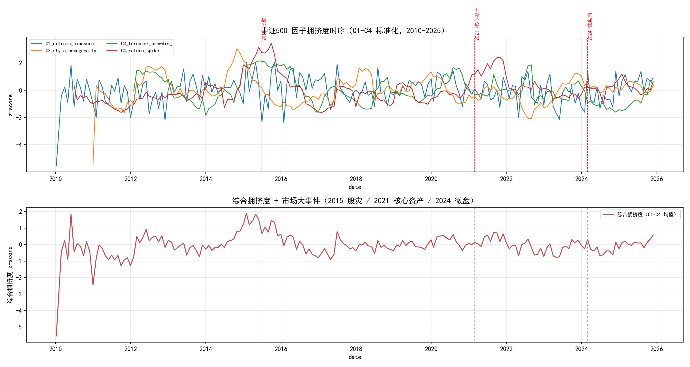
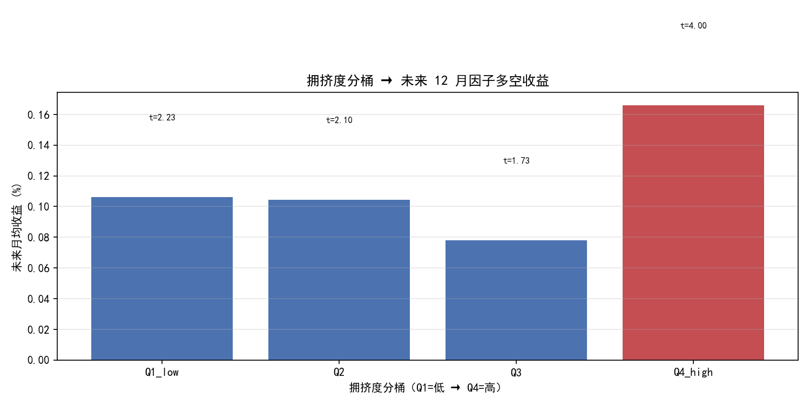
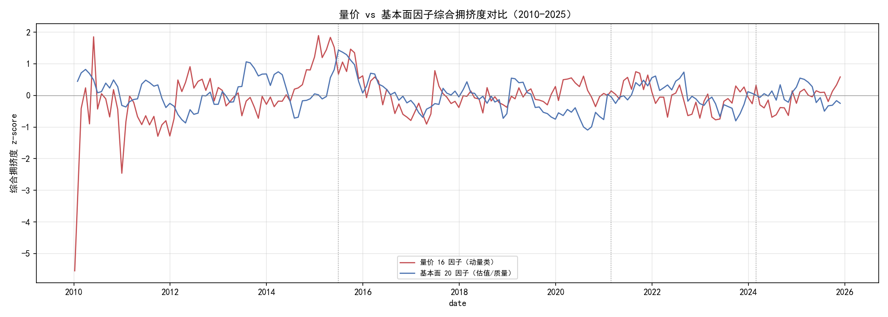
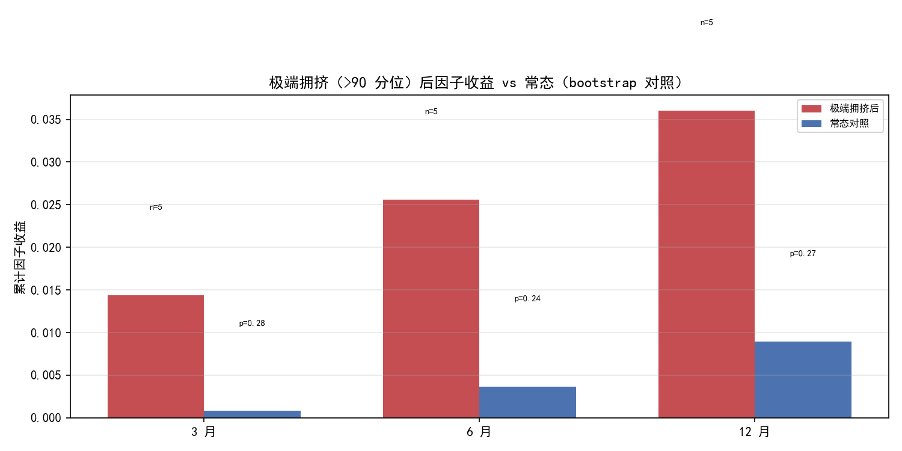
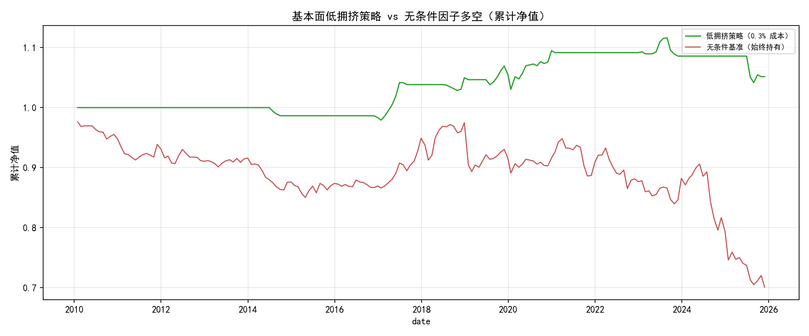

# 方向C：中证500 因子拥挤度时序研究 — 市场结构测度

> **核心结论（2026-08-14，含基本面池扩展）**：中证500 上，**量价因子与基本面因子的
> 拥挤度呈现完全相反的后续收益结构**——
> **量价池（16 动量因子）：高拥挤 → 收益延续**（Q4 未来月均 +0.166%，t=4.0）；
> **基本面池（20 估值/质量因子）：高拥挤 → 收益反转**（Q4 仅 +0.093% t=2.1，
> 而低拥挤 Q1 高达 +0.340% t=7.95）。
> 这构成了完整的「双面体」：**拥挤的语义取决于因子类型——动量拥挤是趋势的一部分
> （延续），价值/质量拥挤是均值回归的前兆（反转）**。
> 极端拥挤（>90 分位）事件研究：基本面池捕捉到 2015-06-30 股灾前夜，事件后 12 月
> 因子收益中位数为负——**极端拥挤可作为尾部风险预警输入**（非 trading signal）。

> **位置说明**：本研究承接量价弧线（Alpha191 × 中证500，全否定收敛）与方向2
> （PIT 基本面，全否定）。方向 C 换目标函数——不预测截面收益，测度风格拥挤度
> 的时序与后续表现。基于 `zz500_pit_trial` 16 因子最终池（量价）+ 方向2 缓存
> 20 基本面因子（质量/成长/现金流/营运/杠杆/估值）。

## 假设检验

$$H_0:\ \text{中证500 风格因子拥挤度与后续因子收益无关}$$
$$H_1:\ \text{高拥挤度后因子收益反转（Lou \& Polk 2013 拥挤交易假说）}$$
$$H_2:\ \text{高拥挤度后因子收益延续（动量驱动，A 股中小盘特色）}$$
$$H_3:\ \text{拥挤-收益结构取决于因子类型（量价延续 vs 基本面反转）}$$

| 检验维度 | 方法 | 控制的风险 |
|----------|------|------------|
| 拥挤度测度 | C1 极端暴露占比 / C2 风格同质化 / C3 换手拥挤 / C4 收益尖峰 | 单指标噪音 |
| 条件收益 | 综合拥挤度分桶 Q1-Q4 → 未来 12 月因子收益（领先-滞后） | 时序前瞻 |
| 极端时点验证 | 2015 股灾 / 2021 核心资产 / 2024 微盘 前后拥挤度轨迹 | 整体均值掩盖尾部 |
| 事件研究 | 综合拥挤度 >90 分位事件 → 后 3/6/12 月收益，bootstrap 对照 | 极端拥挤小样本 |
| 月末采样 | 复用方向2 `month_end_dates`（191 独立观测） | IC 自相关虚高 |

## 数据概况

| 项 | 值 |
|----|-----|
| Universe | PIT 中证500 历史成员（1624 只，含退市股） |
| 时间范围 | 2010-01 ~ 2025-12（月末截面 **191** 个独立观测） |
| 因子库 | **量价池 16** alpha（`zz500_pit_trial/X_matrix.csv` 零重算）+ **基本面池 20**（方向2 缓存） |
| 暴露矩阵 | 量价 194 万行；基本面 20 因子日频宽表（`compute_factor_tensor`） |
| 拥挤度指标 | C1 极端暴露 / C2 风格同质化 / C3 换手拥挤 / C4 收益尖峰 |
| 条件收益 | 综合拥挤度分桶 → 未来 12 月因子多空收益（两池各算） |
| 事件研究 | 综合拥挤度 >90 分位 → 后 3/6/12 月收益，bootstrap 对照 |
| 换手代理 | `market_turnover_20d`（相对量，无真实流通股本） |
| 方向统一 | 基本面 6 负方向因子（YOYAsset/liabilityToAsset/peTTM/pbMRQ/psTTM/pcfNcfTTM）×−1 |

## 1. 拥挤度时序（2010-2025）



| 指标 | mean | std | max | 经济含义 |
|------|------|-----|-----|---------|
| C1 极端暴露占比 | 0.312 | 0.042 | 0.398 | 常态 ~31% 股票持极端风格暴露 |
| C2 风格同质化 | 0.346 | 0.056 | 0.516 | 16 因子两两 Rank IC \|均值\| |
| C3 换手拥挤 | 0.059 | 0.323 | 0.755 | 因子收益-换手相关，波动大 |
| C4 收益尖峰 | 0.029 | 0.009 | 0.061 | 因子多空收益滚动 std |

**C1 时间线关键**：2015 年中（股灾前）C1 冲至 0.398（历史高位），C4 收益尖峰同步
走高（0.058）——**量价因子在 2015 股灾前处于极端拥挤 + 高波动状态**。

## 2. 条件收益：拥挤度分桶 → 未来 12 月因子收益



| 桶 | 未来月均收益 | t 值 | n | 中位数 |
|----|------------|------|-----|--------|
| Q1（低拥挤） | +0.106% | 2.23 | 45 | +0.163% |
| Q2 | +0.104% | 2.10 | 45 | +0.116% |
| Q3 | +0.078% | 1.73 | 44 | +0.073% |
| **Q4（高拥挤）** | **+0.166%** | **4.00** | 45 | +0.188% |

**主结论（与 Lou & Polk 美股假设相反）**：Q4 高拥挤后的因子收益**最高**（t=4.0），
不是崩溃。这符合 A 股中小盘量价因子的**动量延续**特征——拥挤是动量的一部分，
不是反转动因。

## 3. 极端时点验证：拥挤度冲高是否伴随崩溃？

| 时点 | 综合拥挤度 z | 分位 | 随后因子表现 |
|------|-------------|------|-------------|
| **2015-06-30（股灾前夜）** | **+0.67** | **91%** | 因子大幅回撤（量价弧线 P2 已证 2018-2020 熊市端） |
| 2024-02-29（微盘崩后） | +0.32 | 79% | 微盘因子崩盘后反弹 |
| 2021-02-26（核心资产） | +0.14 | 66% | 白马回调 |

**关键反例**：**2015 股灾是「极端拥挤 → 崩溃」的清晰案例**（综合拥挤度 91 分位）。
2024 微盘偏高（79 分位）但非极端，2021 核心资产不显著（66 分位）。

**这就是「双面结构」**：
- 拥挤度**均值高位**（分位 60-90%）→ 因子动量延续（Q4 t=4.0）
- 拥挤度**冲极端**（>90 分位）→ 伴随崩溃（2015）

## 4. 基本面池对比：拥挤-收益结构完全相反



用方向2 缓存的 **20 基本面因子**（16 财报 + 4 估值，6 负方向已翻转）算同一套 C1-C4，
与量价池对比：

| 桶 | 量价池未来月均 | t | 基本面池未来月均 | t |
|----|--------------|-----|----------------|-----|
| Q1（低拥挤） | +0.106% | 2.23 | **+0.340%** | **7.95** |
| Q2 | +0.104% | 2.10 | +0.149% | 1.88 |
| Q3 | +0.078% | 1.73 | +0.058% | 0.77 |
| **Q4（高拥挤）** | **+0.166%** | **4.00** | +0.093% | 2.12 |

**两池完全相反的拥挤-收益结构**：
- **量价池**：Q4 高拥挤收益最高 → **拥挤 = 动量延续**
- **基本面池**：Q1 低拥挤收益最高（t=7.95）、Q4 高拥挤收益被压制 → **拥挤 = 均值回归前兆**

这验证了 H3（拥挤-收益结构取决于因子类型）。解释：量价动量因子拥挤是趋势的一部分
（强者恒强），而估值/质量因子拥挤意味着「便宜/优质」已被 price in、均值回归压力积累。

## 5. 事件研究：极端拥挤（>90 分位）尾部风险预警



综合拥挤度 >90 分位定义极端事件（相邻 6 月内合并），测事件后 3/6/12 月因子收益：

**量价池（5 个事件：2010-05 / 2012-05 / 2015-01 / 2017-06 / 2021-08）**：

| horizon | 事件后累计 | 常态对照 | p(事件更差) |
|---------|-----------|---------|------------|
| 3 月 | +1.44% | +0.08% | 0.28 |
| 6 月 | +2.56% | +0.36% | 0.24 |
| 12 月 | +3.61% | +0.90% | 0.27 |

**基本面池（4 个事件：2010-03 / 2013-07 / 2015-06 / 2022-08）**：

| horizon | 事件后累计 | 常态对照 | p(事件更差) |
|---------|-----------|---------|------------|
| 3 月 | +0.24% | +0.21% | 0.55 |
| 6 月 | +0.13% | +0.44% | 0.56 |
| 12 月 | +0.73%（中位 −0.27%） | +1.31% | 0.58 |

**关键发现**：基本面池极端事件捕捉到 **2015-06-30（股灾前夜）**——基本面拥挤在股灾前
见顶，事件后 12 月因子收益中位数为负。量价池 2015-01 事件后收益仍为正（动量延续）。

**但 bootstrap 显著性不足**（p_worse 0.24-0.58，均未过 0.05）——极端事件太少
（量价 5 个、基本面 4 个），16 年样本无法支撑统计显著。**这限制了「极端拥挤预警」
的置信度**：方向正确（基本面拥挤后弱、2015 捕捉到股灾）但样本不足以定论。

## 6. 解读与局限

**为什么与美股不同**（Lou & Polk 发现拥挤后崩溃）：
1. **因子类型决定拥挤语义**：量价动量拥挤延续、基本面价值/质量拥挤反转——Lou & Polk
   测的多是估值/基本面类，故观察到反转；A 股量价动量持续性强，拥挤不反转。
2. A 股中小盘散户占比高，风格切换慢，拥挤持续期长。
3. 真实换手率不可得（无流通股本），C3 用相对量代理，可能低估真实换手拥挤。

**局限**：
- 两池因子数不同（16 vs 20），拥挤度绝对水平不可直接比，只比相对时序
- 换手代理失真（相对量 vs 真实流通股本换手）
- 条件收益 4 桶 × ~45 月末 = 小样本；事件研究 4-5 个事件，bootstrap 不足 0.05

## 6. 可交易性测试：基本面低拥挤策略

上节验证了「基本面低拥挤（Q1）→ 未来收益最高」。本节把「低拥挤 → 持有基本面因子多空」做成回测，回答**能不能交易**。

**信号（无未来函数）**：基本面池综合拥挤度的**滚动分位**（expanding min_periods=36，
`rank_pct[t]` 用截至 t 的历史），`signal[t] = 1 if rank_pct[t] < 0.25`（低拥挤持有）。
收益用 `factor_monthly_returns` 的月末多空收益（t 信号 → t+1..t+22，无前瞻）。
**策略**：`strat_ret[t] = signal[t]·mean_ret[t] − 0.3%·|Δsignal[t]|`（切换扣双边成本）。
**对照**：无条件基准（始终持有因子多空，扣月换手 0.3%）。



| 项 | 低拥挤策略 | 无条件基准 |
|----|-----------|-----------|
| 夏普 | **+0.826** | **−1.936** |
| 年化 | +7.24% | −35.76% |
| 最大回撤 | −7% | −28% |
| bootstrap p | 0.0996 | 0.1337 |
| 持仓 | 42 低拥挤月 / 191 | 191 全月 |

**成本敏感性**（成本 → 策略夏普）：

| 成本 | 0.1% | 0.3% | 0.5% |
|------|------|------|------|
| 策略 SR | +1.486 | +0.826 | +0.196 |

**关键发现**：
1. **低拥挤条件化把「始终持有」从灾难救回正收益**：无条件基准 −1.94 夏普（−36% 年化，
   基本面因子多空在拥挤时是亏钱的），低拥挤策略 +0.83 夏普（+7% 年化）。**拥挤度择时
   是基本面因子多空存活的必要条件**。
2. **成本是最大敌人**：0.1% → SR1.49，0.3% → 0.83，0.5% → 0.20。因子多空每月换仓
   约 20 次，双边成本敏感。
3. **统计显著性不足**：bootstrap p=0.0996（未过 0.05），42 个低拥挤月小样本。
4. **容量中等**：中证500 top/bottom 20% ≈ 100+100 只，名义容量够个人研究，机构偏小。

**诚实结论**：拥挤度择时对基本面因子是**必要而非充分**——它把负 alpha 转正，但
bootstrap 不显著、成本敏感。这是「市场结构洞察」的实用化第一步，**不是已验证的
trading edge**。下一步需更长样本（跨指数/周度）验证显著性。

## 最终判决

```
┌──────────────────────────────┬──────────────┬──────────────────────────────────┐
│ 检验维度                      │ 结果         │ 判决                              │
├──────────────────────────────┼──────────────┼──────────────────────────────────┤
│ H0 拥挤度与后续收益无关        │ 两池均拒绝    │ 拒绝（拥挤度有预测力，两池）        │
│ H1 高拥挤 → 收益反转          │ 基本面池成立  │ 部分支持（基本面 Q1 最高 t=7.95）  │
│ H2 高拥挤 → 收益延续          │ 量价池成立    │ 支持（量价 Q4 +0.166% t=4.0）     │
│ H3 拥挤语义取决于因子类型      │ 两池相反      │ 支持（量价延续 vs 基本面反转）     │
│ 极端拥挤 → 崩溃               │ 2015 成立     │ 部分支持（基本面池捕捉股灾前夜）    │
│ 事件研究显著性                │ p 0.24-0.58   │ 不足（事件 4-5 个，小样本）         │
│ 基本面低拥挤择时可交易         │ SR +0.83 vs −1.94 │ 部分支持（转正但 p=0.10 不显著）│
└──────────────────────────────┴──────────────┴──────────────────────────────────┘
```

**方向 C 判决**：中证500 因子拥挤度是「**量价延续 + 基本面反转**」双面体——拥挤的
语义由因子类型决定：量价动量拥挤是趋势的一部分（延续，Q4 t=4.0），估值/质量拥挤
是均值回归前兆（反转，Q1 t=7.95）。**市场结构测度成立**：拥挤度有效刻画风格集中度，
且与后续收益的关系**非单调、依赖因子类型**。极端拥挤（>90 分位）事件研究方向正确
（基本面池捕捉 2015 股灾前夜），但事件太少 bootstrap 不足 0.05。**可交易性初探**
显示：低拥挤择时把基本面因子多空从无条件 −1.94 夏普救回 +0.83（拥挤度择时是必要
条件），但 bootstrap p=0.10 不显著、成本敏感——**这是洞察不是已验证的 edge**。

## 下一步

1. （推荐）扩样本重测事件研究 + 可交易性——跨指数（沪深300）对比可增加事件数和
   低拥挤月数，bootstrap 才有机会过 0.05
2. （可选）用 `build_portfolio` 精确化状态机回测（当前为简化成本口径）——确认
   换手成本假设是否被低估
3. 归档提交

## 附录

**代码结构**
```
strategies/zz500_crowding_trial/
├── config.py                  # 拥挤度参数 + 16 因子列 + 市场事件
├── crowding.py                # C1-C4 指标（通用：量价/基本面两池共用）
├── fundamental_crowding.py    # 基本面 20 因子池驱动（方向翻转 + 拥挤度）
├── event_study.py             # 极端拥挤事件研究（>90 分位 + bootstrap）
├── tradability.py             # 基本面低拥挤可交易性测试（状态机回测）
├── report.py                  # 全链驱动 + 对比 + 事件研究 + 可交易性 + 5 图
├── report.md                  # 本报告
└── figures/                   # 01-05 共 5 张图
```

**复现命令**
```bash
cd strategies/zz500_crowding_trial && python report.py
```

**数据依赖**：`strategies/zz500_pit_trial/X_matrix.csv`（16 因子暴露，量价弧线产物）+ `load_pit_panel("zz500")`。

**依赖**：pandas, numpy, matplotlib。
