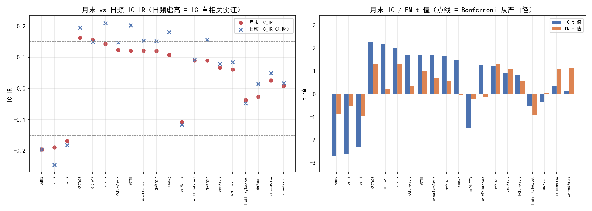
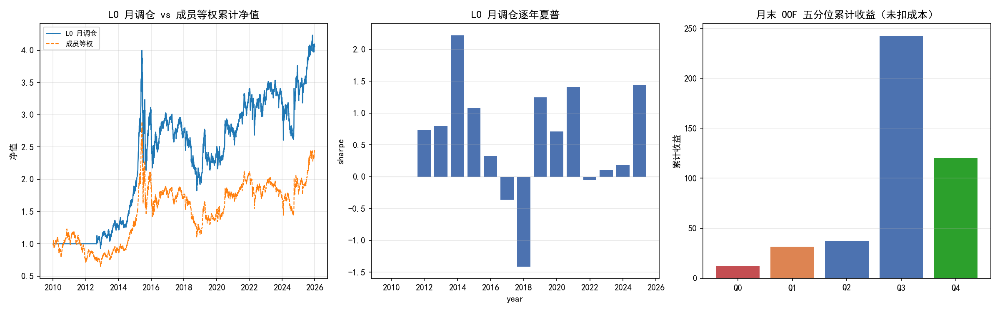

# 方向2：PIT 基本面因子 × 中证500 — 财报质量/成长/现金流/估值的多因子检验

> **状态：数据拉取被 baostock 风控阻塞（2026-08-12）**。本报告为结构骨架，全部数值待数据到位后填充。
> 代码链已提交（`7be0c6d`），方法论测试已通过（`tests/test_monthly_sampling.py`）。
> 数据源解封后：`python data/fetch_all_fundamental.py --qps 3`（串行+限流）→ `report.py` 全链填数。

> **核心结论（待数据填充）**：PIT 中证500 上，财报质量/成长/现金流/估值四类基本面的
> 月末截面预测力是否显著、在真实成本与 selection bias 消除后是否仍有可交易 edge。
> **结论允许任何方向——这是量价弧线全否定后唯一未测的信息源，诚实呈现比证明重要。**

## 假设检验

$$H_0:\ \text{PIT 基本面因子在中证500 的月度预测力} \le 0\ \text{（扣成本后无可交易 alpha）}$$
$$H_1:\ \text{质量/成长/现金流/估值在中小盘定价低效下具有显著截面预测力}$$

| 检验维度 | 方法 | 控制的风险 |
|----------|------|------------|
| 因子提纯 | 月末截面四维 AND（\|IC_IR\|>0.15, \|IC_t\|>2.0, \|FM_t\|>2.0, CS_eff>0.5），Bonferroni 从严 \|t\|>3.09 | 季频因子日频采样的 IC 自相关虚高 |
| 冗余剔除 | Rank IC \|corr\|>0.8 贪心剔除（池 ≤10） | 财报因子强共线虚增维度 |
| 非线性合成 | LightGBM + PurgedTimeSeriesSplit（purge 2 月末单位） | 时序泄露、月度标签自相关 |
| 样本外 | 年度重选池 Walk-Forward PIT-Select（2015-2025 expanding） | 全样本选池的 selection bias |
| 显著性 | Block bootstrap（block=20, n=10000）夏普 p 值 | 收益偶然性 |
| 等权基线 | 最终池截面 zscore 等权（铁律 4，先跑） | ML 合成的过拟合假优势 |
| 幸存者偏差 | PIT 中证500 月末快照并集（1625 只含退市股），pubDate+1 对齐 | 回看当前成分、财报未来函数 |

## 数据概况

| 项 | 值 |
|----|-----|
| Universe | PIT 中证500 历史成员并集（baostock 月末快照，1625 只含退市/调出股） |
| 时间范围 | 2010-01-01 ~ 2025-12-31（月末截面 ≈ 190 个独立观测） |
| 因子库 | 25 = 21 财报（6 接口，PIT=pubDate+1）+ 4 估值（日频快照） |
| 标签 | 未来 21 交易日截面收益 `close(t+22)/close(t+1)-1`，前/后 20% = 1/0 |
| 样本量 | 月末长表 ≈ 190 月 × ~500 成员 ≈ 95k 行（待确认） |
| 调仓频率 | 月度（月末信号 → 次日生效 → 持有至下月末） |
| 成本 | 双边 0.3%（与全链路一致） |
| 财报 PIT 对齐 | pubDate+1 天有效（财报收盘后发布）；pubDate 缺失回退法定截止日+1 |
| 估值对齐 | 日频快照（价格当天已知），+1 交易延迟由回测引擎 t→t+1 约定天然提供 |
| 数据源状态 | **baostock 风控封禁中，待解封拉取**（见附录「数据阻塞记录」） |

## 1. 方法论：月末截面采样（与价量链路分道）

**为什么必须月末采样**：财报因子是季频数据，前向填充到日频后，**相邻交易日的因子值完全相同**。
若沿用价量链路的逐日 IC 评估：

1. 逐日 IC 序列强自相关（lag1 ≈ 0.9）→ 有效样本数虚增 → **t 值被 √(过采样) 放大**
2. 同一财报值被重复采样，统计独立性被破坏

**实证（合成面板测试，`tests/test_monthly_sampling.py`）**：

| 口径 | 有效样本 | IC 序列 lag1 自相关 | t 值 |
|------|---------|-------------------|------|
| 日频采样 | 4089 | **0.88** | **1979** |
| 月末采样 | 189 | **0.01** | **408** |

同一真实信号，日频 t 值是月末的 **4.9×**——一个日频恰好过阈值的因子在月末口径会显著失败。
这是方向2 与价量链路最本质的方法论差异：**提纯/ML/回测全链路必须在月末截面评估**。

**其他方法论决策**：
- 标签前瞻期 = 21 交易日（月调仓），非价量的 5 日
- `PurgedTimeSeriesSplit.purge_days` 是样本数组的**索引位置数**——月末采样下必须按月计（purge=2），**绝不能传 22**（会 purge 掉 22 个月末 ≈ 1/5 训练集）
- **第一版就走 WF PIT-Select 逐年重选池**，不先全样本选池再事后纠正（价量链路 1.906→0.25 的教训）
- 月调仓实现 = 月末预测**前向填充到日频 + `build_portfolio(hold_days=1)`**（裸"月末有值+hold=1"会让持仓只在月末后 1 天存在，与 21 日标签错配）

## 2. 因子清单（25 = 21 财报 + 4 估值）

| 类别 | 因子 | 方向(先验) | 经济含义 |
|------|------|-----------|----------|
| 质量 | roeAvg | + | 净资产收益率 |
| 质量 | dupontROE | + | 杜邦 ROE |
| 质量 | npMargin | + | 净利润率 |
| 质量 | gpMargin | + | 毛利率 |
| 质量 | epsTTM | + | TTM 每股收益 |
| 成长 | YOYNI | + | 净利润同比（PEAD 惯性） |
| 成长 | YOYPNI | + | 扣非净利同比 |
| 成长 | YOYEPSBasic | + | EPS 同比 |
| 成长 | YOYAsset | − | 资产增长异象 |
| 现金流 | CFOToNP | + | 经营现金流/净利（盈利质量） |
| 现金流 | CFOToOR | + | 经营现金流/营收 |
| 现金流 | CFOToGr | + | 经营现金流/营业总收入 |
| 现金流 | CAToAsset | + | 流动资产/总资产 |
| 现金流 | ebitToInterest | + | 息税前利润/利息 |
| 营运 | NRTurnRatio | + | 存货周转率 |
| 营运 | INVTurnRatio | + | 应收周转率 |
| 营运 | CATurnRatio | + | 流动资产周转率 |
| 营运 | AssetTurnRatio | + | 总资产周转率 |
| 杠杆 | liabilityToAsset | − | 资产负债率 |
| 杠杆 | currentRatio | + | 流动比率 |
| 杠杆 | cashRatio | + | 现金比率 |
| 估值 | peTTM | − | 市盈率 TTM（价值溢价） |
| 估值 | pbMRQ | − | 市净率 |
| 估值 | psTTM | − | 市销率 |
| 估值 | pcfNcfTTM | − | 市现率 |

- **方向标注为先验**，最终判定以月末 IC 实测符号为准（报告给方向一致性诊断 `sign_ok`）
- 估值预处理：非正值置 NaN（剔除亏损股）→ 截面 1%/99% winsorize → log
- 共线组（质量 5 / 杠杆 2）由冗余剔除处理，**池收窄到 5-8 个是预期内，不是失败**

## 3. 因子提纯（月末四维 AND）

  <!-- 待数据生成 -->

阈值：`|IC_IR|>0.15`（月末 ~190 截面 ⟺ t≈2.0）AND `|IC_t|>2.0` AND `|FM_t|>2.0` AND `CS_eff>0.5`；
报告附 Bonferroni 从严列（\|t\|>3.09，25 因子多重检验）。**MUST_KEEP=∅**（基本面无先验锚，不 reintroduce bias）。

<!-- 待数据填充：提纯结果表（每因子 IC_mean/IC_IR/IC_t/FM_t/CS/daily 对照/sign_ok/pass）+ 通过因子清单 -->

**日频 vs 月末对照（数据到位后必填）**：若日频 \|IC_t\| 系统性高于月末（>1.5×），即实证
第 1 节的 IC 自相关通胀——这是"方法与价量分道"的书面证据。

## 4. LightGBM 合成（月末 Purged CV）

- 标签：`build_labels(fwd_days=21, top_q=0.2)` → 月末对齐
- CV：`PurgedTimeSeriesSplit(n_splits=5, purge_days=2)`（**月末单位**）
- 模型：LGBM（与价量链路同参），balanced 权重，early stopping
- 评估：月末截面 OOF Rank IC/IR/t + 五分位累计收益

<!-- 待数据填充：CV AUC / OOF 月末 Rank IC/IR/t / 五分位累计 / 特征重要性 top -->

## 5. 月调仓组合回测

<!-- 待数据填充：LO/LS/等权基线/成员等权/指数基准对比表 + bootstrap p + 逐年分解 + MA200 gate 对照 -->

  <!-- 待数据生成 -->

<!-- 待数据填充：LO-raw vs LO-ew（等权基线）——ML 必须显著优于基线才通过铁律 4 -->

## 6. Walk-Forward PIT-Select（selection bias 消除）

每年用截至当年的数据**重选因子池 + 重训**，预测次年（月调仓）。同时跑固定池对照，
两者 OOF 差异 = selection bias 的定量幅度。

<!-- 待数据填充：WF 逐年表（池大小/训练样本/年化/夏普/回撤）+ 固定池 vs PIT-Select 对照 -->

<!-- 待生成：figures/03_walk_forward.png -->

## 7. 中性化与容量诊断

<!-- 待数据填充：行业+log成交额中性化后 Rank IC 变化、LO 相对指数超额 IR、容量上限 -->

局限（预先披露）：行业分类为 baostock **当前快照（非 PIT）**；财报值可能为修订后版本（重述风险）；
退市股财报前 1-2 年缺失 → 选择性缺失偏乐观。IC 同时给 raw 与中性化两套。

## 最终判决

<!-- 待数据填充：Unicode box-drawing 汇总各 H 的接受/拒绝 -->

```
┌──────────────────────────┬──────────┬────────────────────────────┐
│ 检验维度                  │ 结果     │ 判决                        │
├──────────────────────────┼──────────┼────────────────────────────┤
│ H1 质量/成长/现金流 IC    │ TBD      │ 待数据填充                   │
│ H2 估值负向预测          │ TBD      │ 待数据填充（小盘 junk value）│
│ H3 ML 月调仓 > 等权基线   │ TBD      │ 待数据填充                   │
│ H4 中性化后信号保留       │ TBD      │ 待数据填充                   │
│ H5 edge 逐年衰减          │ TBD      │ 待数据填充                   │
│ WF PIT-Select vs 固定池   │ TBD      │ selection bias 幅度          │
└──────────────────────────┴──────────┴────────────────────────────┘
```

## 下一步

1. **数据解封拉取**：`python data/fetch_all_fundamental.py --qps 3`（串行 6 接口 + 估值，断点续写）
2. **填数全链**：`cd strategies/zz500_fundamental_trial && python report.py`（purify → matrix → train → backtest → WF）
3. **回归**：`python tests/test_monthly_sampling.py` + `enhance.py`（build_portfolio 默认行为不变）
4. **报告完成**：填全部 TBD + 生成 3 张图（≥2 张嵌入底线）+ `grep '!\[.*\](.*)' report.md` 检查

## 附录

**代码结构**
```
data/
├── fundamental_fetcher.py        # fetch_interface 按接口批处理 + qps 限流 + checkpoint
├── valuation_fetcher.py          # PE/PB/PS/PCF 4 估值字段独立缓存
├── fetch_all_fundamental.py      # 串行调度：6 接口 + 估值 + 完整性校验 + 断点
├── cache_fundamental/            # 21 财报字段宽表（.gitignore）
└── cache_valuation/              # 4 估值字段宽表（.gitignore）

signals/fundamental/factors.py    # FACTOR_SPECS(25) 工厂化 compute_* + 估值预处理
strategies/zz500_fundamental_trial/
├── config.py                     # 月末口径参数（fwd=21, purge=2, 阈值）
├── purify.py                     # 月末四维提纯 + 日频 t 通胀对照
├── build_monthly_matrix.py       # 月末快照 X/y 长表
├── train_cv.py                   # 月末 LGBM Purged CV + evaluate_oof_monthly
├── backtest_monthly.py           # 月调仓回测（pred 前向填充 + hold=1）
├── walk_forward_pit_select.py    # 年度重选池 + 固定池对照
├── report.py                     # 全链驱动 + 图表
└── report.md                     # 本报告
tests/test_monthly_sampling.py    # 方法论验证（月末 192 截面 / fwd 无未来函数 / t 值通胀 4.9x）
```

**复现命令**
```bash
cd D:/桌面文件/quant
# 数据（baostock 解封后，串行+限流，~66h 财报 + ~15min 估值）
python data/fetch_all_fundamental.py --qps 3

# 全链报告
python tests/test_monthly_sampling.py                          # 方法论验证
cd strategies/zz500_fundamental_trial && python report.py      # 提纯→训练→回测→WF

# 回归
python strategies/zz500_pit_trial/enhance.py                   # build_portfolio 默认行为不变
```

**数据阻塞记录（2026-08-12）**
- 首次拉取时 6 进程并行 ~36 q/s，~40 min 后 baostock 返回 `error_code 10001011`（黑名单），
  全部命中冻结、数据未落盘（cache_fundamental 为空）。
- 封禁对象判断：baostock 免费版为匿名登录（`user_id='anonymous'`），服务端仅能按 IP 识别，
  故为 **IP 级封锁**。换 IP 理论可绕但数据中心 IP 更可疑，且根因是高速并行——慢速串行才是根治。
- 已修复：`fetch_interface`/`fetch_valuation` 加 qps 限流（默认 3），`fetch_all_fundamental.py`
  串行调度 + 接口级断点。**严禁再次并行多进程拉取。**

**依赖**：pandas, numpy, lightgbm, matplotlib, scikit-learn, baostock（数据）。
