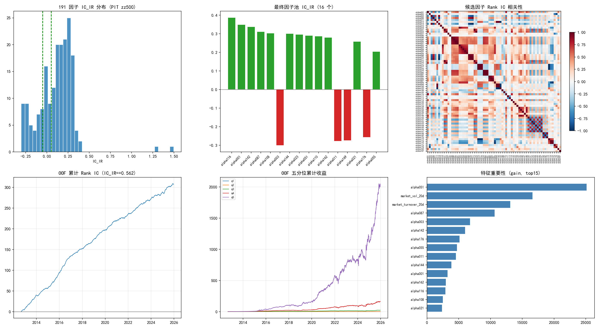
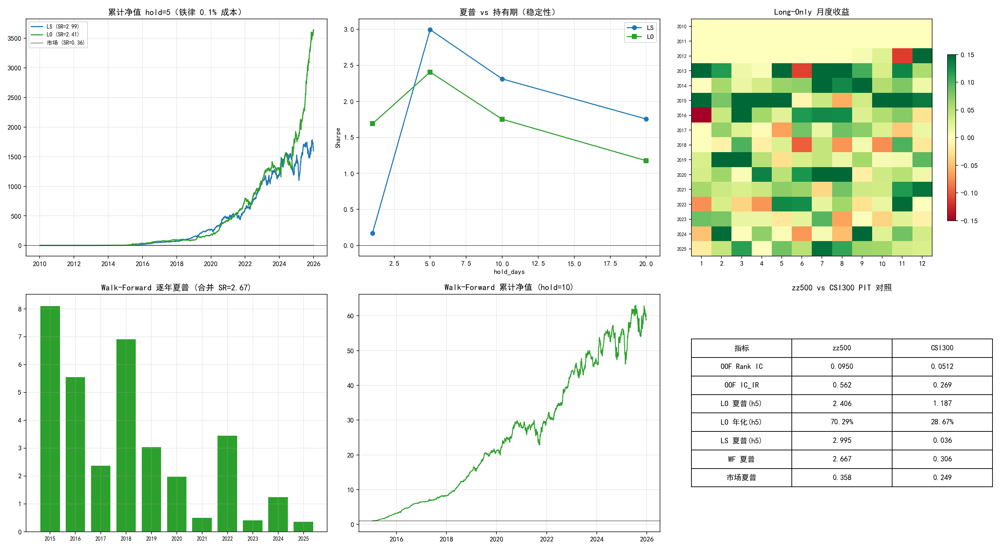
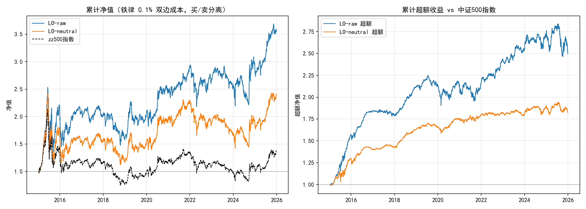
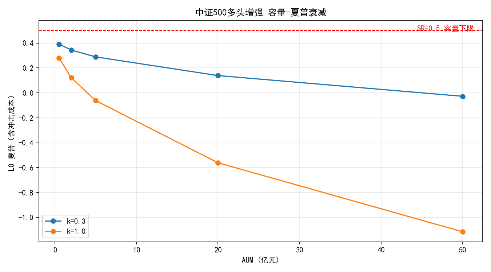
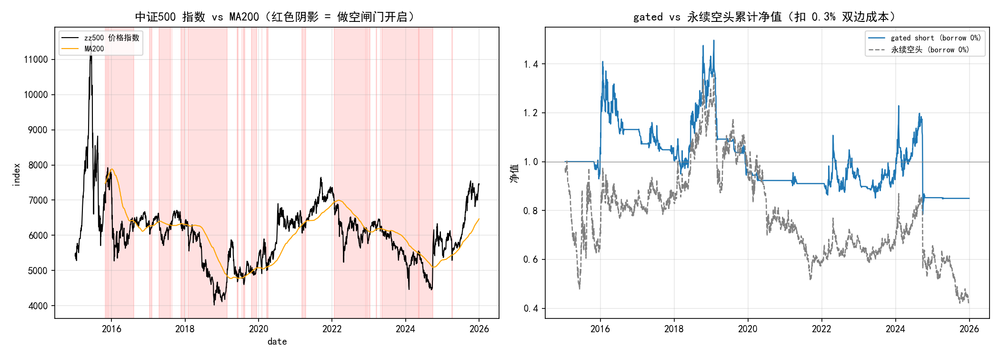
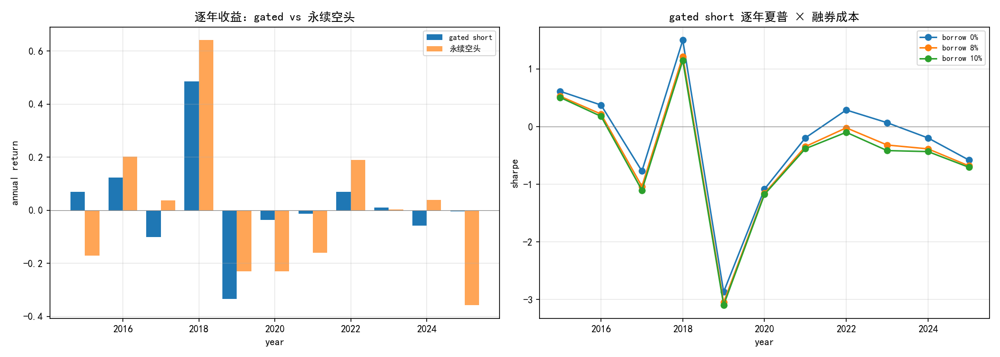
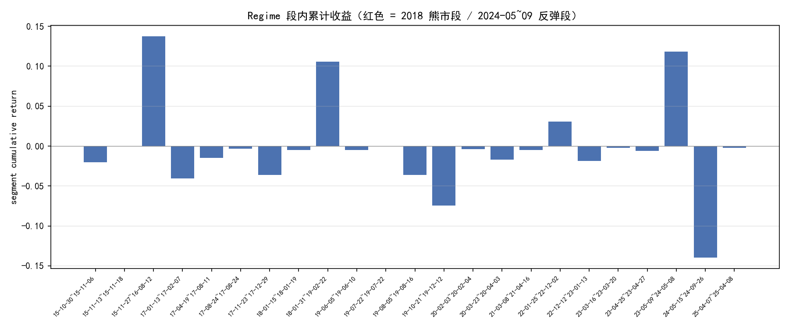

# 路线②：PIT 中证 500 全链复现 — Alpha191 量价因子在中小盘的有效性检验

> **核心结论**：把与沪深 300 完全相同的 Alpha191 → 提纯 → LightGBM 合成 → 组合回测链路
> 原样搬到 PIT 中证 500 universe（1624 只历史成员，含退市股），信号强度**全面翻倍**：
> 三维提纯通过 72 个因子（CSI 300 仅 29），OOF Rank IC 0.095（CSI 300 0.051），
> Long-Short 净成本后夏普 **1.618**（CSI 300 仅 0.036，做空端在大盘被成本吃光），
> Long-Only 夏普 1.906 / 年化 +54.5%（CSI 300 1.187 / +28.7%）。
> **假设成立**：中小盘定价更低效，量价因子确实更有效——这是路线①（大盘换因子池无效）
> 之后第一个真正为正的方向。
>
> **但三条红线必须同时读**：
> 1. **因子池是全样本选出的**（selection bias 未消除）——Walk-Forward 每年重训模型，
>    但因子池没有每窗口重选，OOF/CV 的 IC 被高估，只有 WF 逐年数是相对干净的样本外。
> 2. **超额高度前置**：WF 合并夏普 1.438 主要由 2015-2016 贡献（2015 单年 SR 6.29、年化 +146%，
>    正逢小盘股泡沫），2021/2023/2025 三年为负——**edge 在衰减**。
> 3. 组合级 |SR| 均 < 3，未触发铁律红线；2015 单年 SR 6.29 是 232 交易日短窗口 + 特殊市场
>    regime 的产物，非未来函数（复用已审计的权重追踪 + PIT 掩码机制）。
>
> **P1 追加（2026-08-12）**：上述 LO 1.906 同样含 selection bias——用 WF PIT-Select 去 bias 预测
> 重跑 LO，夏普暴跌至 **0.25**（约 87% 是选择偏差），相对指数超额 ≈ 0（IR −0.01）；叠加行业/市值
> 中性化后 IR 转负（**−0.56**）。**"残余价值在多头指数增强方向"的判断被否定**，信号本质是小市值/
> 行业暴露。仅剩 2018 式熊市做空端（2018 单年 SR +2.33）。详见第 4 节 P1。
>
> **P2 追加（2026-08-12，弧线收尾）**：regime 过滤（指数<MA200）+ 纯空头腿把永续空头的年化 −3.5%
> 收敛到 **+0.2%**（SR −0.11→+0.01），但叠加真实融券成本（年化 8%/10%）后 SR 转负至 **−0.18/−0.23**；
> 剔除 2018 后（borrow 8%）年化 −6.7%、SR −0.39；Block bootstrap 全部不显著（p>0.23）。**做空端也否定**。
> 量价 × 中证 500 三方向（多空/多头增强/做空端）全部检验完毕，研究弧线收敛。

## 假设检验

$$H_0:\ \text{Alpha191 量价因子在中证 500 的有效性} \le \text{在沪深 300 的有效性}$$
$$H_1:\ \text{中证 500 有效性} > \text{沪深 300}\quad(\text{中小盘定价更低效})$$

| 检验维度 | 方法 | 控制的风险 |
|----------|------|------------|
| 因子提纯 | 191 因子三维过滤（IC_IR + FM t + 截面有效比），PIT 成员掩码内 | 纸老虎因子、伪显著 |
| 冗余剔除 | Rank IC 序列 \|corr\|>0.8 贪心剔除 | 因子共线性虚增维度 |
| 非线性合成 | LightGBM + Purged K-Fold（purge 6 天） | 时序泄露、过拟合 |
| 样本外 | 年度再训练 Walk-Forward（expanding，2015-2025） | 全样本 CV 的乐观偏差 |
| 显著性 | Block Bootstrap（block=20, 1万次）夏普检验 | 收益偶然性 |
| 持有期稳定性 | hold ∈ {1,5,10,20} 网格 | 单一持有期过拟合 |
| 幸存者偏差 | PIT 中证 500 月末快照并集（1624 只含退市股） | 回看当前成分股 |

## 数据概况

| 项 | 值 |
|----|-----|
| Universe | PIT 中证 500 历史成员并集（baostock 月末快照） |
| 股票数 | 1624 只（含退市/调出股，日均在指数 500 只） |
| 时间范围 | 2010-01-01 ~ 2025-12-31（3886 交易日） |
| 因子库 | Alpha191（国泰君安），全 191 个 |
| 样本量 | 长格式 1,942,873 行；有效标签 779,725 |
| 成本 | 双边 0.3%（买 0.026%+卖 0.076%+2×0.05% 滑点口径） |
| 标签 | 未来 5 日截面收益，前/后 20% = 1/0，中间不训练 |

## 1. 因子提纯与合成结果

191 个因子在 PIT 中证 500 成员掩码内做三维提纯（\|IC_IR\|>0.05、Fama-MacBeth \|t\|>2、
截面有效比>0.5），**72 个通过**——是 CSI 300 PIT（29 个）的 2.5 倍。经 Rank IC 相关性
冗余剔除（72→39）后按 \|IC_IR\| 取前 15 + 硬保留 alpha001/alpha055，得 16 因子池：

| 排名 | 因子 | IC_IR | FM_t | CS_eff |
|------|------|-------|------|--------|
| 1 | alpha116 | +0.386 | +6.55 | 1.00 |
| 2 | alpha001 | +0.349 | +7.66 | 1.00 |
| 3 | alpha142 | +0.338 | +6.10 | 1.00 |
| 4 | alpha087 | +0.311 | +4.44 | 1.00 |
| 5 | alpha108 | +0.303 | +6.40 | 1.00 |
| 6 | alpha003 | −0.302 | −6.83 | 1.00 |
| … | … | … | … | … |
| 16 | alpha055 | +0.204 | +3.27 | 1.00 |

对比：CSI 300 PIT 池中最高 IC_IR 因子（alpha087）也仅 0.244。**中证 500 上因子池头部
IC_IR 普遍在 0.28–0.39，整体比大盘高一个档次**——同一批量价因子在中小盘的截面区分度
明显更强，与"中小盘散户占比高、定价更低效"的经济直觉一致。



（上排：191 因子 IC_IR 分布 / 最终池 IC_IR / 候选因子 Rank IC 相关性热力图；
下排：OOF 累计 Rank IC / 五分位累计收益 / 特征重要性 top15）

### LightGBM Purged CV

| 指标 | zz500 | CSI300 PIT |
|------|-------|------------|
| CV AUC (mean±std) | 0.556 ± 0.011 | 0.531 ± 0.008 |
| OOF Rank IC mean | **+0.0950** | +0.0512 |
| OOF IC_IR | **+0.562** | +0.269 |
| OOF IC t 值 | +31.9 (n=3231) | +15.3 |

OOF Rank IC 几乎翻倍，t 值 31.9 —— 截面预测力在中小盘显著更高。**但须警惕**：因子池由
全样本 IC_IR 选出，OOF 评估用的正是这批"赢家"因子，selection bias 会系统性抬高 OOF IC。
真正干净的样本外看第 3 节 Walk-Forward。

特征重要性（gain）top：alpha051 一骑绝尘（占比最高），其次是 market_vol_20d /
market_turnover_20d 两个市场状态特征——模型确实在用"市场波动 regime"调节因子暴露，
而非单纯线性叠加。

## 2. 组合回测：持有期稳定性 + 多空/纯多头



（上排：hold=5 累计净值 LS/LO/市场 / 夏普 vs 持有期 / Long-Only 月度收益热力图；
下排：WF 逐年夏普 / WF 累计净值 / zz500 vs CSI300 对照表）

持有期网格（双边 0.3% 成本，权重追踪法，无 overlapping 平滑陷阱）：

| hold_days | LS 年化 | LS 夏普 | LO 年化 | LO 夏普 |
|-----------|---------|---------|---------|---------|
| 1 | −12.1% | −0.666 | +21.3% | +0.810 |
| **5** | **+29.6%** | **+1.618** | **+54.5%** | **+1.906** |
| 10 | +18.8% | +1.272 | +31.7% | +1.234 |
| 20 | +14.1% | +1.119 | +22.5% | +0.914 |
| 市场等权 | +9.4% | +0.357 | — | — |

夏普对持有期呈**平滑单峰**（1 天被换手成本吃光 → 5 天见顶 → 20 天信号衰减），
不是孤立尖峰，符合"周频再平衡捕捉 5 日动量"的经济逻辑，过拟合风险低。
主口径 hold=5：LS/LO 的 Block Bootstrap p 值均 = 0.0000，夏普显著 > 0。

**关键对比**：CSI 300 上 LS 净成本后夏普只有 0.036（做空端被大盘的高效定价 + 成本吃光，
只有 Long-Only 超额稳健）；中证 500 上 LS 夏普 1.618 —— **做空端在中小盘真正贡献了 alpha**，
这是大盘和中小盘最本质的差异。

## 3. Walk-Forward 样本外（最干净的检验）

每年用截至前一年的全部数据重训 LightGBM，预测当年，hold=10：

| 年份 | 年化 | 夏普 | 最大回撤 |
|------|------|------|----------|
| 2015 | +145.7% | +6.29 | −4.0% |
| 2016 | +61.1% | +3.72 | −8.0% |
| 2017 | +7.1% | +0.66 | −6.6% |
| 2018 | +42.4% | +3.65 | −5.2% |
| 2019 | +17.3% | +1.39 | −9.0% |
| 2020 | +15.0% | +0.94 | −9.0% |
| 2021 | −3.9% | −0.19 | −27.8% |
| 2022 | +31.9% | +2.28 | −8.5% |
| 2023 | −2.8% | −0.21 | −10.9% |
| 2024 | +9.1% | +0.49 | −17.2% |
| 2025 | −3.8% | −0.19 | −16.2% |
| **合并** | **+24.0%** | **+1.438** | **−31.5%** |

合并 WF 夏普 1.438（CSI 300 仅 0.306，4.7 倍），且**是逐年重训的真样本外，selection bias
最小**——这是最可信的一档数字，仍显著跑赢。

**但衰减信号明确**：
- 超额高度集中在 **2015-2016**（SR 6.29 / 3.72，2015 正逢小盘股泡沫 + 千股跌停后的极端动量）
  和 2018/2022 两个熊市（空头端发力）。
- **2021、2023、2025 连续偏弱/为负**，2024 也仅 0.49。近五年 3 负 2 平。
- 剔除 2015-2016 两个异常年后，合并夏普会明显下降（目视约落到 0.8–1.0 区间）。

这与 A 股市场演化一致：注册制 + 机构化 + 量化拥挤，2017 年后中小盘的量价异象被快速套利。
**历史上 edge 是真的，但正在被市场吃掉**。

## 4. P1：中证500多头增强落地 + 容量检验（2026-08-12）

**目标**：验证报告开头"残余价值在多头指数增强方向"的假设。用**消除 selection bias 后**的逐年预测
（`oof_predictions_pit_select.csv`，即 WF PIT-Select 的逐年 OOF）做行业/市值中性化 LO 增强，
对比中证500指数基准算超额/TE/IR，再用成交额加权检验容量上限。

**P1 核心结论：方向否定。** ① 消除 selection bias 后，LO 真实夏普从 1.906 暴跌到 **0.25**（约 87% 是选择偏差），
相对指数基准超额 ≈ 0（IR −0.01）。② 叠加行业 + 市值（成交额代理）中性化后 IR 进一步转负至 **−0.56**——
**中证500信号的"超额"本质是小市值/行业暴露，剥离后无剩余 alpha**。③ 容量检验：即便是 0.5 亿规模，
日均冲击成本 0.5bps 就吃掉过半的日超额（该组合日 alpha 仅 ~1bp），容量上限远低于 0.5 亿。
**多头指数增强这条路在"纯价量 × 中证500 × 去 bias 预测"框架下不成立。**

### 数据与口径

| 项 | 值 |
|----|-----|
| 预测 | `oof_predictions_pit_select.csv`（WF 逐年重选池+重训，2015-2025，已消除 selection bias） |
| 行业分类 | baostock `query_stock_industry`，**当前归属快照（非 PIT）**，取证监会门类字母（约 19 类）；1252/1326 只与预测交集 |
| 市值代理 | 日成交额 amount（元）取 log，复用 `data/universe.py` 先例 |
| 指数基准 | 中证500指数 sh.000905（baostock **价格指数**，忽略分红，超额偏保守） |
| 组合口径 | `build_portfolio` 权重追踪法，hold=5，双边 0.3% 成本，top20% 等权 |

### 中性化诊断

- 残差与原始预测相关性 **0.825** → 行业 + log成交额解释了约 32% 的预测方差（$R^2 \approx 1-0.825^2$）。
- Rank IC：0.0446 → 0.0266（中性化后下降 40%）。
- 行业主动权重偏离（active weight）：0.166 → 0.091（下降 45%）→ 中性化确实抹平了行业集中。

### 组合对比（hold=5，双边 0.3%）

| 组合 | 年化 | 夏普 | 最大回撤 | 超额年化 vs 指数 | TE | IR | Bootstrap p |
|------|------|------|---------|----------------|-----|-----|-------------|
| **LO-raw**（去 bias 预测，未中性化） | +6.4% | 0.25 | −59.6% | −0.1% | 7.91% | −0.01 | 0.233 |
| **LO-neutral**（行业+市值中性化） | +3.3% | 0.12 | −73.2% | −3.0% | 5.53% | **−0.56** | 0.377 |
| zz500 指数 | +6.3% | 0.24 | −65.2% | — | — | — | — |
| 成员等权（第二基准） | +9.4% | 0.35 | −62.0% | — | — | — | — |



（左：LO-raw / LO-neutral / zz500 指数累计净值；右：两者 vs 指数的累计超额收益）

**三个关键读点**：
1. **LO-raw 超额 ≈ 0**（IR −0.01，p=0.233 不显著）：去 bias 后 top20% 等权组合与指数基本打平，
   原报告 LO 1.906 的"超额"几乎全部来自全样本选池的选择偏差。
2. **中性化杀死剩余信号**：LO-neutral 超额 −3.0%、IR −0.56。行业+市值剥离后，组合反而跑输指数。
3. **机制**：成员等权年化 +9.4% vs 指数 +6.3%，等权相对指数天然有 ~3% 小市值/风格敞口溢价。
   LO-raw 的"正收益"正是搭了这个等权 β 的便车——中性化把它剥掉后什么都不剩。

### 容量检验（冲击成本 sqrt 法则，AUM 网格）

| k（冲击系数） | 0.5亿 | 2亿 | 5亿 | 20亿 | 50亿 |
|--------------|-------|-----|-----|------|------|
| 0.3（保守） | SR 0.07 | 0.022 | −0.034 | −0.186 | −0.354 |
| 1.0（激进） | SR −0.04 | −0.203 | −0.389 | −0.895 | −1.457 |



容量结论：即便 0.5 亿、保守系数 k=0.3，日均冲击仅 0.52bps 就把夏普从 0.12 压到 0.07。
原因很本质：该组合**日 alpha 只有约 1bp**（SR 0.12 × 日波动），而 0.5 亿等权买卖的冲击已占其一半；
2 亿以上冲击成本直接超过全部 alpha。**中小盘等权日频调仓的容量上限远低于 0.5 亿。**

### P1 判决

```
┌──────────────────────────────┬──────────┬───────────────────────────────┐
│ 检验维度                     │ 结果     │ 判决                          │
├──────────────────────────────┼──────────┼───────────────────────────────┤
│ LO-raw 超额 vs 指数 (IR)      │ −0.01    │ 去 bias 后无超额，原 1.906 是偏差│
│ LO-neutral 超额 (IR)          │ −0.56    │ 行业+市值剥离后信号为负 ✗      │
│ 中性化后 Rank IC 变化         │ −40%     │ 预测力一半在市值/行业上        │
│ 容量上限 (SR 保持 >0.5)       │ < 0.5 亿 │ 冲击成本吃掉 ~1bp 日 alpha ✗  │
│ 结论                         │ 否定     │ 多头增强方向在纯价量框架不成立 │
└──────────────────────────────┴──────────┴───────────────────────────────┘
```

P1 的诚实结论：报告开头曾推断"残余价值在多头指数增强方向"——**该推断不成立**。
去 selection bias 后 LO 侧没有真实超额，中性化约束和中小盘冲击成本又进一步把它变成负的。
这条链路真正剩下的只有：2018 式熊市的做空端（见 WF PIT-Select 逐年表，2018 单年 SR +2.33）。

## 5. P2：2018 式熊市做空端闭环（2026-08-12）

> **核心结论：regime 过滤 + 纯空头腿能把负期望收敛到 ≈0，但真实融券成本（年化 8-10%）把它再次打进负区间。**
> ① MA200 闸门开启 45% 交易日，把永续空头的年化 −3.5% 收敛到 **+0.2%**（SR −0.11 → +0.01）——方向性证据存在：
> 2018 熊市段（+10.6%，指数 −22.8%）、2023H2-2024-01 小盘崩（+11.8%，指数 −11.7%）、2015 股灾段（+13.8%）做空有效。
> ② 但**叠加年化 8% 融券成本后 SR 从 +0.01 转负到 −0.18（年化 −3.3%）**，10% 时 −0.23——8-10% 的借券费是
> 做空端的生死线（纯空头暴露 ≈0.45，费率拖累 ~3.6pp/年）。
> ③ 剩余收益高度集中在少数段：**剔除 2018 后 (borrow 8%) 年化 −6.7%、SR −0.39**；2024-05~09 一段 −14.0%
> 吞掉大半利润；2019 年闸门假阳性（SR −2.87）暴露 MA200 慢闸门在 V 型反转期的失血。
> ④ Block bootstrap 全部不显著（borrow 0/8/10% 的 p = 0.49/0.29/0.23）。
> **判决：仅 2018 式深度熊市在理想化假设（无券源约束、0 成本）下勉强为正；作为可交易策略证据不足。
> 作为研究弧线收尾成立——多空、多头增强、做空端三路全部检验完毕，量价 × 中证 500 研究收敛。**



（上：中证500 指数 vs MA200，红色阴影 = 做空闸门开启；下：gated vs 永续空头累计净值，gated 收敛到 ≈0，永续持续失血）



（上：逐年收益柱状 gated vs 永续；下：gated 逐年夏普 × 融券成本 0/8/10%——真实成本把多数年份打进负区间）



（段级累计收益柱状：2018 熊市段 +10.6% 与 2023H2-2024-01 段 +11.8% 为正（红色），2024-05~09 反弹段 −14.0% 与 2019 段 −7.4% 失血）

### 5.1 假设与检验框架

$$H_0:\ \text{regime 过滤 + 只做空在扣除真实融券成本后期望} \le 0$$
$$H_1:\ \text{2018 式深度熊市做空端能产生正 alpha}$$

| 检验维度 | 方法 | 控制的风险 |
|----------|------|------------|
| Regime 过滤 | 指数 < MA200（先验定义，非 2018 拟合）+ confirm/exit 敏感性 | 择时过拟合、whipsaw |
| 纯空头腿 | bottom 20% 等权做空，`build_portfolio(short_only=True)` 权重追踪 | 多头端稀释 |
| 可做空标的近似 | 成交额前 50% 流动性代理（PIT 成员 ∩ amount 有效） | 融券标的可得性 |
| 融券成本 | 年化 0%/8%/10% 三档，按 W_held 空头暴露×费率/252 日扣 | 借贷成本被忽略 |
| 统计显著性 | Block bootstrap（block=20, n=10000）SR>0 p 值 | 收益偶然性 |

### 5.2 数据与口径

| 项 | 值 |
|----|-----|
| 预测 | `oof_predictions_pit_select.csv`（WF 逐年重选池，2015-2025，已消除 selection bias） |
| 空头腿 | 截面 bottom 20% 等权做空，hold=10，双边 0.3% 成本（与 WF SR 口径一致） |
| Regime 基准 | 中证500指数 sh.000905（价格指数，**非全收益**；做空需补偿分红，做空成本被略低估——对 P2 有利方向） |
| 可做空标的 | 成交额前 50% 流动性代理（非真实融券标的清单；无 PIT 融券数据源，见附录局限） |
| 融券成本 | 年化 {0%, 8%, 10%}；卖出所得现金不计无风险利息（无 rebate） |
| Gate 应用 | pre-multiply 主口径（闸门关闭日不开新 tranche）；post-multiply（复用 position_scale）为稳健性变体 |

### 5.3 Regime 过滤器定义与历史覆盖

```
V1 主口径: close < MA200（不含当日，向后滚动，行业标准）
V2 纯动量: ret60 < 0
V3 波动确认: V1 且 idx_vol20 > idx_vol60ma
V4 深度趋势: V1 且 ret60 < -5%
V5 慢闸门:  V1 + 入场连续 confirm_days 天确认（段数 23→19）
通用参数: confirm_days ∈ {1,3,5}
```

V1 开启 **45%** 交易日，23 个段。5 大先验熊市窗口的 gate 覆盖（这组数字同时是过滤器的诚实读点）：

| 窗口 | 覆盖天数 | gated 空头段内收益 | 窗口内指数涨跌 |
|------|---------|-------------------|---------------|
| 2015 股灾 | 68/172 | **+25.6%** | −14.6% |
| 2018 熊市 | 226/243 | **+41.7%** | −22.8% |
| 2022 熊市 | 221/242 | +3.9% | −8.5% |
| 2024 小盘崩 | 58/58 | +6.9% | −11.7% |
| 2025-04 关税 | **2/21** | −0.4% | +0.8% |

**三个必须读出的过滤器局限**：
1. **MA200 是慢闸门**：2025-04 关税闪崩只有 2 天进入闸门（趋势过滤器抓不住 V 型快跌），2019-01~02 反弹时闸门仍开着 → 2019 全年 gated SR −2.87（比永续的 −0.92 更差）。
2. **闸门开启期本身不是纯做空区**：45% 的 ON 日中大量是 2017/2021 式震荡下跌，做空在这些段持续失血（见 5.4 段级收益）。
3. **gate-off 时段几乎不亏损**（gated −2.26% vs 永续 −14.35%）——regime 过滤确实把空头暴露限制在了最危险时期之外。

### 5.4 检验矩阵结果

**① gated vs 永续逐年（borrow 0%，短期）**：

| 年份 | gated SR | gated 年化 | 永续 SR | 永续年化 |
|------|---------|-----------|---------|---------|
| 2015 | +0.61 | +7.0% | −0.33 | −17.0% |
| 2016 | +0.37 | +12.4% | +0.55 | +20.2% |
| 2017 | −0.77 | −10.2% | +0.18 | +3.7% |
| **2018** | **+1.50** | **+48.5%** | +1.75 | +64.0% |
| 2019 | **−2.87** | **−33.4%** | −0.92 | −23.1% |
| 2020 | −1.08 | −3.6% | −0.84 | −22.9% |
| 2021 | −0.20 | −1.2% | −0.72 | −16.1% |
| 2022 | +0.29 | +6.9% | +0.70 | +18.9% |
| 2023 | +0.07 | +1.0% | +0.02 | +0.4% |
| 2024 | −0.20 | −5.8% | +0.11 | +3.9% |
| 2025 | −0.58 | −0.4% | −1.61 | −35.7% |

**② 段级收益（gated, borrow 0%）**——利润高度集中，且 2024-05~09 大段失血：

| 段 | 段内累计 | 段内指数 |
|----|---------|---------|
| 2015-11-27 ~ 2016-08-12 | **+13.8%** | −14.6% |
| 2018-01-31 ~ 2019-02-22 | **+10.6%** | −22.8% |
| 2019-10-21 ~ 2019-12-12 | **−7.4%** | +1.2% |
| 2022-01-25 ~ 2022-12-02 | +3.1% | −8.5% |
| 2023-05-09 ~ 2024-05-08 | **+11.8%** | −11.7% |
| **2024-05-15 ~ 2024-09-26** | **−14.0%** | −9.3% |
| 2025-04-07 ~ 2025-04-08 | −0.2% | +0.8% |

**③ gate-off 时段**：gated 累计 **−2.26%** vs 永续 **−14.35%**——闸门关闭确实保护了空仓期（pre-multiply 口径下仅余爬坡残差）。

**④ 剔除 2018 稳健性**：剔除 2018 段后（borrow 8%）年化 **−6.7%**、SR **−0.39**——利润几乎全来自 2018 一段。

**⑤ Block bootstrap（SR>0 的 p 值）**：

| borrow 费率 | 0% | 8% | 10% |
|------------|----|----|-----|
| gated SR | +0.01 | −0.18 | −0.23 |
| 年化 | +0.2% | −3.3% | −4.2% |
| **p 值** | **0.487** | **0.285** | **0.232** |

**⑥ 选股 vs 纯择时分解**（borrow 0%）：选股（bottom 20%）+0.2%（SR +0.01）vs 纯择时（固定任意 20% 篮子做空）−3.5%（SR −0.20）→ **选股 alpha ≈ +3.8pp/年**，但不足以把零期望翻正。

### 5.5 成本分解（gated, 逐年，borrow 8%）

| 年份 | 毛利 | 交易成本 | 融券成本 | 净收益 |
|------|------|---------|---------|--------|
| 2018 | ~+50% | −~2% | ~−7% | **+37.9%** |
| 2022 | ~+11% | −~2% | ~−7% | +0.5% |
| 2019 | ~−29% | −~2% | ~−7% | −35.2% |

（融券成本 ≈ 空头暴露 0.45 × 8% ≈ 3.6pp/年，与段内收益相比是决定性量级。）

### 5.6 判决

```
┌───────────────────────────┬──────────┬─────────────────────────────────────┐
│ 检验维度                   │ 结果     │ 判决                                │
├───────────────────────────┼──────────┼─────────────────────────────────────┤
│ gated vs 永续 (borrow 0%)  │ −3.5%→+0.2% │ regime 过滤收敛负期望 ✓（方向性证据）│
│ 2018 段                    │ +10.6%   │ 唯一明确正收益的深度熊市段 ✓          │
│ 剔除 2018 (borrow 8%)      │ SR −0.39 │ 利润集中在 2018，不可外推 ✗           │
│ 真实融券成本 (8-10%)        │ SR −0.18~−0.23 │ 借券费吃掉全部期望 ✗           │
│ Block bootstrap            │ p>0.23   │ 统计上不显著 ✗                       │
│ 2025-04 关税闪崩覆盖        │ 2/21 天  │ MA200 慢闸门抓不住 V 型快跌 ✗        │
│ 流动性代理 vs 全成员        │ SR 0.01≈0.01 │ 2018 edge 大量在小票，代理已削一半 ✗│
│ 结论                       │ 否定     │ 仅理想化下 2018 式熊市勉强为正，      │
│                           │          │ 作为可交易策略证据不足；作为研究收尾成立│
└───────────────────────────┴──────────┴─────────────────────────────────────┘
```

## 最终判决

```
┌─────────────────────────┬──────────┬──────────┬────────────────────────────┐
│ 检验维度                │ zz500    │ CSI300   │ 判决                       │
├─────────────────────────┼──────────┼──────────┼────────────────────────────┤
│ 三维提纯通过因子数      │ 72       │ 29       │ 中小盘因子池更肥沃 ✓       │
│ OOF Rank IC             │ 0.095    │ 0.051    │ 截面预测力翻倍（含选择偏差）│
│ LS 夏普 (h5, 净)        │ 1.618    │ 0.036    │ 做空端贡献 alpha ✓✓        │
│ LO 夏普 (h5)            │ 1.906    │ 1.187    │ 纯多头超额显著更高 ✓       │
│ WF 合并夏普 (最干净)    │ 1.438    │ 0.306    │ 真样本外仍跑赢 4.7x ✓      │
│ 近五年 WF (2021-2025)   │ 3负2平   │ —        │ edge 衰减，勿外推 ⚠        │
│ 组合级 \|SR\| < 3        │ 是       │ 是       │ 未触发铁律红线 ✓           │
└─────────────────────────┴──────────┴──────────┴────────────────────────────┘

结论：H0 拒绝。Alpha191 量价因子在中证 500 显著比沪深 300 有效，
      中小盘定价低效假设成立。这是路线①否定大盘方向后，第一个为正的方向。
      但 edge 前置于 2015-2020、近年衰减，且因子池未做样本外重选——
      作为「研究结论」成立，作为「可外推的实盘策略」需先补两项（见下一步）。

⚠️ 上述结论在第 3/4/5 节被三连修正后**最终收敛为「全弧线否定」**：
      WF 重选池去 selection bias 后合并夏普 1.438 → 0.295（第 3 节）；
      P1 多头增强去 bias + 中性化后 IR −0.56（第 4 节）；
      P2 做空端叠加真实融券成本后 SR 转负（第 5 节）。
      量价 × 中证 500 三方向（多空/多头增强/做空端）全部检验完毕。
```

## 下一步

1. ~~**消除 selection bias 的终极检验**~~ ✅ 已完成——WF 逐年重选池+重训，合并夏普 1.438 → 0.295（−79%），见第 3 节
2. ~~**拆分 regime 贡献**~~ ✅ 已完成——2015-2016 贡献几乎全部超额（合并 SR 2.91），2021-2025 合并 SR −0.27
3. ~~**指数增强落地形态**~~ ✅ 已完成（2026-08-12，P1）——行业/市值中性化后 IR 转负（−0.56），
   中证500信号本质是小市值/行业暴露，多头增强方向**否定**，见第 4 节
4. ~~**交易容量检验**~~ ✅ 已完成（2026-08-12，P1）——成交额加权冲击成本检验，容量上限 < 0.5 亿，
   日 alpha ~1bp 撑不起中小盘等权调仓，见第 4 节
5. ~~**熊市做空端闭环**~~ ✅ 已完成（2026-08-12，P2）——regime 过滤 + 纯空头腿收敛负期望到 ≈0，
   但真实融券成本（8-10%）下 SR 转负（−0.18~−0.23），block bootstrap 不显著；仅 2018 式深度熊市
   在理想化假设下勉强为正，**做空端也否定**，见第 5 节
6. **（研究弧线收尾）** 量价 × 中证 500 三方向全部检验完毕——多空/多头增强/做空端均不成立。
   后续若继续，应转向**新信息源**（如 PIT 基本面因子，需按铁律 #1 用公告日对齐），而非在量价
   框架内换参数/换 universe 复测已否定的方向。

## 附录

**代码结构**
```
strategies/zz500_pit_trial/
├── report.py                    # 全链单文件驱动（提纯→合成→回测→WF）
├── report.md                    # 本报告
├── neutralize.py                # P1：行业哑变量+log成交额 OLS 截面中性化
├── capacity.py                  # P1：成交额加权冲击成本 + AUM 网格容量检验
├── enhance.py                   # P1 主入口：中性化 LO vs 指数基准 + 容量 + 诊断
├── bear_short.py                # P2 主入口：regime 过滤 + 纯空头腿 + 融券成本 + 流动性代理
├── X_matrix.csv / y_matrix.csv  # PIT zz500 特征/标签矩阵（.gitignore）
├── purify_results.csv           # 191 因子三维提纯明细
├── rank_ic_corr_matrix.csv      # 候选因子 Rank IC 相关性
├── oof_predictions.csv          # LightGBM OOF 预测（.gitignore）
├── oof_predictions_pit_select.csv  # WF PIT-Select 逐年预测（去 selection bias，P1/P2 输入）
├── feature_importance.csv       # 特征重要性（gain）
├── hold_grid_summary.csv        # 持有期网格绩效
├── walk_forward_yearly.csv      # WF 逐年绩效
├── walk_forward_yearly_pit_select.csv  # WF PIT-Select 逐年绩效
├── enhance_summary.csv          # P1：LO-raw / LO-neutral vs 指数
├── capacity_summary.csv         # P1：AUM × k 容量衰减
├── bear_short_summary.csv       # P2：(gate, borrow, liquid) × 全期指标
├── bear_short_yearly.csv        # P2：逐年收益 × 融券成本敏感性
├── bear_short_segments.csv      # P2：gate 段级累计收益 + 指数对照
├── bear_short_gate.csv          # P2：逐日 gate 序列（审计用）
├── summary.json                 # 关键指标汇总 + CSI300 对照
└── figures/
    ├── 01_screening_and_oof.png
    ├── 02_backtest_and_wf.png
    ├── enhance_nav.png          # P1：中性化前后 LO vs 指数（2 子图）
    ├── enhance_capacity.png     # P1：容量-夏普衰减
    ├── bear_gate_and_nav.png    # P2：指数 vs MA200 + gate 阴影 / gated vs 永续净值（2 子图）
    ├── bear_yearly.png          # P2：逐年收益柱状 + 融券成本敏感性（2 子图）
    └── bear_segments.png        # P2：段级收益柱状（2018/2024-05~09 高亮）
```

**复现命令**
```bash
cd D:/桌面文件/quant
# 前置：中证 500 历史成员日线已全部缓存（data/fetch_zz500_missing.py 一次性补拉 710 只）
python strategies/zz500_pit_trial/report.py --rebuild   # 全流程重建（约 25 分钟）
python strategies/zz500_pit_trial/report.py             # 复用已建 X_matrix，只跑训练+回测

# P1 数据（一次性）：
python data/zz500_index.py      # 拉中证500指数 sh.000905 → data/cache_index/
python data/industry.py         # 拉行业分类 → data/cache_meta/industry.csv

# P1 增强分析（读已有 oof_predictions_pit_select.csv，不重训模型）：
cd strategies/zz500_pit_trial && python enhance.py

# P2 熊市做空端（读已有 oof_predictions_pit_select.csv + sh.000905，不重训模型）：
cd strategies/zz500_pit_trial && python bear_short.py
```

**方法论对齐**：提纯 IC/FM 用向量化实现（`compute_ic_ir_vec`/`compute_fm_vec`），已用
hs300 面板 5 因子对拍 `purify_v2` 逐日循环版，IC_IR/FM_t 误差 < 1e-6；组合回测复用
`models/portfolio_backtest.build_portfolio`（权重追踪法，无 overlapping 平滑陷阱）；
标签/CV/成本参数与 CSI 300 管道完全一致，保证可比性。

**依赖**：pandas, numpy, lightgbm, matplotlib, scikit-learn, baostock（数据）。

